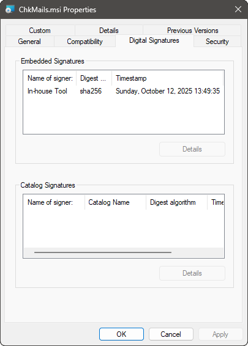
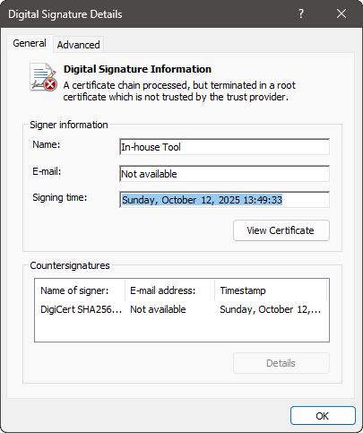
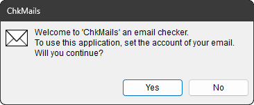

# インストール手順

[`Releases`](releases)
の下にある最新版をマウスでクリックすると,
その最新版を構成するファイルのページが開きます.

その中から `ChkMails.msi` をクリックして, インストールファイルのダウンロードを開始します.

> [!IMPORTANT]
必ず当サイトの [`Releases`](releases) からご自身で直接ダウンロードした
`ChkMails.msi` をお使いください.
人から USB メモリーや SD カードなどに入ったファイルで渡されたものだと,
それが正規品であるとは保証できません.
また, 正規品を提供しているのは当サイトのみです.
どこにもミラーリング等しておりませんので,
当サイト以外からのダウンロードはやめておきましょう.

## Microsoft Edge の場合

### Windows11 ( 2025年1月現在 )

`ChkMails.msi` をクリックすると
`開く` (`Open`) か `名前を付けて保存` (`Save as`) か `保存` ( `Save` ) かの三択を迫られます.

#### `開く` (`Open`) を選ぶと:

なんか赤い&#x26a0;マーク付きで、普通はそんなものはダウンロードとかしません。と警告文が出ます.

でも, その警告文にマウスカーソルをあてがうと右側に `...` が現れます.

その `...` をクリックすると, 下図のようにポップアップメニューが現われます.

ポップアップメニューの並びは下記のようになっていますが,

| 日本語 | English |
| --- | --- |
| `削除` | `Delete` |
| `保存` | `Keep` |
| `このアプリは安全であることを報告する` | `Report this app as safe` |
| `詳細情報` | `Learn more` |
| `ダウンロード リンクのコピー` | `Copy download link` |

ここで `保存` (`Keep`) を選ぶと今度はダイアログが現われて,

| 日本語 | English |
| --- | --- |
| `キャンセル` | `Cancel` |
| `削除` | `Delete` |

という後ろ向きな二択を迫ってきます.

が, ここにもこじんまりと `詳細情報` (`Show more`) という第三の選択肢が提示されているので, それをつつくと:

| 日本語 | English |
| --- | --- |
| `保持する` | `Keep anyway` |
| `このアプリは安全であることを報告する` | `Report this app as safe` |
| `詳細情報` | `Learn more` |

とさらに三つの選択肢が提示されます.
ここで `保持する` (`Keep anyway`) を選ぶと, ようやく `ChkMails.msi` がダウンロードされ,
自動でウイルスチェックでもしているのか, つまづくような時間が空いた後,
ようやく下図のようにインストーラーが動き出します.

#### `保存` (`Save`) を選ぶと:

ちょろっと何かをセーブしたような動きを見せるものの, 
やっぱり赤い&#x26a0;マーク付きで、普通はそんなものはダウンロードとかしません。と警告文が出ます.

でも, その警告文にマウスカーソルをあてがうと右側に `...` が現れます.

その `...` をクリックすると, 下図のようにポップアップメニューが現われます.

ポップアップメニューの並びは下記のようになっていますが,

| 日本語 | English |
| --- | --- |
| `削除` | `Delete` |
| `保存` | `Keep` |
| `このアプリは安全であることを報告する` | `Report this app as safe` |
| `詳細情報` | `Learn more` |
| `ダウンロード リンクのコピー` | `Copy download link` |

ここで `保存` (`Keep`) を選ぶと今度はダイアログが現われて,

| 日本語 | English |
| --- | --- |
| `キャンセル` | `Cancel` |
| `削除` | `Delete` |

という後ろ向きな二択を迫ってきます.

が, ここにもこじんまりと `詳細情報` (`Show more`) という第三の選択肢が提示されているので, それをつつくと:

| 日本語 | English |
| --- | --- |
| `保持する` | `Keep anyway` |
| `このアプリは安全であることを報告する` | `Report this app as safe` |
| `詳細情報` | `Learn more` |

とさらに三つの選択肢が提示されます.
ここで `保持する` (`Keep anyway`) を選ぶと, ようやく `ChkMails.msi` がダウンロードされます.

ところで, どこにダウンロードされたんでしょうね? 
上記画面のフォルダーが開いているような絵柄をつつくとダウンロード先フォルダーにたどり着けます.

| 日本語 | English |
| --- | --- |
| `C:\ユーザー\<ユーザー名>\Downloads\` | `C:\Users\<ユーザー名>\Downloads\` |

にあるはずです.

そこまで迎えに行って, そこに居た `ChkMails.msi` をダブルクリックすると,
ようやく上図のようにインストーラーが動き出します.

#### `名前を付けて保存` (`Save as`) を選ぶと:

どこにダウンロードされたかがはっきりしている以外, `保存` (`Save`) といっしょです.

うーん, `ChkMails.msi` をお迎えに行く手間がない分, `開く` (`Open`) の勝ちかな?
 
ダウンロード先フォルダーに `ChkMails.msi` を残さないので,
あとくされがないし.

でも, 一旦 `保存` (`Save`) した方が,
ファイルが由緒正しいものかどうかの確認ができますね.

正規品の `ChkMails.msi` は, プロパティ―を見ると,
下記のように `2025年 1月 11日 16:43:19` 付けのデジタル署名が付いています
( インストール後の `ChkMails.exe` は `2025年 1月 11日 16:43:17` ).

 

まあ, これはいわゆる「自己署名」(「私がやりました。」) というもので,
ちゃんとした認証局が発行した署名 (「あの人がやりました。」) と比べて全然説得力がないのですが,
その署名の日付は偽造しがたいので, 結果, 偽造防止効果があると思います.
( まあ, 受け取った人が署名の日付まで気にしてくれれば, ですが. )

### Windows10 ( 2025年1月現在 )

`ChkMails.msi` をクリックすると
なんか赤い&#x26a0;マーク付きで、普通はそんなものはダウンロードとかしません。と警告文が出ますが,
その警告文にマウスカーソルをあてがうと右側に現れる `...` をクリックすると,

| 日本語 | English |
| --- | --- |
| `削除` | `Delete` |
| `保存` | `Keep` |
| `このアプリは安全であることを報告する` | `Report this app as safe` |
| `詳細情報` | `Learn more` |
| `ダウンロード リンクのコピー` | `Copy download link` |

と並んだポップアップメニューが出ます.
ここで `保存` (`Keep`) を選ぶと今度はダイアログが現われて,

| 日本語 | English |
| --- | --- |
| `キャンセル` | `Cancel` |
| `削除` | `Delete` |

という後ろ向きな二択 ( デフォルトは (`Delete`) ) を迫ってきます.

が, ここにもこじんまりと `詳細情報` (`Show more`) という第三の選択肢が提示されているので, それをつつくと:

| 日本語 | English |
| --- | --- |
| `保持する` | `Keep anyway` |
| `このアプリは安全であることを報告する` | `Report this app as safe` |
| `詳細情報` | `Learn more` |

とさらに三つの選択肢が提示されます.
ここで `保持する` (`Keep anyway`) を選ぶと, ようやく `ChkMails.msi` がダウンロードされますが,
なんかそのままじっとしています.
よく見ると `ファイルを開く` (`Open file`) という文字列が出ているのでそれをつついてみると,
いきなり下図のようなダイアログがあなたの前に立ち塞がります.

| 日本語 | English |
| --- | --- |
|  |  |

よく見ると, `詳細情報` (`More info`) という文字列が出ているのでそれをつついてみると,
`実行` (`Run anyway`) というボタンが現われるので,
それを押すとようやく下図のようにインストーラーが動き出します.

## Microsoft Edge 以外のブラウザーの場合

すみません.
そういうことを言い始めるとキリがないので省略です.
 

( 派閥論争の元になりますからね.
「なぜ&#x2588;&#x2588;&#x2588;&#x2588;&#x2588;&#x2588;&#x2588;を紹介しといて俺の好きな&#x2588;&#x2588;&#x2588;&#x2588;&#x2588;がないんだ！」とか. )

## インストーラーの操作方法

まず, 最初に出てくるのが下図の状態です.

特にどうもしようがないので, すなおに `Next >` を押しましょう.
すると下図のようになります.

当アプリをインストールする先のフォルダーを指定する段階です.

デフォルトで提示されているフォルダーがなんか気に入らない方は,
直接フォルダー名を打ち込むなり, `Browse...` ボタンを押してフォルダーを選ぶダイアログを出して操作するなり,
お好みのフォルダーを指定します.

そして, `Next >` を押します.
すると下図のようになります.

「インストールを始めるには `"Next"` を押してください。」的なことを言っているので,
 `Next >` を押します.
するとインストーラーが動き出し, 突然
[UAC](https://learn.microsoft.com/ja-jp/windows/security/application-security/application-control/user-account-control/)
が現われてあなたをびっくりさせますが,
くじけずに `Yes` (`はい`) を押しましょう.

すると再びインストーラーが動き出しますが,
すぐに終わって下記のような表示に落ち着きます.

いろいろとお手数をおかけしました.
これで `Close` ボタンを押せば, インストールは完了です.

スタートメニューの **頭文字C** のところを見ると,
下記のように `ChkMails` が紛れ込んでいるはずです.

## 起動してみたら「mfc140u.dll が見つからない」とか言われた場合

「よし、インストールできた！」と勇んで起動してみると,
人によっては ( 正確には PC によっては ), 下図のようなダイアログが現われて,
何か深刻な問題が起きたようなことを告げてきます.

 

(「システムエラー」ですもんね.
「システム」で「エラー」とか言われたら, そりゃパニックですよ. この言い方, どうにかなりません? )

でもこれって,
[よくある話](https://www.google.com/search?q=mfc140u.dll+%E3%81%8C%E8%A6%8B%E3%81%A4%E3%81%8B%E3%82%89%E3%81%AA%E3%81%84)なんですよ.

なんでよくある話なのかというと,
みなさん「`.dll` として切り離せるものは `.exe` から切り離して」提供しているからです.
なんでそんな「外付けの `.dll` が要る `.exe`」なんて意地悪な構成にするのかというと, 下記の利点があるからです.

* オブジェクトサイズが小さくなるので, SSD ( HDD ) の容量節約になる.
* 同じ DLL を使う複数のプロセスが居る場合は DLL が共有されるので, メモリーの節約にもなる.
* Microsoft&reg; さんの DLL には Microsoft&reg; さんがセキュリティー更新をかけてくれるので, 今後も安心.

というわけで, その DLL をくれる Microsoft&reg; さんのサイトは
[こちら](https://learn.microsoft.com/ja-jp/cpp/windows/latest-supported-vc-redist?view=msvc-170)です.
なにやらしちめんどくさそうなことがごちゃごちゃと書いてありますが,
当アプリの場合, 足りない DLL を補うのは,
[`最新の Microsoft Visual C++ 再頒布可能パッケージ バージョン`](https://learn.microsoft.com/ja-jp/cpp/windows/latest-supported-vc-redist?view=msvc-170#latest-microsoft-visual-c-redistributable-version)
 のところにある
[https://aka.ms/vs/17/release/vc_redist.x64.exe](https://aka.ms/vs/17/release/vc_redist.x64.exe)
です.
 
( `X86` のじゃないですよ. `X64` のですからね. )

このリンクをつつくと, 
例によってダウンロードの手続きが始まりますが,
当アプリのようにアヤしいものではないので, わりとすなおに `Open` できます.
すると下図のようになんだかボタンの位置がズレたダイアログが出てきて「だいじょうぶか、こいつ?」と思わせなくもないですが,
だいじょうぶなんです.

中に書いてある「ライセンス条項」とやらに一応目を通してみましょうか.
 
( それにしても小さくて読みづらいですね.
まさか, わざと読みづらいように仕立てておいて, ヤバい条項の存在を悟られないようにしているとか…… )

 
( 茶化してばかりいないで紹介者としての責任を果たすべく,
一応全文読んでみましたが, 特にヤバい条項はなかったです. 2025年1月現在 )

 
( でも, 和訳がビミョーで, 「なんかパチもん臭いな、こいつ。」と思わせなくもなかったです. 2025年1月現在 )

`ライセンス条項および使用条件に同意` に&#x2611;すると押せるようになる `インストール` ボタンを押すと,
すんなりと, しかもタダで, 足りなかった `mfc140u.dll` とやらが, あなたの PC にもインストールされます.

お手数をおかけしますが, お付き合いください. どうやらこれが最善の提供形態のようなんです.

この「DLL のインストール」が無事終わったら,
再び `ChkMails` を起動してみてください.
こんどこそ動くはずです.
なんかいきなり下図のようなダイアログが, 画面の端っこの方に出てきて驚かされますが,
それが正常動作なんです.

その後どうすればいいのかに関しては, [本編の説明](README.md)をご参照ください.

In-house Tool / 家中 徹

