# ChkMails<br><sup><sup>Version 1.0.0.111</sup></sup>

メールが届いているかチェックする常駐アプリです.

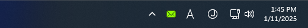

要らないメールかどうかもチェックします.
要らないと判定したメールは自動的に削除します.
<br>
要するに, スパムメール対策<sup>*</sup>なんです.
<br>
<br>
<sub>
*
実際には
「( spam )スパムメール対策」というよりは
「( phishing )フィッシングメール対策」なんですが,
以降の記述は「スパムメール」で統一しています.
「これ以上余計なメールは見たくもない」という動機で作ったアプリなので,
気分的には「スパムメール対策」なのかな, と.
</sub>

## 経緯

とある取引先から「サーバーに不正アクセスされ、お客様のメールアドレスの流出を確認いたしました。」との連絡があり,
ほどなくしてウチにもスパムメールが届くようになりました.
当初はメーラーで内容を目視確認してから削除していたのですが, それもすぐに面倒になり,
また, 一日に何十通も来るので, 肝心のメールの到着も見逃してしまいそうな状況が続きました.

元々メールの到着をお知らせするお手製のアプリを稼働させていたのですが,
そのアプリがメールの到着を確認する手段として用いている[POP3](https://ja.wikipedia.org/wiki/Post_Office_Protocol)に,
「指定のメールを削除するコマンド(`DELE`)」があることに思い至り,
とりあえず
「[メールヘッダー](https://www.dekyo.or.jp/soudan/contents/ihan/header.html)を見るだけで
スパムであることが一目瞭然なメール」
をそのアプリに削除させることによって,
目視確認してから削除する作業量 ( あと, 「メールが届いた」とのお知らせが空振りに終わる回数 ) を減らそうと考えた次第です.


## 原理

スパムメールであるか否かを完全に区別する方法はありません.
「区別」ができないのなら「差別」するしかないというのがこのアプリのスタンスです.
例えば「この国からのメールは全てスパムに違いない」といった差別です.

どこからのメールが要らないのかは, 個人によって異なります.
なので, どういうメールが要らないのかはユーザーが設定するようにしています.
以降はその設定に従って, 要らないと判定されたメールは到着次第削除します.


## 運用

タスクバーの通知領域にアイコンが常駐しているので,
それをマウスで右クリックすると現れる下記のようなポップアップメニューから操作します.


| イメージ | 項目 | 用途 |
| --- | --- | --- |
|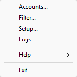|[Accounts](#accounts)<br>[Filter](#filter)<br>[Setup](#setup)<br>[Logs](#logs)<br>[Help](#help)<br>[Exit](#exit)| メールアカウント設定<br>スパム判定条件設定<br>その他の設定<br>ログ確認<br>ヘルプ<br>本アプリを終了|

しかし, 初めて起動した場合は, まず下のようなごあいさつのダイアログが, 画面の端の方にこじんまりと出てきます.

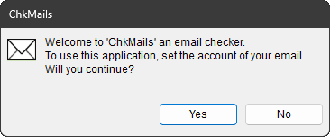

「このアプリを使うには、メールのアカウントをセットしてください。」とか言っています.
アヤしいことこの上なく, デフォルトが「はい」なのも押し付けがましく感じますが,
あなた宛てのメールを[POP](https://ja.wikipedia.org/wiki/Post_Office_Protocol)して事前確認するには,
必要な情報なのです. ご理解の上, ご承諾いただけますよう.

「No」(「いいえ」のボタンを押すと, このアプリは黙って終了します.
「やっぱ使ってみる！」と気が変わった場合は, アプリの起動からやり直してください.<br>
「Yes」(「はい」) のボタンを押すと, [Accounts](#accounts) の設定に進みます.


### Accounts

下記のようなダイアログが現われます.

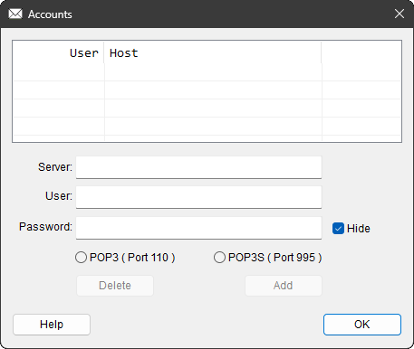

上の方にあるリスト ( 空っぽだとリストだと判りづらいですが ) が,
複数のメールアドレスを登録できることを示しています.
ここは直接何かを入力する欄ではなく,
入力の終わったメールアドレスが表示されるところです.
登録内容を目視確認したり,
クリックして選んで修正するためのリストです.

そして, このリストの下に並んでいるのが,
必要な情報を入力する欄です.
メーラーでメールアカウントを設定したときと同じ情報を入力します.
以下, それぞれの入力項目についての説明です.

#### Server

メーラーでメールアカウントを設定したときの「受信メールサーバー」と同じサーバー名を入力します.
「[POP3](https://ja.wikipedia.org/wiki/Post_Office_Protocol)」
または
「[POP3S](https://ja.wikipedia.org/wiki/Post_Office_Protocol#暗号化)」
のサーバーとされているものです.
( 「[IMAP](https://ja.wikipedia.org/wiki/Internet_Message_Access_Protocol)」と兼用の場合もあります. )
「[SMTP](https://ja.wikipedia.org/wiki/Simple_Mail_Transfer_Protocol)」のサーバーではない方です.

#### User

「ユーザー名」または「アカウント名」とされている名義を入力します.
「メールアドレス」の `@` の左側の文字列だけの場合と, 「メールアドレス」の文字列すべての場合がありますので,
よく思い出して正しい文字列を入力しましょう.
( 思い出せなかったら, メーラーを起動してそのアカウント設定をコピペしましょう. )

#### Password

「パスワード」を入力します.
デフォルトでは入力した文字列が見えないようになっていますが,
この欄の右にある `Hide` という&#x2611;を外すと,
普通に見えるようになります.
周囲に人が居ないことを確認した上でご利用ください.

#### POP3 ( Port 110 ) / POP3S ( Port 995 )

メールサーバーとの間の通信方式を選びます.
<br>
プロバイダーとの契約内容によりますが,
最近は [POP3](https://ja.wikipedia.org/wiki/Post_Office_Protocol)
より [POP3S](https://ja.wikipedia.org/wiki/Post_Office_Protocol#暗号化) の方が多いと思います.

そんなこんなで下のように全てを入れ終わったら, `Add` ボタンを押します.

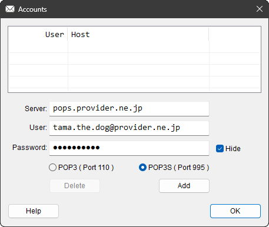

すると, 下のようにリストに入力した内容 ( の一部 ) が反映されます.

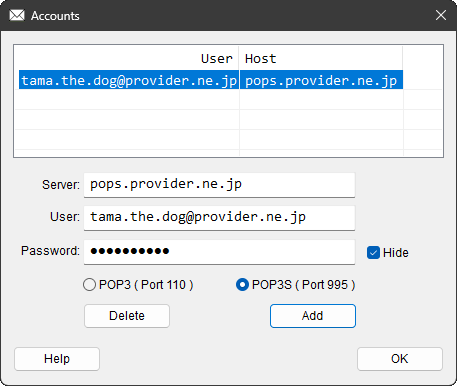

リストに入ったのを確認したら, `OK` ボタンを押すと完了です.

アカウントの登録が完了すると, 直ちにメールサーバー ( POP サーバー ) との通信を開始します.
<br>
タスクバーの通知領域にあるアイコンが赤くなった場合は, 登録内容のいずれかが誤っています.
アイコンにマウスカーソルをあてがうと, 下記のように簡単な説明が出ます.

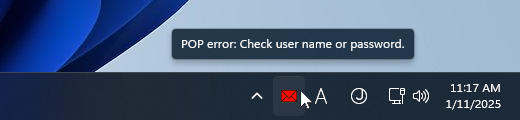

で, この「簡単な説明」のバリエーションですが, 下記のようになっています.

| 文言 | 意味 |
| --- | --- |
| `Connection error: Check server name.`| 指定されたサーバーにつながりません.<br>サーバー名が正しいか見直してください. |
| `POP error: Check user name or password.`| 通信が拒否されました.<br>ユーザー名とパスワードが正しいか見直してください. |

上記のいずれかに引っかかった場合は設定を見直します.
見直すには, 赤いアイコンをマウスで右クリックします.
すると, [冒頭](#運用)で紹介したようなポップアップメニューが出てきます.

`Accounts...` を選ぶと再挑戦できます.
( `Exit` を選ぶとあきらめます. )

そして, 下記のようになんだかアイコンが目立たない灰色になってしまった
( その前にちょこっとアイコンが黄色くなったような気がする ) あなた.

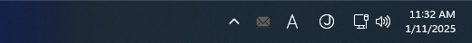

おめでとうございます! あなたの入力に誤りはなかったのです.
その灰色は, 何かが無効になっていることを示すものではありません.
サーバーと通信した結果, 新着メールが来ていないことが確認されたという状況を示すものです.

アイコンのカラーバリエーションとその示す意味を下記に挙げておきます.

| イメージ | 意味 | で, どうすれば? |
| :-: | --- | --- |
|   | アカウント未設定 | メールアカウントを設定しましょう. |
|  | サーバーと通信中 | 黙って見守りましょう. |
|    | 新着メールなし   | メールが来るのを楽しみに待ちましょう. |
|   | 新着メールあり   | メーラーを起動してメールを読みましょう. |
|     | 通信エラー | アカウントやネットワークの設定を見直しましょう. |

 [Accounts](#accounts) の設定が無事完了したら, 次は
 [Filter](#filter)に進みます.

### Filter

メールの通知ができるようになったことを確認できたら, 次はスパムメール対策です.<br>
「Filter」という当たり障りのないメニュー名で表されていますが,

* 「こういうメールはスパムメールである」という「区別」
* 「こういうメールはどうせスパムメールに違いない」という「差別」

という「スパムメールかどうかの判定条件」をあなたの交友関係に基づいて設定するメニュー項目です.

アイコンを右クリックしたときに現れる
[ポップアップメニュー](#運用)から `Filter...` を選ぶと,
タブ式のダイアログが現われます.
タブをクリックすると設定項目が選べます.
`Filter` には以下の項目があります.

| 設定項目 | 設定内容 |
| --- | --- |
| [`Authentication`](#authentication)	| 認証結果による区別		|
| [`Coding`](#coding)			| 文字コードによる区別		|
| [`Domain`](#domain)			| ドメイン名による差別		|
| [`Sender`](#sender)			| 送信者の振る舞いによる区別	|
| [`Time Zone`](#time-zone)		| タイムゾーンによる差別		|
| [`Whitelist`](#whitelist)		| 「ホワイトリスト」による救済	|

以下, それぞれの設定項目についての説明です.

#### Authentication

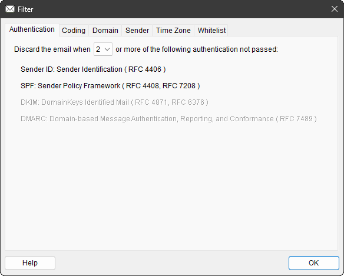

[認証](https://ja.wikipedia.org/wiki/送信ドメイン認証)
( [Authentication](https://en.wikipedia.org/wiki/Email_authentication) )
の結果に従って, 届いたメールを「区別」します.

認証の方式にもいくつかありますが,
どの認証結果がもたらされるかはご契約のプロバイダーによって異なります.
ご契約のプロバイダーがサポートしていない認証方式は, 画面上は薄く表示されています.

届いたメールのメールヘッダーを見ると, 認証結果が判ります.
下記のような `Authentication-Results:` という一節があるはずです.

```
Authentication-Results: mx.provider.ne.jp;
 spf=pass smtp.mailfrom=pochi.the.cat@provider.ne.jp;
 sender-id=pass header.From=pochi.the.cat@provider.ne.jp
```

この例の場合, 受信者側のプロバイダーが提供している認証は,
[SPF](https://ja.wikipedia.org/wiki/Sender_Policy_Framework) と
[Sender-ID](https://ja.wikipedia.org/wiki/Sender_ID) の2つのようです.
( 逆に言えば [DKIM](https://ja.wikipedia.org/wiki/DKIM) と
[DMARC](https://ja.wikipedia.org/wiki/DMARC) はサポートされていないようです. )
`Authentication-Results:` はプロバイダーが付けている情報なので,
送信者によって偽造できません,
客観的に信じられる情報です.

そして, 上記の例では
`spf=pass` と `sender-id=pass` となっているので, SPF と Sender-ID の両方が pass しています.
なので,
このメールは `pochi.the.cat@provider.ne.jp` 名義の送信者が `pochi.the.cat@provider.ne.jp` から送ったものに間違いないと,
プロバイダーが認証済みということです.<br>
<sub>(「なに当たり前のこと言ってんだ?」と思われる向きもあろうかと存じますが,
世の中には「メール配信代行業者」というものがあって,
「名義」はクライアント企業なのに実際の「送信者」は代行業者というメールも多いのです.
おかげでスパムメールかどうかの見極めも面倒になりました. )</sub>

で, 上の設定画面の例では

* 2つ以上の認証が pass していなかった場合は, メールを破棄する

となっています.
( 逆に言えば「pass しそこないが許されるのは 1つまで」ということです. )

上記のメールの例では「pass しそこなった認証」は `0` ( 2つとも pass している ) なので,
このメールは破棄されず届きます.

上記の画面にあるプロバイダーの例では DKIM や DMARC は提供されていませんが,
それらは「pass しそこなった認証」にカウントされません.

ところで,
「pass しそこないが許されるのは 1つまで」に対して
「1つでもひっかかったらダメだろ?」
と思われる向きもあろうかとは存じますが,
居るんですよ, マジで.
[1つぐらい引っかかってしまう送信者](Examples/README.md#authentication-results-が全ては-pass-していない正当なメールの例)ってのが.<br>
<sup>( メール配信を代行業者に頼んでいる企業とかに多いんです.
代行業者の仕事が粗いのか, クライアントの協力が不十分なのかは存じませんが. )</sup>

それらを全部ハネてしまってはダメなので,
「2つ以上 pass しなかったら」というややこしい基準で判定しています.
そしてこの「2つ」を設定上のデフォルト値 ( 何も設定しなくても最初っからそうなっている ) としています.
このデフォルト値のチョイスは

* [大抵のプロバイダーは2つ以上の認証結果を付けている.](https://www.dekyo.or.jp/soudan/contents/auth/index.html)
* どんな送信者 <sup>( 代行業者 )</sup> でも pass しそこなうのはせいぜい 1つまで.

という理由によるものです.

ところでこの「pass していない」という遠回しな言い方ですが,
`pass` 以外にも下記のバリエーションがあるので, 「`pass` 以外の結果」という意味で使っています.

| 結果を表す文字列 | 意味 |
| --- | --- |
| `pass` | 正しく認証された |
| `fail` | 偽造されている |
| `hardfail` | 偽造されている |
| `softfail` | 偽造されているかも |
| `temperror` | 一時的な認証エラー |
| `permerror` | 継続的な認証エラー |
| `neutral` | 認証結果が非公開 |
| `none` | 認証結果がない |

[`pass` 以外の結果をどう扱うべきか](https://salt.iajapan.org/wpmu/anti_spam/admin/tech/explanation/spf/#60)については,
色々と解釈の幅があるというのが RFC 的スタンスのようですが,
「スパム対策」である本アプリとしては「`pass` 以外はダメ」と決めつけています.
( ただし, デフォルトでは「ダメでも 1つまでは見逃す」となっていますが. )

なお, 色々解釈の幅のある「`pass` 以外」ですが,
そのうち `fail` と `hardfail` はほぼ間違いなく「偽造」を示すものなので,
これらに関しては 1つでもあればアウトとして扱っています.
「1つまではセーフ」といった生ぬるい判定はしません.

この認証によるスパムメールの「区別」は, 何らの先入観もない正当なもので, 「差別」にはあたりません.
プロバイダーによってはサービスとして提供してくれているところもあると思います.
実際, コレがあるだけでもスパムメールがぐっと減ります.

が, 「減る」だけです. この認証だけではハネられないスパムメールというのも存在します.
それで当アプリでは, 追加の「区別」や, さらに踏み込んだ「差別」を用意しています.


#### Coding

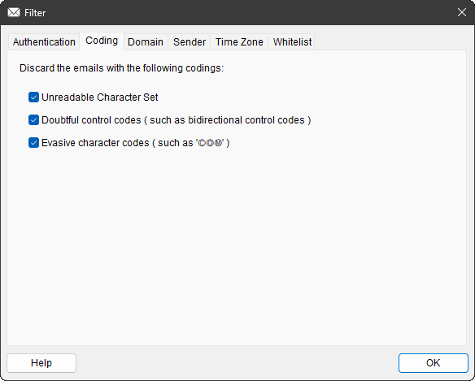

届いたメールの文字コードによってメールを「区別」します.

* 読めない文字セット<br>
Windows&reg; が保有するデータベースにない文字セットで書かれているメールを破棄します.<br>
このデータベースは, 以下の registry の配下にあるものを意味します.<br>
`HKEY_CLASSES_ROOT\MIME\Database\Charset\`<br>
( 日本に向けてのスパムメールを
[GB 2312](https://ja.wikipedia.org/wiki/GB_2312) で書いてくるうっかりさんも居るには居るのですが,
こういうメールは他の条件でもハネられる場合ばかりだったので,
特に文字セットで「差別」する機能は設けていません.
この条件に引っかかるのは, ホントに何かの間違いのときだけです. )

* 疑わしい制御文字<br>
[UNICODE の制御文字](https://en.wikipedia.org/wiki/Unicode_control_characters)
が埋め込まれているメールを破棄します.<br>
読み手に実際とは異なる文字列を表示して見せたり, パターン検索から逃れるために使用されたり, と,
こういう文字コードが埋め込まれているメールにはロクなものがありません.<br>
( ただし, 右から左に書く言語の場合は, ごく普通に「右から左に読んでね。」という制御文字が入っていることがあるので,
こういう言語とお付き合いのある方はこの&#x2611;を外してください. )

* 回避的な文字コード<br>
埋め込まれたリンク先などに ASCII コードではなく UNICODE の似た文字が埋め込まれたメールを破棄します.<br>
たとえば “.&#x24B8;&#x24C4;&#x24C2;” とかです.
“.&#x24B8;&#x24C4;&#x24C2;” を “.com” と善意に解釈してくれるメーラーでもあるのですかね?
だとすると, こうした文字コードを埋め込んだメールというのは, その善意につけ込んでパターン検索から逃れるためのものでしょう.
こういう文字コードが埋め込まれているメールにはロクなものがありません.<br>
( ひょっとすると,
「普通に書くより目立つから」という理由でわざわざこういう文字コードを使うファンキーな店舗もあるかもしれません.
そういうファンキーな店舗とお付き合いのある方はこの&#x2611;を外してください. )

デフォルトで, 3つ全て ON にしています.


#### Domain

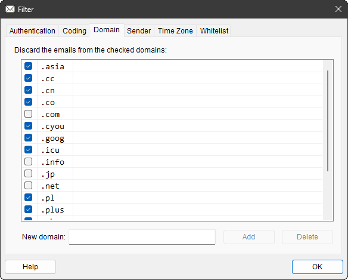

届いたメールの発信元[ドメイン名](https://ja.wikipedia.org/wiki/ドメイン名)によってメールを「差別」します.

本アプリでは,
届いたメールの[トップレベルドメイン](https://ja.wikipedia.org/wiki/トップレベルドメイン)を記録に残しています.
大げさに言うと「学習」しているわけです.
それを上の画面の例のようにリストに表示し,
&#x2611;を付けたドメインを「要らないメールの発信元」として「差別」し,
以降, そのドメインに属する送信者からのメールを全て破棄します.

まるで「[クレタ人は皆うそつき](https://ja.wikipedia.org/wiki/エピメニデスのパラドックス)」という言い分を信じて,
クレタからの通信をすべて遮断してしまうようなやり方です.
しかし,
クレタとの交流が全くない立場の人々にとっては,
「そんな私にクレタからのメールが来たら、それはスパムに違いない。」という判断もアリでしょう.

考え方としてどうかと思いますが……, 悲しいことに, コレが結構効くんです.

なお, この「差別」したドメインかどうかのチェックですが,
メールの送信元アドレスのみならず, メール本文に埋め込まれているリンクに対しても行っています.
なので, 「ヤバくない国」からの送信を装った「ヤバい国へのリンク」が埋め込まれたメールも同様にハネます.

ところで, ここでは「ドメイン」と説明していますが,
実のところ送信元メールアドレスやリンク先アドレスと,
リスト上で&#x2611;された文字列が後方一致するか否か ( 右から比べて同じかどうか ) で判断しているにすぎません.

なので,
「新規ドメイン」として特定の送信元のメールアドレスを加えておくと,
そのメールアドレスから来たメールも同様にハネます.

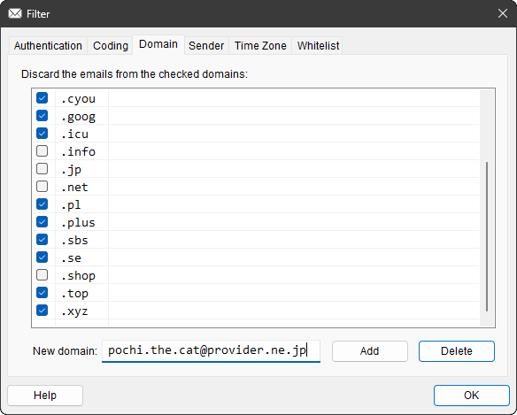

上の例のように, ハネたい相手のメールアドレスを `New Domain:` に入力してから `Add` を押すと,<br>
下の図のようにリストに入ります.

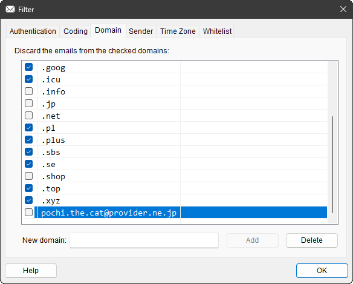

この段階ではリストに入るだけなので,
ホントにハネる場合は&#x2611;を入れるのを忘れないようにしましょう.

ということで, ドメインが対象にせよメールアドレスが対象にせよ,
事実上の「[ブラックリスト](https://ja.wikipedia.org/wiki/ブラックリスト)」ということになります.


#### Sender

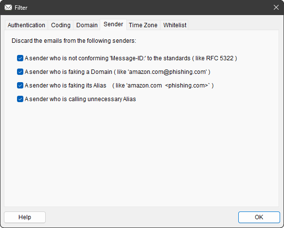

疑わしい送信者を締め出すためのその他の「区別」です.

現状で用意しているのは下記の 4つです.

* Message-ID が標準に準拠していないメール<br>
メールヘッダーには, そのメールを一意に識別するための Message-ID という識別コードが振られていますが,
このコードの書き方にも一応
[準拠すべき標準](https://datatracker.ietf.org/doc/html/rfc5322#section-3.6.4)というものがあります.<br>
スパムメールにはこの辺がいいかげんなものが多いので,
判断の材料の一つとして加えてあります.

* ドメインを装ったメールアドレス<br>
画面に例示されている通り, ぱっと見, 実在する企業の正規のドメインからのものであるように見せかけながら,
実はとんでもない送信者から来ているようなメールを破棄します.<br>
子供騙しのようですが ( と言っては子供に失礼か )
[ホントにあるんですよ](Examples/README.md#dkim-signature-があるスパムメールの例), こういうの.

* 別名 ( Alias ) を騙ったメールアドレス<br>
別名とは, `From:` にある `<` と `>` の間に囲まれたメールアドレスの手前にある ( つまり `<` の手前にある )
送信者を表す文字列のことです.<br>
スパムメールでは,
`Amazon.com <phishing.com>`
のように, この別名に実際の送信者とは全く別の企業名が騙られることがあります.
こうした騙りが明らかなメールを破棄します.

* 無駄な別名 ( Alias ) で呼びかけてくるメール<sup>※</sup><br>
上とは逆に, `To:` にある受信者の別名に関するチェックです.<br>
スパムメールも別名で呼びかけてくることがありますが,
スパムメール送信者は宛先のメールアドレスしか知らないので,
別名もメールアドレスから素材を採った文字列になります.
正規のメールは一般的にそんなことはしない
( ユーザー登録時に入力した氏名で語りかけてくるか, そもそも別名なんか付けない ) ので,
こういう意味のない別名を振ってくるメールを破棄します.<br>
※ これは当方の経験則によるチェック項目なので,
もし副作用 ( 要るメールまで棄てられた ) が出たら&#x2611;を外してください.


デフォルトで 4つとも ON にしています.


#### Time Zone

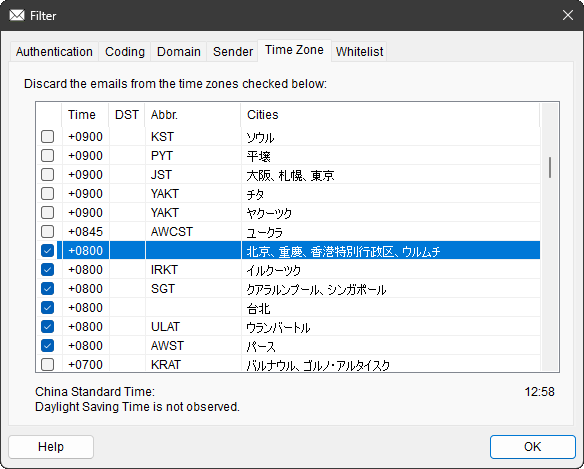

メール発信元の[タイムゾーン](https://ja.wikipedia.org/wiki/等時帯)によってメールを「差別」します.

[Domain](#domain) による「差別」もたいがいですが,
こっちの「差別」はもっと範囲が広いです.
上は中国からのメールをハネようと同国が属している `UTC+0800` を&#x2611;してみた例ですが,
何の関係もないオーストラリアのパース ( Perth ) まで巻き込まれていることが判ります.
オーストラリアの西側に友達の居る人は使わない方が良い手段でしょう.

ただ……, これも結構効くんですよ.
どこから出しているんだか判らないようにしている送信者って, 居ますからね.

「よし解った！俺は海外には友達も居ないから、外国は全部&#x2611;だ！」

と思い切ったあなた, それは早計かもしれません.
大手企業には(わざわざ)海外から国内に向けたメールを配送するところもあるんですよ.
( たとえば
[Amazon は UTC の `+0000` から連絡がきます](Examples/README.md#date-がどこの国だか判らない正当なメールの例). )
友達はだいじょうぶでも, ユーザー登録したメーカーからの連絡が途絶えるかもしれません.
思い切った手を打つのは, ご自身のメール履歴をよく確認してからにしましょう.

ところで, この一覧, 「あの国はいま何時かな?」を見るのに便利です.
`OK` ボタンの上に出ている時刻表示は, 選んだタイムゾーンの現地時刻を示しています.
[サマータイム](https://ja.wikipedia.org/wiki/夏時間)
( イギリス英語で“Summer Time” / アメリカ英語で “Daylight Saving Time” ) も反映した表示です.
海外の友達と連絡するとき, 現地の時刻を一考するのに便利でしょう.


#### Whitelist

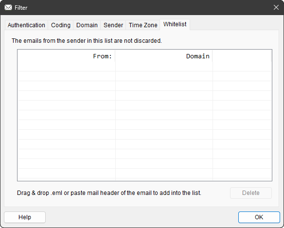

これまでご紹介したメールをハネるための「区別」や「差別」とは違い,
ここで登録しておいたメールはハネずに受け入れます.
つまり, 「[ホワイトリスト](https://ja.wikipedia.org/wiki/ホワイトリスト)」というわけです.

他のチェック項目で引っかかったメールも, この「ホワイトリスト」に登録してある送信者からのものは,
引っかかったのをなかったことにして受け入れます.

[Domain](#domain) や [Time Zone](#time-zone) で特定の地域全体を排除しておきながらも,
同地域に在住する数少ない信じられる相手からのメールは受け入れる, といったような用途に使えます.

さて, ここからの話は友達の少ない方限定の手段です.<br>
「私にメールを送ってくる人なんて、あいつとこいつと、あと、あの会社ぐらいなもんだ。」というあなた,
あなたにおススメの良い方法があります.

まず, [Authentication](#authentication) で,
「pass しそこなった認証」の件数を `0 以上` に設定するのです. ( 下図参照 )


こうすると, 全ての認証が pass しても, つまり「pass しそこなった認証」の件数が `0` でも,
「`0 以上`」という条件に引っかかるので全てのメールが破棄されます.
が, ここで「ホワイトリスト」に登録されている送信者だけはお目こぼしされます.
つまり, あなたが認めた送信者からのメールだけがあなたに届くようになるのです.

友達と取引先全てを「ホワイトリスト」に登録するのがちょっと面倒ですが,
なに, 友達の少ないあなたのことです. すぐに作業は終わるでしょう.

で, その登録方法ですが,
[Domain](#domain) のようにメールアドレスを直接入力する方法は用意していません.
その友達や取引先からのメールを

* [`.eml`](https://www.google.com/search?q=.eml+ファイル) ファイルとしてセーブされたものをこの画面に Drag & Drop する.
* [メーラーで表示させたメールヘッダー](https://www.dekyo.or.jp/soudan/contents/ihan/header.html)
を全選択 (`Ctrl`+`A`) して Copy (`Ctrl`+`C`) してから,
この画面に Paste (`Ctrl`+`V`) する.

の 2通りの手段が用意されています.

上の手段のいずれかを実施すると, 下のように友達のメールアドレスが登録されます.

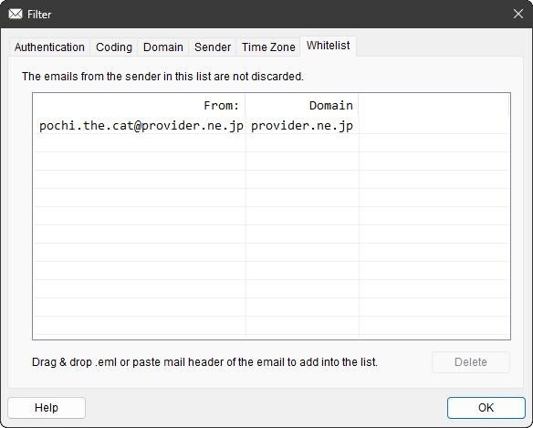

[Domain](#domain)のように直接入力を許していないのは,
送信者の正確な名義 ( メールヘッダーの `From:` にあるメールアドレス ) と,
実際の送信者の正確なドメイン ( メールヘッダーの `Authentication-Results:` などに記録されている送信元ドメイン )
の 2つの情報のペアが必要だからです.
「ホワイトリスト」との照合はこのペアで行っています.
`From:` だけで照合するとスパムメールの偽造にダマされてしまいますから.<p>
<sub>
ただし, 企業 ( メール配信を登録したベンダーとか ) のホワイトリスト登録には気を付けてください.
いつの間にか ( ユーザーに断りもなく ) 送信者が代わっている場合があるのです.
昔は自前でメールを配信していた企業が, 配信をメール配信代行業者に委託した場合などです.
この場合, 「名義」は変わらないのに「送信者」が代わってしまうので,
この「ホワイトリスト」の条件から外れてしまいます.
( せめて委託前にユーザーに周知してほしいものです. > 各クライアント企業 )
<br>
「ホワイトリスト」に入れておいたはずのあの企業からのメールが途絶えた,
といった場合は, [Logs](#logs)でログを眺めて, お馴染みのあの企業のメールが捨てられていないか確認してみてください.
「どうせ売り込みのメールであろう。そのようなものが途絶えても一向に構わぬ！」( とあるテストユーザー談 ) という方以外は.
</sub>


### Setup

当アプリの動作をあなた好みに設定します.

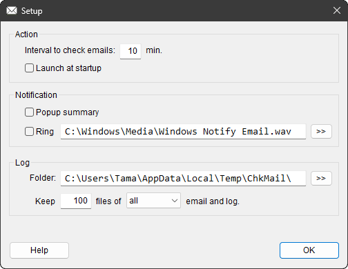

デフォルトのままほっといても特に動作に支障はありませんが,
より好みの動作にカスタマイズすることができます.

#### Action

当アプリの基本動作に関する設定です.

* Interval to check emails<br>
メールをチェックする時間間隔を設定します.<br>
デフォルトは `10` [分] です. そんなもんで十分だと思いますが,
とても待ち焦がれているメールでもあるときは, この間隔を短くするのもいいでしょう.
もちろん, メールサーバーには負担になりますが.

* Launch at startup<br>
Windows&reg; が起動したとき ( 正確にはユーザーがサインインしたとき ) に当アプリを起動します.<br>
デフォルトは OFF になっているので, 「このアプリは使える!」と思われたら, &#x2611;しておくといいでしょう.

#### Notification

メール着信時のお知らせに関する設定です.

* Popup summary<br>
メール着信時にサマリー ( 概要 ) として,
そのメールの`Subject:`, `From:`, `Date:` をまとめたものを画面の端にポップアップ表示します.<br>
デフォルトは OFF になっています.<br>
ON にすると, 着信したメールの概要を下記のように画面の隅っこに表示します.
古いメールが下の方, 新しいメールはその上に積み上げるように表示されます.
<br><br>
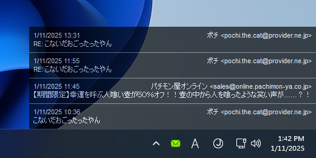
<br><br>
この表示はクリックすると消えます.
しばらくは消えたままでいますが, そこに新たなメールが届くと,
一段積み増した状態で再表示され,
未決の仕事が溜まっていくようなプレッシャーをあなたに与えます.

* Ring<br>
メール着信時にご指定の `.wav` ファイルを鳴らします.<br>
デフォルトは OFF で, `.wav` ファイルは Windows&reg; のデフォルトのメール着信音です.
<br><br>
ところで,
`Ring` させる `.wav` ファイルを選ぶとき,
右の `>>` ボタンを押して Explorer でファイルを見に行くと,
下図のように File name が中途半端な状態で表示されることがあります.
<br><br>

<br><br>
これは
[Windows&reg; のポカ](https://stackoverflow.com/questions/64424601/cmfceditbrowsectrl-is-cropping-the-file-name)
です.
だいぶ前から指摘されているのに, いまだに直っていません.
<br>
<sup>
( 2025年1月に Windows&reg; 11 24H2 で確認 )
</sup>


#### Log

* Folder<br>
[ログ](#logs) をしまっておくフォルダーを指定します.<br>
デフォルトは, ユーザーのテンポラリーフォルダーです.

* Keep<br>
`.eml` と `.txt` をそれぞれいくつまでフォルダーにとっておくかを指定します.<br>
指定のファイル数を超えたら, 古いものから順に削除していきます.<br>
デフォルト値は `100` です.

* files of<br>
しまっておくログを `破棄された` メールに限定するのか `全ての` メールとするのかを選びます.<br>
デフォルトは `全ての` です.<br>
[Filter](#filter) の調整中は, 破棄されたものもパスしたものも両方とも, あとから確認できた方がいいでしょう.


### Logs

ログのフォルダーを開きます.

このフォルダーには以下の 2種類のファイルがセーブされています.

| 拡張子 | ファイルの内容 |
| --- | --- |
| [`.eml`](https://www.google.com/search?q=.eml+ファイル) | メールをそのまま保存したファイル. メーラーで直接開ける. |
| `.txt` | 上記をデコードしたファイル. そのままテキストとして読める. |

当アプリのチェックに引っかかって, 破棄されたメールもファイルのかたちでここに保存されています.

いずれもファイル名は, そのメールの `From:` にあった送信者の「名義」です.
ただし, 破棄されたメールのファイルは, ファイル名の冒頭に `!` が付けられているので見分けが簡単です.
また, 破棄されたメールの `.txt` ファイルの中身には,
その冒頭の方に下記の情報が当アプリによって加えられています.

| 見出し | 意味 |
| --- | --- |
| `Discard-Reason:` | 破棄理由 |
| `Embedded-Link:` | 埋め込まれていたリンク |

この `Discard-Reason:` ですが, 下記のようなバリエーションがあります.

| `Discard-Reason:` | 意味 |
| --- | --- |
| `Authentication Failure`		| [Authentication](#authentication) で不合格			|
| `Coded in Unreadable Charset`		| [Coding](#coding) の「読めない文字セット」を検出		|
| `Coded with Doubtful Control Code`	| [Coding](#coding) の「疑わしい制御文字」を検出			|
| `Coded with Evasive Encoding`		| [Coding](#coding) の「回避的な文字コード」を検出		|
| `Domain Unreliable`			| [Domain](#domain) での排除対象					|
| `Sender Using Aberrant Message-ID`	| [Sender](#sender) の「Message-ID が標準に準拠していないメール」に該当	|
| `Sender Faking a Domain`		| [Sender](#sender) の「ドメインを装ったメールアドレス」を検出	|
| `Sender Faking Alias`			| [Sender](#sender) の「別名を騙ったメールアドレス」を検出		|
| `Sender Calling Unnecessary Alias`	| [Sender](#sender) の「無駄な別名で呼びかけてくるメール」を検出	|
| `Time Zone Unreliable`		| [Time Zone](#time-zone) での排除対象				|
| `Link to Unreliable Domain`		| リンク先が [Domain](#domain) での排除対象			|
| `Evasive Link Path`			| リンク先に [Coding](#coding) の「回避的な文字コード」を検出	|

たまにはログを見て [Filter](#filter) が「甘かった」あるいは「やり過ぎた」の反省材料にお使いください.

「やり過ぎて」しまって要るのにハネてしまったメールの
[`.eml` ファイルをメーラーにインポートする方法](https://www.google.com/search?q=.eml+ファイル+インポート)は,
メーラーによって異なるので, お手数ですが各自でご調査の上, ご対応願います.


### Help

`Help` には以下のようなサブメニューがあります.

| イメージ | 項目 | 用途 |
| --- | --- | --- |
|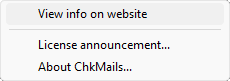|[View info on website](#view-info-on-website)<br>[License announcement](#license-announcement)<br>[About ChkMails](#about-chkmails)| Web で情報を見る<br>ライセンス宣言を見る<br>本アプリについて|

#### View info on website

本アプリの web ページで情報を眺めます.
というか, 今ご覧になっているこのページです.
<br>
<sub>
まあ, どうせ, 大したことは書いてありませんが,
Help ファイルとか実装するの面倒だったし…….
</sub>


#### License announcement

ライセンス宣言とかいうのを見ます.

よーく見ると「タダで使っていいよ。」てなことが書いてあります.
あと,「使ってなんかあっても責めないでね。」とも書いてあります.
まー, タダなんだし, そんなもんではないでしょうか.


#### About ChkMails

本アプリのバージョン情報とか表示します.

たまには表示させて, このページに掲載されている最新バージョンと見比べてください.
アプリの性格上, 今後もバージョンアップが必要な気もするのですよ.
( 新手の手法といたちごっこを続ける羽目になりそうな予感 )


### Exit

本アプリを終了します.<br>
が, その前に下のような確認ダイアログが現われます.

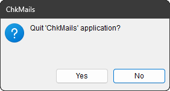

デフォルトが「いいえ」なのも未練がましく感じますが,
「Yes」(「はい」) のボタンを押すとすんなり終了します.
<br>
<sub>
このアプリって, 終了させることに意味があるのかって気もしますが,
最新版を導入したときに旧版を……,
あ. 後から最新版を起動すれば先に走っていた旧版は押し退けられるんだった.
あれー? なんでこんな機能を付けたんだっけ?
</sub>

## 操作

本アプリのアイコンに対しては, 以下の操作が有効です.


| 操作 | 動作 |
| --- | --- |
| マウスで左クリック  | 直ちにメイルのチェックを行う. |
| マウスで右クリック  | [メニュー](#運用)を出す. |

ユーザー様の目に触れるかたちで出している GUI がアイコンだけなので, 操作はこれだけです.

なお,
`ChkMails.exe` の置いてあるフォルダーに `Mails` というサブフォルダーを掘り,
そのサブフォルダーに試してみたいメールの `.eml` を入れておいてから `ChkMails.exe` を起動すると,
`ChkMails.exe` は通常営業の POP3 での通信はせず,
`.eml` の中身を通信で受け取ったかのように動作し,
その内容を今設定されている [Filter](../README.md#filter) の条件で再判定します.
そうした「練習」が終わったら, `Mails` フォルダを削除するか, `Mails` 以外の名前に付け替えるかしましょう.
それで通常営業に戻ります.
<br>
<sub>
そうだ! 「練習」を始めたり終わらせたりするのに「[終了](#exit)」が必要だったんだ.
思い出せてよかった.
</sub>

## 環境

* Visual Studio 2022&reg; での Windows&reg; 11 向け build なので, 64bit OS 用です.
* 同じ build で Windows&reg; 10 でも問題なく動作しますが, 64bit 版に限ります.


## 実装

「お前の言い分は解った。だが、どこの馬の骨が作ったかも判らないものに、パスワードとか入力するのは……」
とためらわれたあなた, いえ, あなたの感覚こそ正しいんです.
このご時世, あなたのような感覚を持つべきなのです.

このアプリが github という「ソース置き場」に置かれているのもだからこそです.
Visual C++&reg; の読める方は, ソースコードをご確認の上, ご自身で build して試してみることをオススメします.
そんなあなたがこのアプリのソースコードを読み解く一助になればと,
ちょっとした[ソースの説明](docs/README.md)も上げておきました.

## 導入

そして……, 「ソースコードなんて読むヒマはない。とっとと現物を寄越せ！」とお考えのあなた,
そういう考え方はいかがなものかと思うのですが,
いちおう「インストーラー」として用意したものが,
本ページ右上の「Releases」というコーナーに上げてあります.
でも, それをダウンロードする前に,
せめて[インストール手順](Installation.md)をご一読ください.
あなたの危険な行為を阻止すべく, 色々と Windows&reg; が説得してくるはずですが,
どうやってそれらを振り切って初志貫徹するかが書いてあります.

<div style="text-align: right;">
In-house Tool / 家中 徹
</div>
