# ChkMails<br><sup><sup>Version 1.1.11.419</sup></sup>

メールが届いているかチェックしてお知らせする常駐アプリです.

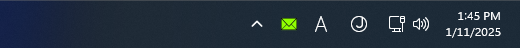

要らないメールかどうかもチェックします.
要らないと判定したメールは自動的に削除します.
要するに, スパムメール対策<sup>*</sup>なんですが,
要らないメールは「仕分け」するのではなく「削除」し,
要るメールが残らない限り何事もなかったかのように黙っています.
結果的に,
スパムメールなどというものが来るようになる前の平和な頃に戻ったかのようになります.
<br>
<br>
<sub>
*
実際には
「( spam )スパムメール対策」というよりは
「( phishing )フィッシングメール対策」なんですが,
以降の記述は「スパムメール」で統一しています.
「これ以上余計なメールは見たくもない」という動機で作ったアプリなので,
気分的には「スパムメール対策」なのかな, と.
</sub>

## [経緯](#readme)

とある取引先から「サーバーに不正アクセスされ、お客様のメールアドレスの流出を確認いたしました。」との連絡があり,
ほどなくしてウチにもスパムメールが届くようになりました.
当初はメーラーで内容を目視確認してから削除していたのですが, それもすぐに面倒になり,
また, 一日に何十通も来るので, 肝心のメールの到着も見逃してしまいそうな状況が続きました.

元々メールの到着をお知らせするお手製のアプリを稼働させていたのですが,
そのアプリがメールの到着を確認する手段として用いている[POP3](https://ja.wikipedia.org/wiki/Post_Office_Protocol)に,
「指定のメールを削除するコマンド(`DELE`)」があることに思い至り,
とりあえず
「[メールヘッダー](https://www.dekyo.or.jp/soudan/contents/ihan/header.html)を見るだけで
スパムであることが一目瞭然なメール」
をそのアプリに削除させることによって,
目視確認してから削除する作業量 ( あと, 「メールが届いた」とのお知らせが空振りに終わる回数 ) を減らそうと考えた次第です.


## [原理](#readme)

スパムメールであるか否かを完全に区別する方法はありません.
「区別」ができないのなら「差別」するしかないというのがこのアプリのスタンスです.
例えば「この国からのメールは全てスパムに違いない」といった差別です.

どこからのメールが要らないのかは, 個人によって異なります.
なので, どういうメールが要らないのかはユーザーが設定するようにしています.
以降はその設定に従って, 要らないと判定されたメールは到着次第削除します.

[ベイジアンフィルター](https://ja.wikipedia.org/wiki/ベイジアンフィルタ)などの学習的手法は使っていません.
ユーザー設定のフィルターでメールヘッダーと埋め込まれたリンクをチェックして, 要らないメールか否かの判定をしています.


## [運用](#readme)

タスクバーの通知領域にアイコンが常駐しているので,
それをマウスで右クリックすると現れる下記のようなポップアップメニューから操作します.


| イメージ | 項目 | 用途 |
| --- | --- | --- |
|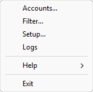|[Accounts](#accounts)<br>[Filter](#filter)<br>[Setup](#setup)<br>[Logs](#logs)<br>[Help](#help)<br>[Exit](#exit)| メールアカウント設定<br>スパム判定条件設定<br>その他の設定<br>ログ確認<br>ヘルプ<br>本アプリを終了|

しかし, 初めて起動した場合は, まず下のようなごあいさつのダイアログが, 画面の端の方にこじんまりと出てきます.


「このアプリを使うには、メールのアカウントをセットしてください。」とか言っています.
アヤしいことこの上なく, デフォルトが<kbd>はい</kbd>なのも押し付けがましく感じますが,
あなた宛てのメールを[POP](https://ja.wikipedia.org/wiki/Post_Office_Protocol)して事前確認するには,
必要な情報なのです. ご理解の上, ご承諾いただけますよう.

<kbd>No</kbd>(<kbd>いいえ</kbd>) のボタンを押すと, このアプリは黙って終了します.
「やっぱ使ってみる！」と気が変わった場合は, アプリの起動からやり直してください.<br>
<kbd>Yes</kbd>(<kbd>はい</kbd>) のボタンを押すと, [Accounts](#accounts) の設定に進みます.


### [Accounts](#readme)

まずは下記のようなダイアログが現われます.
ここでメールのアカウントを設定します.

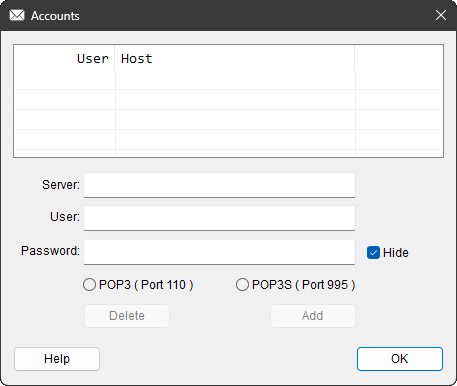

上の方にあるリスト ( 空っぽだとリストだと判りづらいですが ) が,
複数のメールアドレスを登録できることを示しています.
ここは直接何かを入力する欄ではなく,
入力の終わったメールアドレスが表示されるところです.
登録内容を目視確認したり,
クリックして選んで修正するためのリストです.

そして, このリストの下に並んでいるのが,
必要な情報を入力する欄です.
メーラーでメールアカウントを設定したときと同じ情報を入力します.
以下, それぞれの入力項目についての説明です.

#### [Server](#readme)

メーラーでメールアカウントを設定したときの「受信メールサーバー」と同じサーバー名を入力します.
「[POP3](https://ja.wikipedia.org/wiki/Post_Office_Protocol)」
または
「[POP3S](https://ja.wikipedia.org/wiki/Post_Office_Protocol#暗号化)」
のサーバーとされているものです.
( 「[IMAP](https://ja.wikipedia.org/wiki/Internet_Message_Access_Protocol)」と兼用の場合もあります. )
「[SMTP](https://ja.wikipedia.org/wiki/Simple_Mail_Transfer_Protocol)」のサーバーではない方です.

#### [User](#readme)

「ユーザー名」または「アカウント名」とされている名義を入力します.
「メールアドレス」の `@` の左側の文字列だけの場合と, 「メールアドレス」の文字列すべての場合がありますので,
よく思い出して正しい文字列を入力しましょう.
( 思い出せなかったら, メーラーを起動してそのアカウント設定をコピペしましょう. )

#### [Password](#readme)

「パスワード」を入力します.
デフォルトでは入力した文字列が見えないようになっていますが,
この欄の右にある `Hide` という☑を外すと,
普通に見えるようになります.
周囲に人が居ないことを確認した上でご利用ください.

#### [POP3 ( Port 110 ) / POP3S ( Port 995 )](#readme)

メールサーバーとの間の通信方式を選びます.
<br>
プロバイダーとの契約内容によりますが,
最近は [POP3](https://ja.wikipedia.org/wiki/Post_Office_Protocol)
より [POP3S](https://ja.wikipedia.org/wiki/Post_Office_Protocol#暗号化) の方が多いと思います.

#### [アカウント追加](#readme)

そんなこんなで下のように全てを入れ終わったら, <kbd>Add</kbd> ボタンを押します.

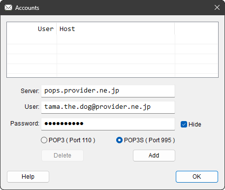

すると, 下のようにリストに入力した内容 ( の一部 ) が反映されます.

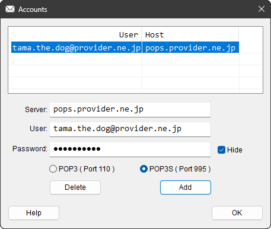

リストに入ったのを確認したら, <kbd>OK</kbd> ボタンを押すと完了です.
<br>
入力された情報は暗号化を施した上でセーブします.
情報漏洩のご懸念には及びません.

アカウントの登録が完了すると, 直ちにメールサーバー ( POP サーバー ) との通信を開始します.

タスクバーの通知領域にあるアイコンが赤くなった場合は, 登録内容のいずれかが誤っています.
アイコンにマウスカーソルをあてがうと, 下記のように簡単な説明が出ます.

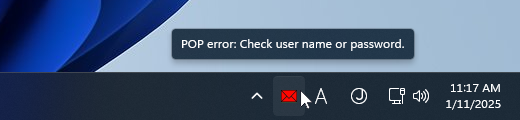

で, この「簡単な説明」のバリエーションですが, 下記のようになっています.

| 文言 | 意味 |
| --- | --- |
| `Connection error: Check server name.`| 指定されたサーバーにつながりません.<br>サーバー名が正しいか見直してください. |
| `POP error: Check user name or password.`| 通信が拒否されました.<br>ユーザー名とパスワードが正しいか見直してください. |

上記のいずれかに引っかかった場合は設定を見直します.
見直すには, 赤いアイコンをマウスで右クリックします.
すると, [冒頭](#運用)で紹介したようなポップアップメニューが出てきます.

`Accounts...` を選ぶと再挑戦できます.
( `Exit` を選ぶとあきらめます. )

そして, 下記のようになんだかアイコンが目立たない灰色になってしまった
( その前にちょこっとアイコンが黄色くなったような気がする ) あなた.

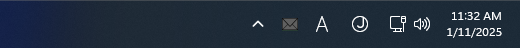

おめでとうございます! あなたの入力に誤りはなかったのです.
その灰色は, 何かが無効になっていることを示すものではありません.
サーバーと通信した結果, 新着メールが来ていないことが確認されたという状況を示すものです.

アイコンのカラーバリエーションとその示す意味を下記に挙げておきます.

| イメージ | 意味 | で, どうすれば? |
| :-: | --- | --- |
|   | アカウント未設定 | メールアカウントを設定しましょう. |
|  | サーバーと通信中 | 黙って見守りましょう. |
|    | 新着メールなし   | メールが来るのを楽しみに待ちましょう. |
|   | 新着メールあり   | メーラーを起動してメールを読みましょう. |
|     | 通信エラー | アカウントやネットワークの設定を見直しましょう. |

なお, このアイコンですが,
Windows&reg; のデフォルト動作として初回起動時のちょっとしたプレビュー期間が終わると,
見えないところに隠されてしまいます.
その場合は, アイコンの並びの左側にある `^` をクリックしてみましょう.
すると隠されたアイコンのみなさんが囲まれている小さなウィンドウが現れるので,
その中に居る  をつかんで引きずり降ろす ( マウスでクリックしたままタスクバーまでドラッグする )
と表示されたままになります.

そんなこんなで
 [Accounts](#accounts) の設定が無事完了したら, 次は
 [Filter](#filter)に進みます.

### [Filter](#readme)

メールの通知ができるようになったことを確認できたら, 次はスパムメール対策です.<br>
「Filter」という当たり障りのないメニュー名で表されていますが,

* 「こういうメールはスパムメールである」という「区別」
* 「こういうメールはどうせスパムメールに違いない」という「差別」

という「スパムメールかどうかの判定条件」をあなたの交友関係に基づいて設定するメニュー項目です.

アイコンを右クリックしたときに現れる
[ポップアップメニュー](#運用)から `Filter...` を選ぶと,
タブ式のダイアログが現われます.
タブをクリックすると設定項目が選べます.
`Filter` には以下の項目があります.

| 設定項目 | 設定内容 |
| --- | --- |
| [`Authentication`](#authentication)	| 認証結果による区別		|
| [`Coding`](#coding)			| 文字コードによる区別		|
| [`Domain`](#domain)			| ドメイン名による差別		|
| [`Name`](#name)			| 名義による区別			|
| [`Recipient`](#recipient)		| 宛先による区別			|
| [`Sender`](#sender)			| 送信者の振る舞いによる区別	|
| [`Time Zone`](#time-zone)		| タイムゾーンによる差別		|
| [`Word`](#word)			| 言葉による区別			|
| [`whitelist`](#whitelist)		| 「ホワイトリスト」による救済	|

いずれかの設定を変更した場合は,
その新たな設定でログ ( `.eml` ) を再評価してみるか問い返されます.
これに <kbd>Yes</kbd> と答えると,
いま蓄積しているログ ( `.eml` ) 全てを再評価します.
少々時間がかかりますが, この結果,
ログ ( `.txt` ) 中の `Discard-Reason:` がどう変わるか興味のある方は試してみるのもいいでしょう.
「Filter 設定が甘かった」 or 「やり過ぎた」の判断材料になります.

以下, それぞれの設定項目についての説明です.

#### [Authentication](#readme)

[認証](https://ja.wikipedia.org/wiki/送信ドメイン認証)
( [Authentication](https://en.wikipedia.org/wiki/Email_authentication) )
の結果に従って, 届いたメールを「区別」します.

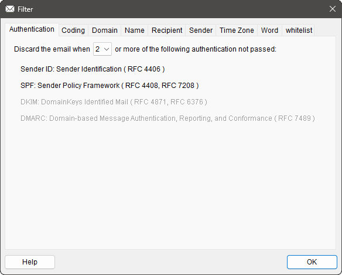

認証の方式にもいくつかありますが,
どの認証結果がもたらされるかはご契約のプロバイダーによって異なります.
ご契約のプロバイダーがサポートしていない認証方式は, 画面上は薄く表示されています.

届いたメールのメールヘッダーを見ると, 認証結果が判ります.
下記のような `Authentication-Results:` という一節があるはずです.

```
Authentication-Results: mx.provider.ne.jp;
 spf=pass smtp.mailfrom=pochi.the.cat@provider.ne.jp;
 sender-id=pass header.From=pochi.the.cat@provider.ne.jp
```

この例の場合, 受信者側のプロバイダーが提供している認証は,
[SPF](https://ja.wikipedia.org/wiki/Sender_Policy_Framework) と
[Sender-ID](https://ja.wikipedia.org/wiki/Sender_ID) の2つのようです.
( 逆に言えば [DKIM](https://ja.wikipedia.org/wiki/DKIM) と
[DMARC](https://ja.wikipedia.org/wiki/DMARC) はサポートされていないようです. )
`Authentication-Results:` はプロバイダーが付けている情報なので,
送信者によって偽造できません,
客観的に信じられる情報です.

そして, 上記の例では
`spf=pass` と `sender-id=pass` となっているので, SPF と Sender-ID の両方が pass しています.
なので,
このメールは `pochi.the.cat@provider.ne.jp` 名義の送信者が `pochi.the.cat@provider.ne.jp` から送ったものに間違いないと,
プロバイダーが認証済みということです.<br>
<sub>(「なに当たり前のこと言ってんだ?」と思われる向きもあろうかと存じますが,
世の中には「メール配信代行業者」というものがあって,
「名義」はクライアント企業なのに実際の「送信者」は代行業者というメールも多いのです.
おかげでスパムメールかどうかの見極めも面倒になりました. )</sub>

で, 上の設定画面の例では

* 2つ以上の認証が pass していなかった場合は, メールを破棄する

となっています.
( 逆に言えば「pass しそこないが許されるのは 1つまで」ということです. )

上記のメールの例では「pass しそこなった認証」は `0` ( 2つとも pass している ) なので,
このメールは破棄されず届きます.

上記の画面にあるプロバイダーの例では DKIM や DMARC は提供されていませんが,
それらは「pass しそこなった認証」にカウントされません.

ところで,
「pass しそこないが許されるのは 1つまで」に対して
「1つでもひっかかったらダメだろ?」
と思われる向きもあろうかとは存じますが,
居るんですよ, マジで.
[1つぐらい引っかかってしまう送信者](Examples.md#authentication-results-が全ては-pass-していない正当なメールの例)ってのが.<br>
<sup>( メール配信を代行業者に頼んでいる企業とかに多いんです.
代行業者の仕事が粗いのか, クライアントの協力が不十分なのかは存じませんが. )</sup>

それらを全部ハネてしまってはダメなので,
「2つ以上 pass しなかったら」というややこしい基準で判定しています.
そしてこの「2つ」を設定上のデフォルト値 ( 何も設定しなくても最初っからそうなっている ) としています.
このデフォルト値のチョイスは

* [大抵のプロバイダーは2つ以上の認証結果を付けている.](https://www.dekyo.or.jp/soudan/contents/auth/index.html)
* どんな送信者 <sup>( 代行業者 )</sup> でも pass しそこなうのはせいぜい 1つまで.

という理由によるものです.

ところでこの「pass しそこなった」という遠回しな言い方ですが,
`pass` 以外にも下記のバリエーションがあるので, 「`pass` 以外の結果」という意味で使っています.

| 結果を表す文字列 | 意味 |
| --- | --- |
| `pass` | 正しく認証された |
| `fail` | 偽造されている |
| `hardfail` | 偽造されている |
| `softfail` | 偽造されているかも |
| `temperror` | 一時的な認証エラー |
| `permerror` | 継続的な認証エラー |
| `neutral` | 認証結果が非公開 |
| `none` | 認証結果がない |

[`pass` 以外の結果をどう扱うべきか](https://salt.iajapan.org/wpmu/anti_spam/admin/tech/explanation/spf/#60)については,
色々と解釈の幅があるというのが RFC 的スタンスのようですが,
「スパム対策」である本アプリとしては「`pass` 以外はダメ」と決めつけています.
( ただし, デフォルトでは「ダメでも 1つまでは見逃す」となっていますが. )

なお, 色々解釈の幅のある「`pass` 以外」ですが,
そのうち `fail` と `hardfail` はほぼ間違いなく「偽造」を示すものなので,
これらに関しては 1つでもあればアウトとして扱っています.
「1つまではセーフ」といった生ぬるい判定はしません.

この認証によるスパムメールの「区別」は, 何らの先入観もない正当なもので, 「差別」にはあたりません.
この「区別」に基づいて, メールに注意喚起のマークを付けたり, いっそメールを自動削除してくれたりを,
サービスとして提供してくれているプロバイダーもあると思います.
実際, コレがあるだけでもスパムメールがぐっと減ります.

が, 「減る」だけです. この認証だけではハネられないスパムメールというのも存在します.
それで当アプリでは, 追加の「区別」や, さらに踏み込んだ「差別」を用意しています.


#### [Coding](#readme)

届いたメールの文字コードによってメールを「区別」します.

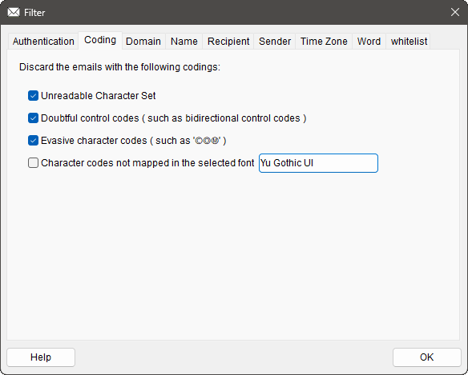

下記 4つの対象を「区別」できます.

1. 読めない文字セット<br>
Windows&reg; が保有するデータベースにない文字セットで書かれているメールを破棄します.<br>
このデータベースは, 以下の[レジストリー](https://ja.wikipedia.org/wiki/Windows_レジストリ)の配下にあります.<br>
`HKEY_CLASSES_ROOT\MIME\Database\Charset\`<br>
このデータベースにない文字セットを指定されても Windows&reg; としては読めない,
という意味でふるい落としています.
あなたが読めない外国語の文字セットをハネているわけではありません.
<sub>( 日本に向けてのスパムメールを[GB 2312](https://ja.wikipedia.org/wiki/GB_2312)で書いてくるうっかりさんも居るには居るのですが,
こういうメールは他の条件でもハネられる場合ばかりだったので,
特に文字セットで「差別」する機能は設けていません.
この条件に引っかかるのは, ホントに何かの技術的な誤りのときだけです. )</sub>

1. 疑わしい制御文字<br>
[UNICODE の制御文字](https://en.wikipedia.org/wiki/Unicode_control_characters)
が埋め込まれているメールを破棄します.<br>
読み手に実際とは異なる文字列を表示して見せたり, パターン照合から逃れるために使用されたり, と,
こういう文字コードが埋め込まれているメールにはロクなものがありません.<br>
<sub>( ただし, 右から左に書く言語の場合は, ごく普通に「右から左に読んでね。」という制御文字が入っていることがあるので,
こういう言語とお付き合いのある方はこの☑を外してください. )</sub>

1. 回避的な文字コード<br>
埋め込まれたリンク先などに ASCII コードではなく UNICODE の似た文字が埋め込まれたメールを破棄します.<br>
たとえば “.ⒸⓄⓂ” とかです.
“.ⒸⓄⓂ” を “.com” と善意に解釈してくれるメーラーでもあるのですかね?
だとすると, こうした文字コードを埋め込んだメールというのは, その善意につけ込んでパターン検索から逃れるためのものでしょう.
こういう文字コードが埋め込まれているメールにはロクなものがありません.<br>
<sub>( ひょっとすると,
「普通に書くより目立つから」という理由でわざわざこういう文字コードを使うファンキーな店舗もあるかもしれません.
そういうファンキーな店舗とお付き合いのある方はこの☑を外してください. )</sub>

1. マップされていない文字コード<br>
選択したフォントが持っていない文字が混入しているメールを破棄します.<br>
たとえば [Arial](https://ja.wikipedia.org/wiki/Arial) などの英文用フォントを選択すると, 漢字を含んだメールはハネられます.
つまり, フォントを使って言語の区別を行っているわけです.
あなたが普段使っているフォントを選択することによって,
あなたが読めない外国語の文字が混入したメールをハネます.
( ただし, どこの国語でもない記号や絵文字の類はハネません. )<br>
フォントを選択する前のデフォルトは
[Windows&reg; が使っているフォント](https://learn.microsoft.com/en-us/windows/apps/design/globalizing/loc-international-fonts)です.
あなたが普段使っている国語で書かれたメールはハネません.
なのでデフォルトのままでもいいのですが,
フォント名をクリックすると,
フォントを選択するための[文字コード表 ( Character Map )](CharacterMap.md) が開きます.

デフォルトで, 1. から 3. までは ON, 4. は OFF にしています.


#### [Domain](#readme)

届いたメールの発信元の[ドメイン名](https://ja.wikipedia.org/wiki/ドメイン名)によってメールを「差別」します.

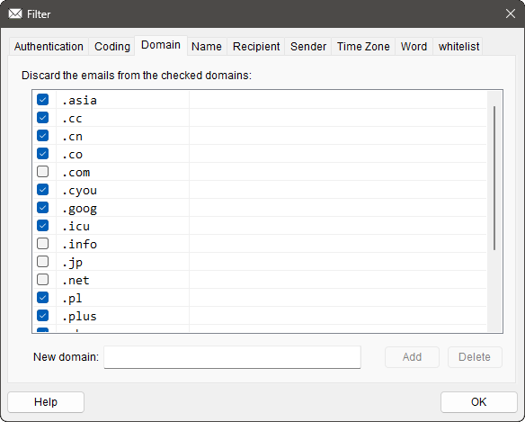

本アプリでは,
届いたメールの[トップレベルドメイン](https://ja.wikipedia.org/wiki/トップレベルドメイン)を記録に残しています.
それを上の画面の例のようにリストに表示し,
☑を付けたドメインを「要らないメールの発信元」として「差別」し,
以降, そのドメインに属する送信者からのメールを全て破棄します.

まるで「[クレタ人は皆うそつき](https://ja.wikipedia.org/wiki/エピメニデスのパラドックス)」という言い分を信じて,
クレタからの通信をすべて遮断してしまうようなやり方です.
しかし,
クレタとの交流が全くない立場の人々にとっては,
「そんな私にクレタからのメールが来たら、それはスパムに違いない。」という判断もアリでしょう.

考え方としてどうかと思いますが……, 悲しいことに, コレが結構効くんです.

なお, この「差別」したドメインかどうかのチェックですが,
メールの送信元アドレスのみならず, メール本文に埋め込まれているリンクに対しても行っています.
なので, 「ヤバくない国」からの送信を装った「ヤバい国へのリンク」が埋め込まれたメールも同様にハネます.

ところで, ここでは「ドメイン」と説明していますが,
実のところ送信元メールアドレスやリンク先アドレスと,
リスト上で☑された文字列が後方一致するか否か ( 右から比べて同じかどうか ) で判断しているにすぎません.

なので,
「新規ドメイン」として特定の送信元のメールアドレスを加えておくと,
そのメールアドレスから来たメールも同様にハネます.

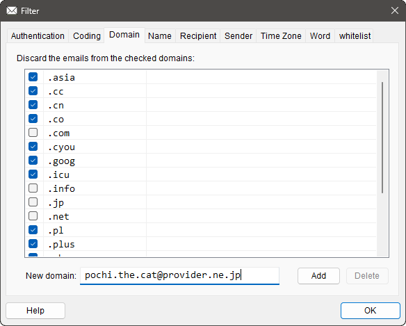

上の例のように, ハネたい相手のメールアドレスを `New Domain:` に入力してから <kbd>Add</kbd> を押すと,<br>
下の図のようにリストに入ります.

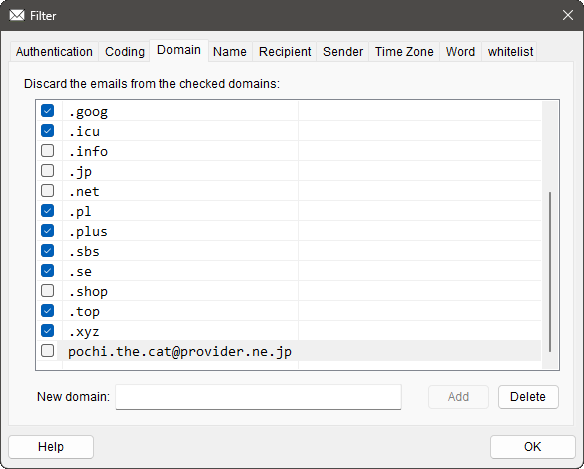

これで☑を入れると, 以降, この人からのメールは自動的に削除されるようになります.

ということで, ドメインが対象にせよメールアドレスが対象にせよ,
事実上の「[ブラックリスト](https://ja.wikipedia.org/wiki/ブラックリスト)」ということになります.


#### [Name](#readme)

届いたメールの名義によってメールを「区別」します.

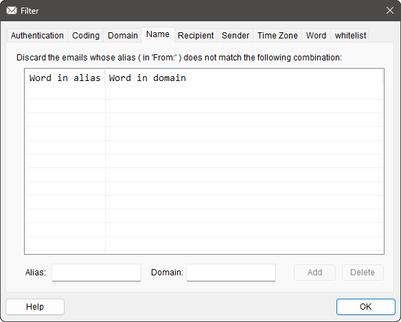

この「名義」とは,
メールヘッダーの `From:` 欄に書いてある「名義」のことで,
`<` と `>` で囲まれた送信者のメールアドレスと,
その前 (左) に置かれている ( 置かれていない場合もまれにありますが ) Alias ( 別名 ) のペアで構成されています.

例えば,

`From: "Amazon.co.jp" <account-update@amazon.co.jp>`

という例では:

`"Amazon.co.jp"` が Alias で, `account-update@amazon.co.jp` がメールアドレスです.

スパムメールではほぼ全ての例でこの Alias を騙っています.
図式的には

`Amazon.com <spammer@phishing.com>`

というかたちです.

この Alias で受信者を騙そうとしているわけです.
ただ, そのほぼすべての例でメールアドレスは本家のものとは異なるメールアドレスになっています.
メールアドレスまで本家をパクると, [Authentication](#authentication) で引っかかりやすいからでしょう.

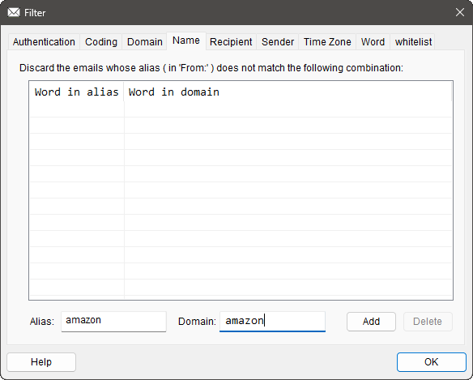

で, この [Name](#name) で本家の公式な Alias と公式なメールアドレスのペアを登録しておいて,
Alias を騙ったメールが来たら, メールアドレスが登録してある公式なものと異なるので,
スパムメールと判断してハネる, というわけです.

上図のように `Alias:` 欄と `Domain:` 欄に,
それぞれ由緒正しい Alias と本家のメールアドレスのドメイン ( `@` の後ろ ) をペアで入力します.
上図のようにそれぞれに含まれる「一部の単語」でも構いません.
その場合でもそれなりに騙りのメールをハネる効果が期待できます.

 Alias ( の一部 ) とメールアドレス ( の一部 ) を入力が済んだら,
<kbd>Add</kbd> ボタンを押します.

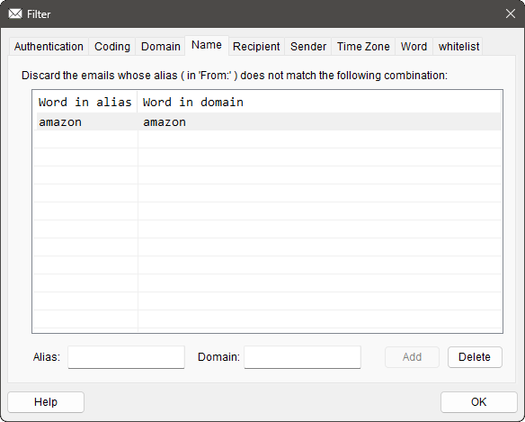

<kbd>Add</kbd> ボタンを押すと, 上図のように入力したペアがリストに登録されます.

入力ミスがあったら, リスト上の該当行を選んで <kbd>Delete</kbd> ボタンを押します.

予定通りの入力が済んだら, <kbd>OK</kbd> ボタンを押しましょう. それで登録完了です.

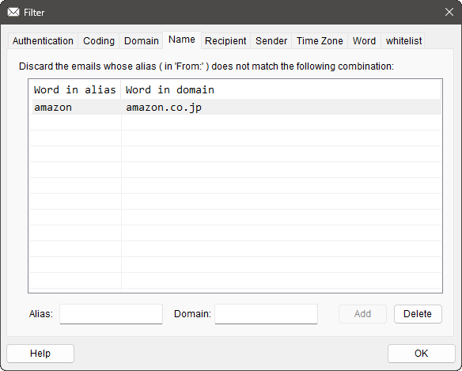

ドメインの入力に `*` や `?` が含まれていると,
いわゆる「[正規表現](https://ja.wikipedia.org/wiki/正規表現#%E5実用的説明)」とみなし,
送られてきたメールが名乗っているドメイン名と以下のように照合します.

| キャラクター | 照合方法 |
| --- | --- |
| `*` | 0 文字以上の任意の文字列と合致 |
| `?` | 0 または 1 文字の任意の文字と合致 |

ドメインの入力に `.` が含まれていると,
「一部の単語」ではなく「ドメイン名の右側」が登録されているものと判断し,
送られてきたメールが名乗っているドメイン名の右側と一致するかを判定します.
結構入力が面倒ですが, スパムをハネる精度は上がります.

 `*` や `?` または `.` を含まない場合は,
送られてきたメールが名乗っているドメイン名に入力した単語が含まれているかで判定します.

2, 3ドメイン程度の使い分けなら,
その 2, 3件を全て登録してしまうべきでしょう.
同じ Alias で複数のドメインを登録することもできます.

本家のドメインを調べるには,
web 検索で「[amazon メール ドメイン](https://www.google.co.jp/search?q=amazon+メール+ドメイン)」
とか入力するといいでしょう.
<br>
<sup>
この検索には google が良さげですね.
[Bing](https://www.bing.com/search?q=amazon+メール+ドメイン) でやると, なんかピントのぼけた結果が出てきます.
( 2025年3月現在 )
</sup>

さて, どこまでこの登録をするかはあなたのところに到達するスパムメールの状況と相談ですが,
スパムメールというものは原理的には

* 非正規のアドレスから送られてくる正規のフリをしたメール

なので, 正規のアドレスの登録を徹底しておけば全てのスパムを跳ね返すことができるはずです, 原理上は.

登録されていない Alias に関しては, なにもしません.
毎回面白い Alias を名乗ってくる愉快なお友達が居たとしても,
そのメールはハネられずに到達します.
<sub>
( 有名企業名とカブらない限りは )
</sub>

また, どういう Alias を騙ってくるのかは, スパマーのやりたい放題なので,
「amazon」とは名乗らず「アマゾン」と名乗ってくる事例もあるかもしれません.
この場合は,
「amazon」を登録したのとは別に「アマゾン」も登録しておかないと撃ち漏らします.
本家が名乗る正式な Alias 以外に, 「スパマーが名乗りそうな Alias」も登録しておく必要があるわけです.

ところで,
登録したい件数が多くなってくると,
いちいち上記 GUI を介してちまちま一件ずつ入れていくのも面倒に感じるかもしれません.
そう感じた場合は,
下記のように Alias とドメイン名をタブ (`\t`) で仕切ったテキストファイルを作っておきましょう.
```
AEON		aeon.co.jp
ANA		ana.co.jp
ANA		amadeus.com
Amazon		amazon.com
Amazon		amazon.co.??
American Express	aexp
American Express	americanexpress
Apple		apple
DCカード		dccard.co.jp
DCカード		cr.mufg.jp
DCカード		dnp-cdms.jp
DHL		dhl.com
```
で, そのテキストファイルをこの Name のページに Drag & Drop すると,
テキストファイル中の全項目が現在の設定に追加されます.
最後に <kbd>OK</kbd> ボタンを押せば, 一気に登録完了です.

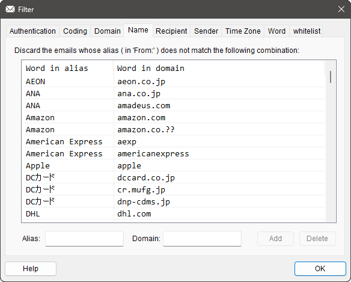

実を言うと, 一旦ファイル化してからの Drag & Drop のみならず,
中身を Copy (<kbd>Ctrl</kbd>+<kbd>C</kbd>) したものをこの Name のページに Paste (<kbd>Ctrl</kbd>+<kbd>V</kbd>) しても,
登録内容を丸写しすることができます.
なので, 今この説明をご覧のブラウザー上で上記の設定例の部分を Drag して Copy して,
その状態で Name に Paste しても上記の設定例が丸写しできます.
が, どうせ丸写しするなら,
[実際に当方に来たスパムの Alias を面白がって全て登録してみた例](Examples.md#filter-の設定例)を
Copy & Paste した方がより面白いでしょう.
<br>
<sup>
( 一度そういう道に走ると, 「新作」が到着するたびに対抗策を登録したくなるという心理的効果が働いてしまいますが. )
</sup>


#### [Recipient](#readme)

届いたメールの宛先によってメールを「区別」します.

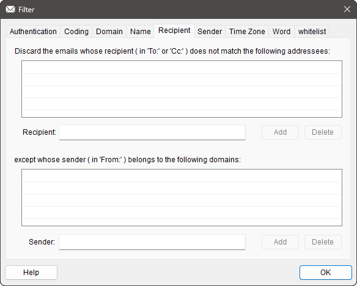

「宛先？私に決まってるじゃん。だから私に届いたんでしょ？」
と思われる向きも多いかと存じますが,
どうも最近, 「私宛てじゃないメール」が「私」に届くことが多くなってきました.
<sub>
( 2025年9月 当方調べ )
</sub>

たとえば, `tama.the.dog@provider.ne.jp` さんのところに届いたメールで,

```
From: Arnazon <store-news@arnazon.co>
To: ponta.the.fox@somewhereelse.co.jp
```

と, 知らない人のメールアドレスがメールヘッダーに書いてあったりします.
そして, `To:` や `Cc:` のどこにも
`tama.the.dog@provider.ne.jp` とは書かれていません.
にもかかわらず `tama.the.dog@provider.ne.jp` に届いている, といった具合です.

ではなぜこのメールが `tama.the.dog@provider.ne.jp` に届いているのかというと,
`To:` や `Cc:` ではなく `Bcc:` に `tama.the.dog@provider.ne.jp` と書いてあったからです.

まともなメール配信サービスなら,
[Bcc:](https://ja.wikipedia.org/wiki/ブラインドカーボンコピー) でメールをバラまくことはしません.
宛先一人ひとりを `To:` に指名したメールをひとつずつ個別に送信します.
不特定多数に `Bcc:` で一斉送信されているメールは, 十中八九スパムメールです.
そんなスパムメールを「区別」するフィルターが, この Recipient です.

ここのフィルターは, 上下 2つのリストがあって,

* 「この宛先じゃないメールは捨てる」というリスト
* 「ただしここからのメールは除く」というリスト

の二段構えになっています.

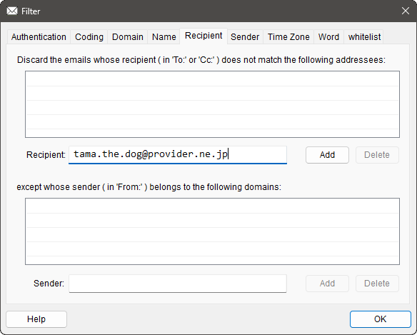

このフィルターを設定する場合は,
上図のように `Recipient:` 欄に自分のメールアドレスを入力します.<br>
<kbd>Add</kbd> ボタンをクリックすると,
下図のように入力したメールアドレスがリストに登録されます.

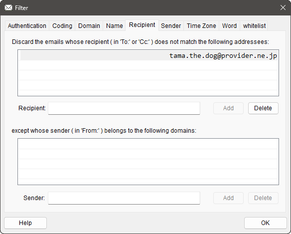

この状態で <kbd>OK</kbd> ボタンをクリックすれば,
以降, 登録しておいたメールアドレスが届いたメールの `To:` か `Cc:` に見当たらない場合は,
そのメールを破棄します.
つまり, `Bcc:` でバラまかれたメールはシャットアウトするわけです.

デフォルトでは, リストは空っぽです.
この状態ではこのフィルターは何もしません.

一つでもメールアドレスをリストに登録すると,
そのメールアドレス宛て以外は破棄します.
[Accounts](#accounts) に複数のメールアドレスを登録されている方は,
それらのメールアドレス全てをここのリストにも登録し切ってください.
<br>
<sub>
なんか二度手間な感じもしますが,
[Accounts](#accounts) に登録した情報からメールアドレスを合成することはできません.
似てはいますが, 同じとは限らないのです.
なので, ここでは手ずからメールアドレスを入力していただく必要があるのです.
</sub>

ところで,
注意深い方は
「不特定多数に `Bcc:` で一斉送信されているメールは, 十中八九スパムメールです.」
という先ほどの言い分に「十中八九？100% じゃなくて？」と疑問を持たれたかもしれません.
以下その疑問への答えです.
<br>
<sub>
あなたのそういう細かいところが人にどう思われるかは, ここでは扱わないものとします.
</sub>

「十中八九」に属さないケース【その１】

人はたまに「特定多数」に `Bcc:` でメールを配ることがあるようです.
たとえば,
勤めていた会社の退職のあいさつを「メールで失礼する」ときなんかです.
こういう場合, その退職者は自分がお世話になった方々に `Bcc:` でメールを配ったりします.

そういう `Bcc:` の使い方を完全に否定するのもナンなので,
そういうメールを配りそうな人, あるいはそういうメールが配られそうなドメインを,
例外として登録できるようにしてあります.
それが下の方のリストです.

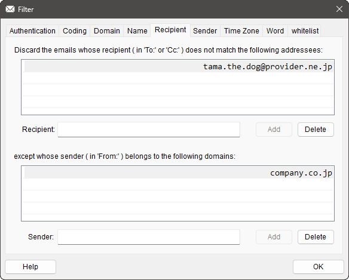

上図のように,
下の方のリストにドメインを登録しておくと,
そのドメインのメンバーが `Bcc:` で配ったメールは破棄しません.
ドメインのみならずメールアドレスも登録できます.

「十中八九」に属さないケース【その２】

ごく少数ですが, こういう `Bcc:` でのメール送信を行う業者も居ることは居ます.
<sub>( 2025年 9月現在 当方調べで該当 1社. )</sub>

この Recipient のフィルターをかける前に,
お手許のメーラーであなたに届いているメールの「宛先」をざっと確認してみてください.
`recipients not specified` とか `undisclosed-recipients` とかになっているケースが実在したら,
それが `Bcc:` で送信されているメールです.
その `From:` のメールアドレス ( もしくは所属ドメイン ) を下の方のリストに登録しておきましょう.

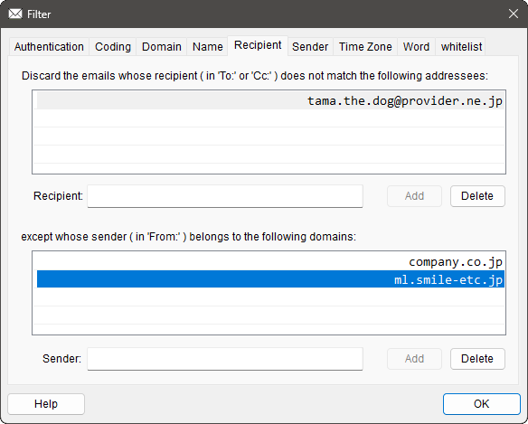

設定がややこしくなるのを承知の上で, 下の方のリストを設けた理由は,
こういうメール配信者が実在するからです.
<br>
<sub>
あえて名指ししておきますが,
「ＥＴＣマイレージサービス事務局」からのメールは,
全て[この形式](Examples.md#authentication-results-が全て-pass-している代行業者メールの例)になっています.
<sub>( 2025年現在 )</sub>
メール配信が代行業者に委託される前からこの形式なので, クライアントからの指定なのだと思われます.
[フィッシングのエサにされることが多い配信元](https://www.etc-meisai.jp/caution/caution_phishing.html)なので,
もう少しメールの送り方にナーバスになっていただきたいものです.
</sub>


#### [Sender](#readme)

疑わしい送信者を締め出すためのその他の「区別」です.

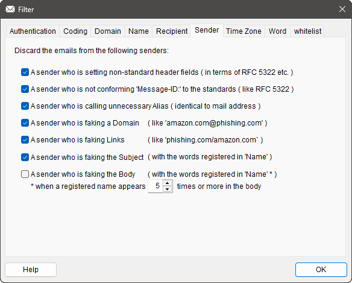

現状で用意しているのは下記の 6つです.

1. Message-ID が標準に準拠していないメール<br>
メールヘッダーには, そのメールを一意に識別するための Message-ID という識別コードが振られていますが,
このコードの書き方にも一応
[準拠すべき標準](https://datatracker.ietf.org/doc/html/rfc5322#section-3.6.4)というものがあります.<br>
スパムメールにはこの辺がいいかげんなものが多いので,
判断の材料の一つとして加えてあります.

1. 無駄な Alias ( 別名 ) で呼びかけてくるメール<sup>※</sup><br>
上とは逆に, `To:` にある受信者の Alias に関するチェックです.<br>
スパムメールも Alias で呼びかけてくることがありますが,
スパムメール送信者は宛先のメールアドレスしか知らないので,
Alias もメールアドレスから素材を採った文字列になります.
正規のメールは一般的にそんなことはしない
( ユーザー登録時に入力した氏名で語りかけてくるか, そもそも Alias なんか付けない ) ので,
こういう意味のない Alias を振ってくるメールを破棄します.<br>
※ これは当方の経験則によるチェック項目なので,
もし副作用 ( 要るメールまで棄てられた ) が出たら☑を外してください.

1. ドメインを装ったメールアドレス<br>
`From: amazon.com@phishing.com` のように, ぱっと見, 実在する企業の正規のドメインからのものであるように見せかけながら,
実はとんでもない送信者から来ているようなメールを破棄します.<br>
送信元アドレスの冒頭を一瞥して送信者を判断する癖のある人を陥れるやり口です.<br>
子供騙しのようですが ( と言っては子供に失礼か )
[ホントにあるんですよ](Examples.md#dkim-signature-があるスパムメールの例), こういうの.

1. ドメインを装ったリンク<br>
送信者を騙った「ドメインを装ったメールアドレス」や「別名を騙ったメールアドレス」に対し,
メールに埋め込まれたリンクを騙ったものです.<br>
`https://phishing.com/amazon.com` のように, ぱっと見, 実在する企業の正規のドメインのものであるように見せかけながら,
実はとんでもないウェブサイトを指しているリンクが埋め込まれたメールを破棄します.<br>
リンクの末尾を一瞥して URL を判断する癖のある人を陥れるやり口です.

1. Subject を騙ったメール<br>
`Subject: 【至急】Amazon.co.jpアカウント利用制限解除のお願い` のように,
ぱっと見, `Amazon` からのメールであるように見せかけながら,
実は `Amazon` とは無関係な送信者から来ているようなメールを破棄します.<br>
このチェックは [Name](#name) に設定された「別名」と「メールアドレス」のペアに基づいて実施しています.<br>
`Subject:` の中にいずれかの送信元の公式な「別名」として登録されている単語が含まれていた場合,
その単語にひも付けされた公式な「メールアドレス」からのメールでなければ,
その「別名」の持ち主を騙ったメールと判定して破棄します.

1. 本文で誰かを騙っているメール<br>
上記 5. のように Subject を騙っているわけではなく,
メールの本文だけで誰かを騙っているようなメールを破棄します.<br>
このチェックは [Name](#name) に設定された「別名」と「メールアドレス」のペアに基づいて実施しています.<br>
メール本文の中にいずれかの送信元の公式な「別名」として登録されている単語が規定回数
( デフォルトでは `5` 回 ) 以上含まれていた場合,
その単語にひも付けされた公式な「メールアドレス」からのメールでなければ,
その「別名」の持ち主を騙ったメールと判定して破棄します.

デフォルトで, 1. から 5. までは ON, 6. は OFF にしています.


#### [Time Zone](#readme)

メール発信元の[タイムゾーン](https://ja.wikipedia.org/wiki/等時帯)によってメールを「差別」します.

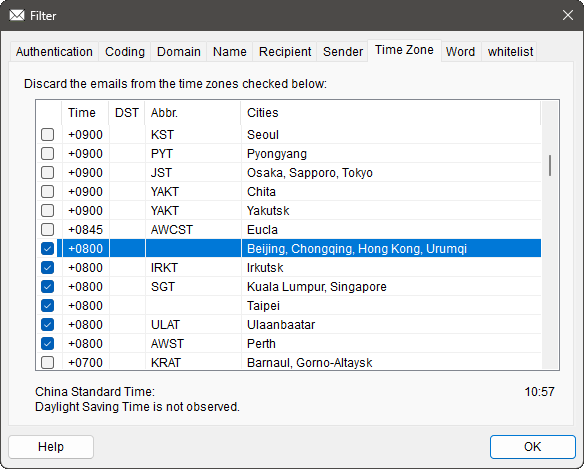

[Domain](#domain) による「差別」もたいがいですが,
こっちの「差別」はもっと範囲が広いです.
上は中国からのメールをハネようと同国が属している `UTC+0800` を☑してみた例ですが,
何の関係もないオーストラリアのパース ( Perth ) まで巻き込まれていることが判ります.
オーストラリアの西側に友達の居る人は使わない方が良い手段でしょう.

ただ……, これも結構効くんですよ.
どこから出しているんだか判らないようにしている送信者って, 居ますからね.

「よし解った！俺は海外には友達も居ないから、外国は全部☑だ！」

と思い切ったあなた, それは早計かもしれません.
大手企業には(わざわざ)海外から国内に向けたメールを配送するところもあるんですよ.
( たとえば
[Amazon は UTC の `+0000` から連絡がきます](Examples.md#date-がどこの国だか判らない正当なメールの例). )
友達はだいじょうぶでも, ユーザー登録したメーカーからの連絡が途絶えるかもしれません.
思い切った手を打つのは, ご自身のメール履歴をよく確認してからにしましょう.

ところで, この一覧, 「あの国はいま何時かな?」を見るのに便利です.
<kbd>OK</kbd> ボタンの上に出ている時刻表示は, 選んだタイムゾーンの現地時刻を示しています.
[サマータイム](https://ja.wikipedia.org/wiki/夏時間)
( イギリス英語で“Summer Time” / アメリカ英語で “Daylight Saving Time” ) も反映した表示です.
海外の友達と連絡するとき, 現地の時刻を一考するのに便利でしょう.


#### [Word](#readme)

指定した言葉を含むメールを「区別」します.

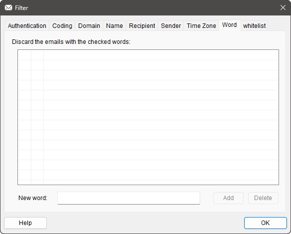

例えば, 「[Foxmail](https://en.wikipedia.org/wiki/Foxmail)」というメーラーから送られてきたメールを区別するには,
メールヘッダーにある `X-mailer:` 欄での自己申告をアテに,
下記のように `X-mailer: Foxmail` という文字列を入力します.

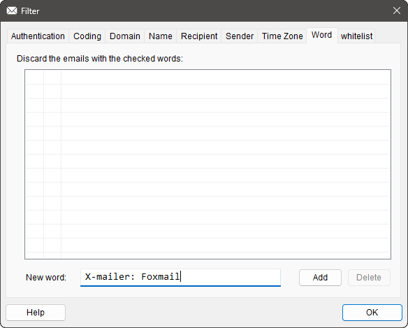

文字列の入力が終わったら <kbd>Add</kbd> をクリックします.

すると入力した文字列が下記のようにリストに追加されます.

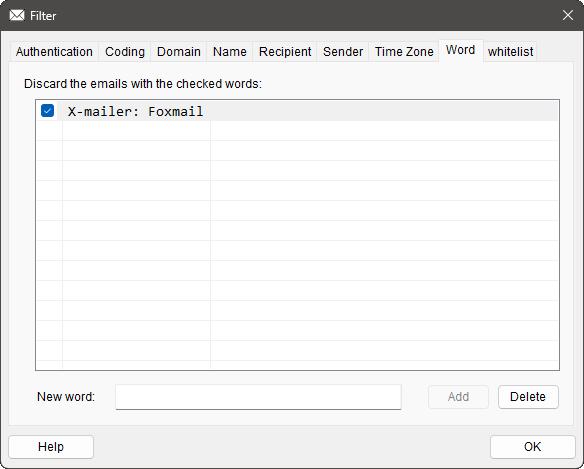

追加直後は上のようにチェックボックスが☑されていて,
リストの文字列を含むメールは破棄されます.

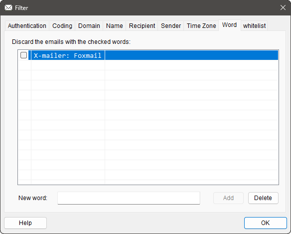

チェックボックスの☑を外すと, リストの文字列を見つけてもお目こぼしします.

この「検閲」はメールヘッダーのみならず, メール本文も対象とします.
あまり短い単語を指定すると思わぬ副作用に巻き込まれることもあるので,
言葉の指定は慎重に行いましょう.


#### [whitelist](#readme)

これまでご紹介したメールをハネるための「区別」や「差別」とは違い,
ここで登録しておいたメールはハネずに受け入れます.
つまり, 「[ホワイトリスト](https://ja.wikipedia.org/wiki/ホワイトリスト)」というわけです.

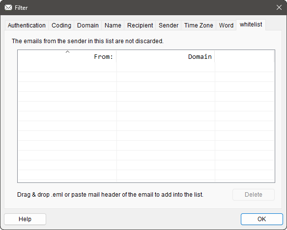

他のチェック項目で引っかかったメールも, この「ホワイトリスト」に登録してある送信者からのものは,
引っかかったのをなかったことにして受け入れます.

[Domain](#domain) や [Time Zone](#time-zone) で特定の地域全体を排除しておきながらも,
同地域に在住する数少ない信じられる相手からのメールは受け入れる, といったような用途に使えます.

さて, ここからの話は友達の少ない方限定の手段です.<br>
「私にメールを送ってくる人なんて、あいつとこいつと、あと、あの会社ぐらいなもんだ。」というあなた,
あなたにおススメの良い方法があります.

まず, [Authentication](#authentication) で,
「pass しそこなった認証」の件数を `0` 以上に設定するのです. ( 下図参照 )


こうすると, 全ての認証が pass しても, つまり「pass しそこなった認証」の件数が `0` でも,
「`0` 以上」という条件に引っかかるので全てのメールが破棄されます.
が, ここで「ホワイトリスト」に登録されている送信者だけはお目こぼしされます.
つまり, あなたが認めた送信者からのメールだけがあなたに届くようになるのです.

友達と取引先全てを「ホワイトリスト」に登録するのがちょっと面倒ですが,
なに, 友達の少ないあなたのことです. すぐに作業は終わるでしょう.

で, その登録方法ですが,
[Domain](#domain) のようにメールアドレスを直接入力する方法は用意していません.
その友達や取引先からのメールを

* [`.eml`](https://www.google.com/search?q=.eml+ファイル) ファイルとしてセーブされたものをこの画面に Drag & Drop する.
* [メーラーで表示させたメールヘッダー](https://www.dekyo.or.jp/soudan/contents/ihan/header.html)
を全選択 (<kbd>Ctrl</kbd>+<kbd>A</kbd>) して Copy (<kbd>Ctrl</kbd>+<kbd>C</kbd>) してから,
この画面に Paste (<kbd>Ctrl</kbd>+<kbd>V</kbd>) する.

の 2通りの手段が用意されています.

上の手段のいずれかを実施すると, 下のように友達のメールアドレスが登録されます.

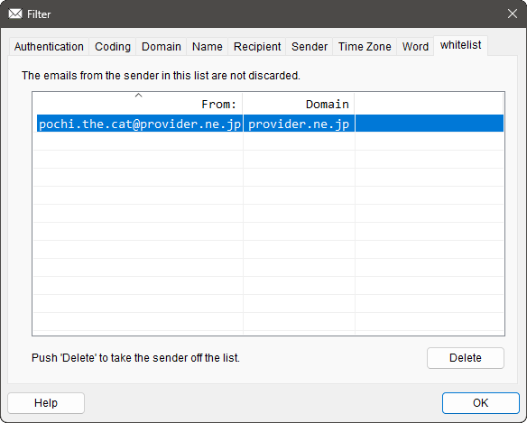

[Domain](#domain)のように直接入力を許していないのは,
送信者の正確な名義 ( メールヘッダーの `From:` にあるメールアドレス ) と,
実際の送信者の正確なドメイン ( メールヘッダーの `Authentication-Results:` などに記録されている送信元ドメイン )
の 2つの情報のペアが必要だからです.
「ホワイトリスト」との照合はこのペアで行っています.
`From:` だけで照合するとスパムメールの偽造にダマされてしまいますから.<p>
<sub>
ただし, 企業 ( メール配信を登録したベンダーとか ) のホワイトリスト登録には気を付けてください.
いつの間にか ( ユーザーに断りもなく ) 送信者が代わっている場合があるのです.
昔は自前でメールを配信していた企業が, 配信をメール配信代行業者に委託した場合などです.
この場合, 「名義」は変わらないのに「送信者」が代わってしまうので,
この「ホワイトリスト」の条件から外れてしまいます.
( せめて委託前にユーザーに周知してほしいものです. > 各クライアント企業 )
<br>
「ホワイトリスト」に入れておいたはずのあの企業からのメールが途絶えた,
といった場合は, [Logs](#logs)でログを眺めて, お馴染みのあの企業のメールが捨てられていないか確認してみてください.
「どうせ売り込みのメールであろう。そのようなものが途絶えても一向に構わぬ！」( とあるテストユーザー談 ) という方以外は.
</sub>


### [Setup](#readme)

当アプリの動作をあなた好みに設定します.

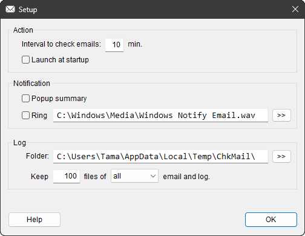

デフォルトのままほっといても特に動作に支障はありませんが,
より好みの動作にカスタマイズすることができます.

#### [Action](#readme)

当アプリの基本動作に関する設定です.

* Interval to check emails<br>
メールをチェックする時間間隔を設定します.<br>
デフォルトは `10` [分] です. そんなもんで十分だと思いますが,
とても待ち焦がれているメールでもあるときは, この間隔を短くするのもいいでしょう.
もちろん, メールサーバーには負担になりますが.

* Launch at startup<br>
Windows&reg; が起動したとき ( 正確にはユーザーがサインインしたとき ) に当アプリを起動します.<br>
デフォルトは OFF になっているので, 「このアプリは使える!」と思われたら, ☑しておくといいでしょう.

#### [Notification](#readme)

メール着信時のお知らせに関する設定です.

* Popup summary<br>
メール着信時にサマリー ( 概要 ) として,
そのメールの`Subject:`, `From:`, `Date:` をまとめたものを画面の端にポップアップ表示します.<br>
デフォルトは OFF になっています.<br>
ON にすると, 着信したメールの概要を下記のように画面の隅っこに表示します.
古いメールが下の方, 新しいメールはその上に積み上げるように表示されます.
<br><br>
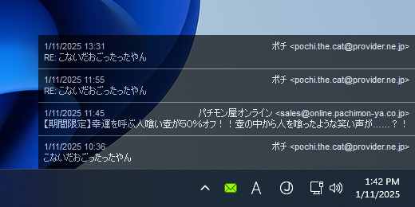
<br><br>
この表示はクリックすると消えます.
しばらくは消えたままでいますが, そこに新たなメールが届くと,
一段積み増した状態で再表示され,
未決の仕事が溜まっていくようなプレッシャーをあなたに与えます.

* Ring<br>
メール着信時にご指定の `.wav` ファイルを鳴らします.<br>
デフォルトは OFF で, `.wav` ファイルは Windows&reg; のデフォルトのメール着信音です.
<br><br>
ところで,
`Ring` させる `.wav` ファイルを選ぶとき,
右の <kbd>>></kbd> ボタンを押して Explorer でファイルを見に行くと,
下図のように File name が中途半端な状態で表示されることがあります.
<br><br>
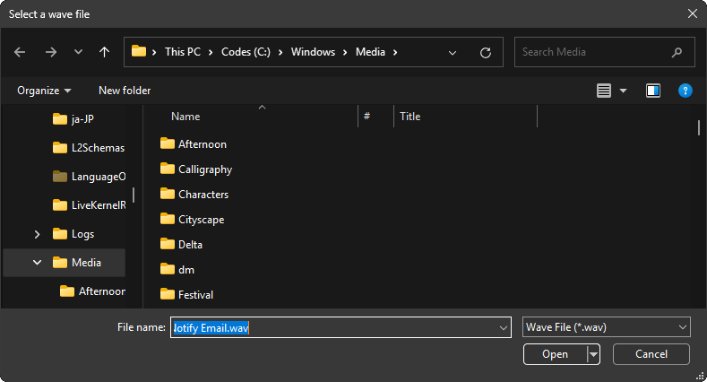
<br><br>
これは
[Windows&reg; のポカ](https://stackoverflow.com/questions/64424601/cmfceditbrowsectrl-is-cropping-the-file-name)
です.
だいぶ前から指摘されているのに, いまだに直っていません.
<br><sup>( 2025年1月に Windows&reg; 11 24H2 で確認 )</sup>


#### [Log](#readme)

* Folder<br>
[ログ](#logs) をしまっておくフォルダーを指定します.<br>
デフォルトは, ユーザーのテンポラリーフォルダーです.

* Keep<br>
`.eml` と `.txt` をそれぞれいくつまでフォルダーにとっておくかを指定します.<br>
指定のファイル数を超えたら, 古いものから順に削除していきます.<br>
デフォルト値は `100` です.

* files of<br>
しまっておくログを `破棄された` メールに限定するのか `全ての` メールとするのかを選びます.<br>
デフォルトは `全ての` です.<br>
[Filter](#filter) の調整中は, 破棄されたものもパスしたものも両方とも, あとから確認できた方がいいでしょう.


### [Logs](#readme)

ログのフォルダーを開きます.

このフォルダーには以下の 2種類のファイルがセーブされています.

| 拡張子 | ファイルの内容 |
| --- | --- |
| [`.eml`](https://www.google.com/search?q=.eml+ファイル) | メールをそのまま保存したファイル. メーラーで直接開ける. |
| `.txt` | 上記をデコードしたファイル. そのままテキストとして読める. |

当アプリのチェックに引っかかって, 破棄されたメールもファイルのかたちでここに保存されています.

いずれもファイル名は, そのメールの `From:` にあった送信者の「名義」です.
ただし, 破棄されたメールのファイルは, ファイル名の冒頭に `!` が付けられているので見分けが簡単です.
また, 破棄されたメールの `.txt` ファイルの中身には,
その冒頭の方に下記の情報が当アプリによって加えられています.

| 見出し | 意味 |
| --- | --- |
| `Discard-Reason:` | 破棄理由 |
| `Embedded-Link:` | 埋め込まれていたリンク |
| `Talking-Like:` | 本文で騙られている送信者 |

この `Discard-Reason:` ですが, 下記のようなバリエーションがあります.

| `Discard-Reason:` | 意味 |
| --- | --- |
| `Authentication Failure`		| [Authentication](#authentication) で不合格			|
| `Coded in Unreadable Charset`		| [Coding](#coding) の「読めない文字セット」を検出		|
| `Coded with Doubtful Control Code`	| [Coding](#coding) の「疑わしい制御文字」を検出			|
| `Coded with Evasive Encoding`		| [Coding](#coding) の「回避的な文字コード」を検出		|
| `Coded with Unmapped Character`	| [Coding](#coding) の「マップされていない文字コード」を検出	|
| `Domain Unreliable`			| [Domain](#domain) での排除対象					|
| `Sender Faking Alias`			| [Name](#name) の「別名を騙ったメールアドレス」を検出		|
| `Unknown Recipient`			| [Recipient](#recipient) の「Bcc: で送られてきたメール」を検出		|
| `Sender Using Aberrant Message-ID`	| [Sender](#sender) の「Message-ID が標準に準拠していないメール」に該当	|
| `Sender Calling Unnecessary Alias`	| [Sender](#sender) の「無駄な別名で呼びかけてくるメール」を検出	|
| `Sender Faking a Domain`		| [Sender](#sender) の「ドメインを装ったメールアドレス」を検出	|
| `Sender Faking Links`			| [Sender](#sender) の「ドメインを装ったリンク」を検出		|
| `Sender Faking the Subject`		| [Sender](#sender) の「Subject を騙ったメール」を検出		|
| `Sender Talking Like Another Sender`	| [Sender](#sender) の「本文で誰かを騙っているメール」を検出	|
| `Time Zone Unreliable`		| [Time Zone](#time-zone) での排除対象				|
| `Word Censored`			| [Word](#word) での検閲対象に該当				|
| `Link to Unreliable Domain`		| リンク先が [Domain](#domain) での排除対象			|
| `Evasive Link Path`			| リンク先に [Coding](#coding) の「回避的な文字コード」を検出	|

たまにはログを見て [Filter](#filter) が「甘かった」あるいは「やり過ぎた」の反省材料にお使いください.

「やり過ぎて」しまって要るのにハネてしまったメールの
[`.eml` ファイルをメーラーにインポートする方法](https://www.google.com/search?q=.eml+ファイル+インポート)は,
メーラーによって異なるので, お手数ですが各自でご調査の上, ご対応願います.


### [Help](#readme)

`Help` には以下のようなサブメニューがあります.

| イメージ | 項目 | 用途 |
| --- | --- | --- |
|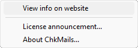|[View info on website](#view-info-on-website)<br>[License announcement](#license-announcement)<br>[About ChkMails](#about-chkmails)| Web で情報を見る<br>ライセンス宣言を見る<br>本アプリについて|

#### [View info on website](#readme)

本アプリの web ページで情報を眺めます.
というか, 今ご覧になっているこのページです.
<br>
<sub>
まあ, どうせ, 大したことは書いてありませんが,
Help ファイルとか実装するの面倒だったし…….
</sub>


#### [License announcement](#readme)

ライセンス宣言とかいうのを見ます.

よーく見ると「タダで使っていいよ。」てなことが書いてあります.
あと,「使ってなんかあっても責めないでね。」とも書いてあります.
まー, タダなんだし, そんなもんではないでしょうか.


#### [About ChkMails](#readme)

本アプリのバージョン情報とか表示します.

たまには表示させて, このページに掲載されている最新バージョンと見比べてください.
アプリの性格上, 今後もバージョンアップが必要な気もするのですよ.
( 新手の手法といたちごっこを続ける羽目になりそうな予感 )


### [Exit](#readme)

本アプリを終了します.<br>
が, その前に下のような確認ダイアログが現われます.

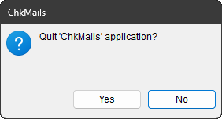

デフォルトが <kbd>No</kbd>(<kbd>いいえ</kbd>) なのも未練がましく感じますが,
<kbd>Yes</kbd>(<kbd>はい</kbd>) のボタンを押すとすんなり終了します.
<br>
<sub>
このアプリって, 終了させることに意味があるのかって気もしますが,
最新版を導入したときに旧版を……,
あ. 後から最新版を起動すれば先に走っていた旧版は押し退けられるんだった.
あれー? なんでこんな機能を付けたんだっけ?
</sub>

## [操作](#readme)

本アプリのアイコンに対しては, 以下の操作が有効です.


| 操作 | 動作 |
| --- | --- |
| マウスで左クリック  | 直ちにメイルのチェックを行う. |
| マウスで右クリック  | [メニュー](#運用)を出す. |

ユーザー様の目に触れるかたちで出している GUI がアイコンだけなので, 操作はこれだけです.

メーラーを起動する直前にアイコンをポチる習慣をつけておくと,
要らないメールが紛れ込んでくる可能性を限りなく減らせます.

なお,
`ChkMails.exe` の置いてあるフォルダーに `Mails` というサブフォルダーを掘り,
そのサブフォルダーに試してみたいメールの `.eml` を入れておいてから `ChkMails.exe` を起動すると,
`ChkMails.exe` は通常営業の POP3 での通信はせず,
`.eml` の中身を通信で受け取ったかのように動作し,
その内容を今設定されている [Filter](../README.md#filter) の条件で再判定します.
そうした「練習」が終わったら, `Mails` フォルダを削除するか, `Mails` 以外の名前に付け替えるかしましょう.
それで通常営業に戻ります.
<br>
<sub>
そうだ! 「練習」を始めたり終わらせたりするのに「[終了](#exit)」が必要だったんだ.
思い出せてよかった.
</sub>

## [環境](#readme)

* Visual Studio 2022&reg; での Windows&reg; 11 向け build なので, 64bit OS 用です.
* 同じ build で Windows&reg; 10 でも問題なく動作しますが, 64bit 版に限ります.


## [実装](#readme)

「お前の言い分は解った。だが、どこの馬の骨が作ったかも判らないものに、パスワードとか入力するのは……」
とためらわれたあなた, いえ, あなたの感覚こそ正しいんです.
このご時世, あなたのような感覚を持つべきなのです.

このアプリが github という「ソース置き場」に置かれているのもだからこそです.
Visual C++&reg; の読める方は, ソースコードをご確認の上, ご自身で build して試してみることをオススメします.
そんなあなたがこのアプリのソースコードを読み解く一助になればと,
ちょっとした[ソースの説明](docs/README.md)も上げておきました.

## [導入](#readme)

そして……, 「ソースコードなんて読むヒマはない。とっとと現物を寄越せ！」とお考えのあなた,
そういう考え方はいかがなものかと思うのですが,
いちおう「インストーラー」として用意したものが,
本ページ右上の「Releases」というコーナーに上げてあります.
でも, それをダウンロードする前に,
せめて[インストール手順](./Installation/README.md)をご一読ください.
あなたの危険な行為を阻止すべく, 色々と Windows&reg; が説得してくるはずですが,
どうやってそれらを振り切って初志貫徹するかが書いてあります.

<div style="text-align: right;">
In-house Tool / 家中 徹
</div>
