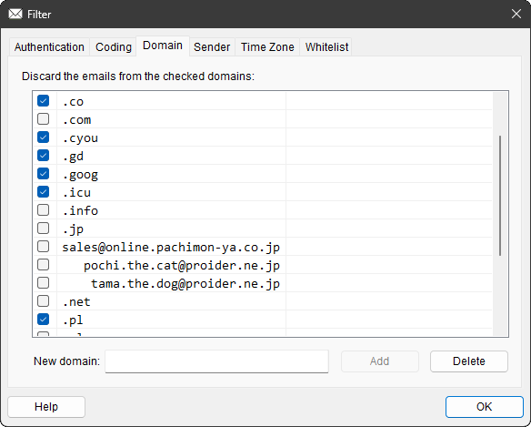

# `CDomainPage`

## 構成

ソースコード上は,
[`DomainPage.h`](../ChkMails/ChkMails/DomainPage.h) と
[`DomainPage.cpp`](../ChkMails/ChkMails/DomainPage.cpp)
で実装されています.

この class は以下のメンバー関数で構成されています.

#### Constructor

[`CDomainPage`](#cdomainpage-1)

#### Override

[`OnInitDialog`](#oninitdialog)
[`OnOK`](#onok)
[`PreTranslateMessage`](#pretranslatemessage)

#### コマンドハンドラー

[`OnButtonAdd`](#onbuttonadd)
[`OnButtonDelete`](#onbuttondelete)
[`OnEditDomain`](#oneditdomain)
[`OnChangeList`](#onchangelist)

#### 固有関数

[`SortDomain`](#SortDomain)
[`CompareDomain`](#comparedomain)

## 概要

[Domain](../README.md#domain) の設定を行うための「Page」です. 
[`CProperSheet`](CProperSheet.md) に乗っかった
[`CFilterSheet`](CFilterSheet.md) が
束ねている page のうちの 1つです.

これまでの運用で, どのドメインからメールが来た実績があるのかを,
[Main Window](CMainWnd.md) から改行区切りの文字列でもらい, その文字列に応じてドメイン名をリストアップしています.

どのドメインがチェック ( 拒否 ) されているかも,
[Main Window](CMainWnd.md) から改行区切りの文字列でもらっています.

[`CEdit`](https://learn.microsoft.com/ja-jp/cpp/mfc/reference/cedit-class)
に入力されたドメイン名の追加にも対応しています.

以下, 本 class 内に実装された関数それぞれの説明です.

## `CDomainPage`

この class の constructor です.

ソースコードを見ると, 何もやっていないように見えて「要るの？これ。」という感じですが,
リソース ID を指定して基底クラスの constructor を呼ぶという大事な仕事をしています.

## `OnInitDialog`

[`CPropertyPage::OnInitDialog`](https://learn.microsoft.com/ja-jp/cpp/mfc/reference/cdialog-class#oninitdialog)
の override です.

まずは普通に
`CPropertyPage::OnInitDialog` を呼んだ後,
( `CPropertyPage` は `OnInitDialog` を override していないようなので,
[`CDialog::OnInitDialog`](https://learn.microsoft.com/ja-jp/cpp/mfc/reference/cdialog-class#oninitdialog)
にスルーパスされた後, )
 以下の独自処理を挟みます.

1. [`GetCommonFont`](#CChkMailsApp.md#getcommonfont) で共通の等幅フォントを得る.
1. Edit Box に等幅フォントをセットする.
1. List Control に等幅フォントをセットする.
1. List Control を全カラムで選択表示するように設定.
1. List Control をグリッド表示するように設定.
1. List Control に 2カラム追加.
1. [`SortDomain`](#SortDomain) でドメイン配列をソート.
1. 「ドメイン配列」をList Control に追加.
1. 「破棄対象配列」に含まれていたら List Control を&#x2611;.
1. List Control のカラム幅を自動調整.
1. フォーカスを設定していないので, `TRUE` を返す.

## `OnOK`

[`CPropertyPage::OnOK`](https://learn.microsoft.com/ja-jp/cpp/mfc/reference/cpropertypage-class#onok)
の override です.

基底 class の実装である
[`CPropertyPage::OnOK`](https://learn.microsoft.com/ja-jp/cpp/mfc/reference/cpropertypage-class#onok)
も呼ばずに, 以下の処理だけ行います.

* List Control にあるドメインを「ドメイン配列」に格納.
* List Control で Check Box が&#x2611;されたドメインを「破棄対象配列」に格納.

これらの `public` な配列は `OnOK` の後,
[Main Window](CMainWnd.md) が勝手に回収していく手筈になっています.

## `PreTranslateMessage`

`CProperSheet::PreTranslateMessage` の override です.

`WM_KEYDOWN` が来たとき, `New domain:` の Edit Box に入力フォーカスがあって入力キーが `Enter` だったら,
その事象を「`Add` ボタンが押された」にすり替えて
[`OnButtonAdd`](#onbuttonadd) が呼ばれるように仕向けています.

せっかく Edit Box に何か入れたのに,
`Add` ボタンを押さずにイキオイで `Enter` キーを叩いちゃううっかりさんって, 結構いらっしゃるようです.
しかし page 上で `Enter` キーを叩くと `OK` ボタンが押されたことになっちゃうので,
せっかくの入力がパーです.
ということで, その救済策として挟んでいる心遣いです.

## `OnButtonAdd`

`Add` ボタンが押された時に飛んでくる `BN_CLICKED` コマンドのハンドラーです.

`New domain:` の Edit Box に入力されたドメインを List Control に追加します.

ただし, すでに List Control 内に全く同じドメインがエントリー済みの場合は,
追加はしません.
同じものを複数登録しても意味がないので.

`Add` 直後のドメインは, List Control 上では「選択されている」状態になっています.
「間違えた」と思ったらすかさず `Delete` ボタンを押しましょう.
今 `Add` したばかりのドメインが登録抹消されます.

Edit Box への入力を終えた時点で, ついイキオイで `Enter` キーを叩いてしまったときは,
[`PreTranslateMessage`](#pretranslate) の心遣いで当関数が呼ばれています.

## `OnButtonDelete`

`Delete` ボタンが押された時に飛んでくる `BN_CLICKED` コマンドのハンドラーです.

今 List Control 上で選択されている行のエントリーを削除します.

この「選択されている」を常に表現するため,
List Control の元ネタになっているリソース上では,
`Always Show Selection` が `True` に設定されています.
このお陰で List Control に入力フォーカスが当たっていない状況でも,
それなりに「選択されている」行がアピールされます.

## `OnEditDomain`

Edit Box で文字列が変更された時に飛んでくる `EN_CHANGE` コマンドのハンドラーです.

* 文字列が空なら `Add` ボタンを disable.
* 文字列が空でなければ `Add` ボタンを enable.

としています.

## `OnChangeList`

List Control 上の状態が変えられた時に飛んでくる `LVN_ITEMCHANGED` コマンドのハンドラーです.

最終的にどの行が選択されたのか知りたいだけの
[`CAccountDlg::OnChangeList`](CAccountDlg.md#onchangelist) でやっている横着な処理と違って,
マジメに全てのコマンドに対応しています.
なぜなら,
 
Check Box をいじると飛んでくる

* &#x2611;状態から非&#x2611;状態になったという `LVN_ITEMCHANGED`
* 非&#x2611;状態から&#x2611;状態になったという `LVN_ITEMCHANGED`

の両方にそれぞれ対応したいからです.

さらに `LVNI_FOCUSED` の変化と `LVNI_SELECTED` の変化が別々に飛んでくる, という冗長っぷりなので,
下記のように状態変化を整理した上で対応しています.

| チェック | 意味 | 対応 |
| --- | --- | --- |
| `-1` | 変化なし | 何もしない |
| `0` | &#x2611;されていたものから&#x2611;が外れた | &#x2611; を OFF する. |
| `1` | &#x2611;されていなかったものが&#x2611;された | &#x2611; を ON する. |

| 選択状態 | 意味 | 対応 |
| --- | --- | --- |
| `-1` | 変化なし | 何もしない |
| `0` | 選択されていたものから選択が外れた | `Delete` ボタンを disable. |
| `1` | 選択されていなかったものが選択された | `Delete` ボタンを enable. |

選択状態への対応は最後の状態にだけ対応すれば良いので少々冗長と言えますが,
チェックへの対応は両方の状態変化に対応する必要があるので,
上記のように対応しています.

## `SortDomain`

文字列をソートして `CStringArray` に格納します.

`\n` 区切りで `CString` に収められたドメイン文字列をソートして `CStringArray` に格納します.

設定値を registry に格納する際は 1本の文字列だと都合が良いのですが,
List に並べて扱う時は配列の方が扱いやすいので,
こうして「文字列→配列」の処理を構えています.

配列に並べる際に, ソートしておくと見やすい配列になるので,
[`CompareDomain`](#comparedomain) で比較して, その大小関係で並び替えています.

## `CompareDomain`

ドメイン名文字列同士を比較します.

与えられた二つのドメイン名のうち, 前者が後に位置するものだったら `+1` を, 前者が前に位置するものだったら `-1` を返します.
全く同じ文字列だったら理論上 `0` を返すのですが,
そんな入力は [`OnButtonAdd`](#onbuttonadd) が許していません.

ただし, 単純にアルファベット順に文字列を比較するのではなく,
[ドメイン名](https://www.nic.ad.jp/ja/dom/system.html)を構成する要素ごとに後ろ ( 右 ) の方から比較します.
つまり, まず 2つのドメイン名の「トップレベルドメイン」を比較し,
それで前後が決まればその結果を返し, トップレベルドメインが同じなら第2レベルドメインを比較し……,
と結論が出るまで左の方へ視点を移しながら比較を繰り返します.

その結果, 下記のように並べられることになります.

* 同じ `.jp` なら `.co.jp` の方が `.ne.jp` より前
* 同じ `provider.ne.jp` なら, `cat` の方が `dog` より前

となっています.
 
( まあ, `@` の左側まで同じルールでやらなくてもいいんですが, ついでなので. )

あと, 上の図にある通り,
[トップレベルドメイン](https://ja.wikipedia.org/wiki/トップレベルドメイン)以外のドメイン名
( アドレス ) が入力されている場合は,
ドメインの違いが判りやすいように右詰めで List が表示されます.
この辺の心遣いは [`OnInitDialog`](#oninitdialog) でやっています.

一方新規ドメイン追加時は, 入力したままの順序で入力したままの文字列が List の末尾に加えられていきます.
何を追加したのかが直感的に判りやすいように, との心遣いです.
 
( なので, 新規追加中と `OK` を押して sheet を閉じてから再び開いた後は,
表示されている順序が異なります. )

この関数は,
本アプリの「三大ソート用比較関数」(
`CDomainPage::CompareDomain`,
[`CZonePage::CompareZone`](CZonePage.md#comparezone),
[`CWhitePage::CompareSender`](CWhitePage.md#comparesender) )
のうち, 唯一コールバック関数ではない実装となっております.