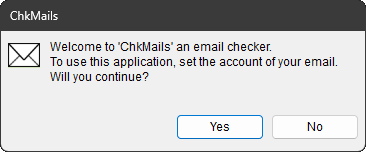

# `CMainWnd`

## 構成

ソースコード上は,
[`MainWnd.h`](../ChkMails/ChkMails/MainWnd.h) と
[`MainWnd.cpp`](../ChkMails/ChkMails/MainWnd.cpp)
で実装されています.

この class は以下のメンバー関数で構成されています.

#### Constructor & Destructor

[`CMainWnd`](#cmainwnd-1)
[`~CMainWnd`](#cmainwnd-2)

#### Override

[`DestroyWindow`](#destroywindow)

#### 標準 Window Message ハンドラー

[`OnCreate`](#oncreate)
[`OnTimer`](#ontimer)
[`OnGetFont`](#ongetfont)
[`OnSocketNotify`](#onsocketnotify)

#### ユーザー定義 Window Message ハンドラー

[`OnUserTrayNotify`](#onusertraynotify)
[`OnPopupNotify`](#onpopupnotify)
[`OnGetCommonFont`](#ongetcommonfont)
[`OnGetSender`](#ongetsender)
[`OnShowHelp`](#onshowhelp)

#### コマンドハンドラー

[`OnMenuWeb`](#onmenuweb)
[`OnMenuLicense`](#onmenulicense)
[`OnMenuAbout`](#onmenuabout)
[`OnMenuAccounts`](#onmenuaccounts)
[`OnMenuFilter`](#onmenufilter)
[`OnMenuLogs`](#onmenulogs)
[`OnMenuSetup`](#onmenusetup)
[`OnMenuExit`](#onmenuexit)

#### 常駐アイコン関連

[`AddNI`](#addni)
[`DelNI`](#delni)
[`ModNI`](#modni)

#### メニュー関連

[`SetMenu`](#setmenu)

#### 導入関連

[`Introduce`](#introduce)

#### 設定値関連

[`LoadAccounts`](#loadaccounts)
[`SaveAccounts`](#saveaccounts)
[`LoadSettings`](#loadsettings)
[`SaveSettings`](#savesettings)
[`LoadFilters`](#loadfilters)
[`SaveFilters`](#savefilters)
[`LoadTLDs`](#loadtlds)
[`SaveTLDs`](#savetlds)

#### 暗号関連

[`MakeBlob`](#makeblob)
[`EnDecrypt`](#endecrypt)

#### 電源状態関連

[`OnPower`](#onpower)

#### メールチェック関連

[`PollNow`](#pollnow)
[`PollMails`](#pollnow)
[`ParseMail`](#parsemail)<br>
[`GetAttr`](#getattr)
[`GetAuth`](#getauth)
[`GetFrom`](#getfrom)
[`GetSender`](#getsender)
[`GetType`](#gettype)
[`GetEncode`](#getencode)
[`GetTime`](#gettime)
[`GetCodePage`](#getcodepage)
[`CheckMID`](#checkmid)<br>
[`CheckAlias`](#checkalias)
[`CheckBlackList`](#checkblacklist)
[`CheckWhiteList`](#checkwhitelist)
[`CheckLink`](#checklink)
[`CheckUnicode`](#checkunicode)
[`FilterError`](#filtererror)

#### ログ関連

[`MakeLog`](#makelog)
[`SaveLog`](#savelog)
[`IsDuplicated`](#isduplicated)
[`AddSuffix`](#addsuffix)
[`TrimFiles`](#trimfiles)
[`MoveFiles`](#movefiles)

#### サマリー関連

[`MakeSummary`](#makesummary)
[`ShowSummary`](#showsummary)
[`ShareSummary`](#sharesummary)

#### 文字列変換関連

[`StringFromHeader`](#stringfromheader)
[`StringFromBody`](#stringfrombody)
[`DecodeBase64`](#decodebase64)
[`DecodeQuoted`](#decodequoted)
[`StringFromCodePage`](#stringfromcodepage)
[`EscapeFromJIS`](#escapefromjis)
[`StringToUTF8`](#stringtoutf8)
[`LFtoCRLF`](#letocrlf)
[`HexToASCII`](#hextoascii)
[`HexToUnicode`](#hextounicode)

#### 通信関連

[`ConnectPOP`](#connectpop)
[`RespondPOP`](#respondpop)
[`ClosePOP`](#closepop)

#### デバッグ関連

[`FeedDebug`](#feeddebug)
[`ReadDebug`](#readdebug)


## 概要

肝心なことは, 全てこの class の中で行っています.
このプロジェクトの中には他にも色々 class がありますが,
この class 以外はほとんど設定のためのダイアログとか通知のためのダイアログとか,
この class とユーザーの対話のために設けられたものです.

この class の中で行われている主な動作は,
以下の通りです.

1. 設定値を取り込む.
1. タスクバーの通知領域にアイコンを仕込む.
1. タイマーを仕掛ける.

で, タイマーが満了するごとに,

1. 設定されていたメールサーバーに[POP3](https://ja.wikipedia.org/wiki/Post_Office_Protocol)で接続する.
1. 設定されていたユーザー名とパスワードで POP3 にサインインする.
1. メールが届いているか確認し, 届いていればその中身を読み取って, 設定に従ってスパムかどうか判定する.
1. スパムと判定したメールは破棄するよう POP3 でメールサーバーに要請する.
1. スパムではないメールが届いていたら, アイコンでお知らせする.
1. メールのイメージを [`.eml`](https://www.google.com/search?q=.eml+ファイル) ファイルで保存する.
1. 上記イメージをデコードした `.txt` ファイルも保存する.

といったことを行っています.

タスクバーに常駐させているアイコンをつついた時の動作は:

* 左クリックされたら直ちにメールを確認する.
* 右クリックされたらポップアップメニューを出す.

となっており,
ポップアップメニューでいずれかの項目が選択された場合は,
その項目の動作を行います.

その他の細かい動作ですが,

* 設定値のうちメールアカウントに関する情報は, 暗号化してレジストリーに格納
* メールのサマリーを
[ファイルマッピング](https://learn.microsoft.com/ja-jp/windows/win32/memory/file-mapping)
で他プロセスに共有する機能も具備 ( デフォルトは OFF )
* 受け取り済みのメールの `.eml` を喰わせて [Filter](../README.md#filter) の設定を「練習」する機能付き

といったところもあります.

ところでこの class は `CWnd` から派生した window なのですが,
何も表示しません. 表示する気がないのです.
それなのになぜ「window」という形態をとっているのかというと,
ただ単に「Window Message を受けて動きたいから」というだけです.
大抵の Windows&reg; アプリケーションは「非同期」というか
「[event driven](https://ja.wikipedia.org/wiki/イベント駆動型プログラミング)」なものですが,
当 class もその例に漏れず, 「*Window Message* driven」の動作原理で動いています.

以下, 本 class 内に実装された関数それぞれの説明です.


## `CMainWnd`

この class の constructor です.

別に constructor でなくても,
初期化の契機はもう1つ別に[「window として create されたとき」](#oncreate)があるのですが,
その際に初期化するのは「window として create されてからでないと初期化できないもの」とし,
ここで全てのメンバー変数を初期化しています.
<sub>
そうしておかないと[C26495](https://learn.microsoft.com/ja-jp/cpp/code-quality/c26495)がうるさいので.
</sub>

個別の変数初期化とは別に, 以下のユーザー設定値読み込みの関数を呼び出しています.

| 関数 | 初期化対象 |
| --- | --- |
| [`LoadSettings`](#loadsettings) | [Setup](../README.md#setup) で設定できるパラメーターの読み込み |
| [`LoadFilters`](#loadfilters) | [Filter](../README.md#filter) で設定できるパラメーターの読み込み |
| [`LoadTLDs`](#loadtlds) | 過去に受信した実績のある [TLD ( Top Level Domain )](https://ja.wikipedia.org/wiki/トップレベルドメイン) 名の読み込み |
| [`MakeBlob`](#makeblob) | 復号用 [BLOB](https://ja.wikipedia.org/wiki/バイナリ・ラージ・オブジェクト) の読み込み |


## `~CMainWnd`

この class の destructor です.

別に destructor でなくても,
片付ける契機はもう1つ別に[「window として destroy されたとき」](#destroywindow)があるのですが,
「constructor で作ったものは destructor で片付ける」という対称性のために,
最低限の後片付けを行っています.


## `DestroyWindow`

`CWnd::DestroyWindow` の override です.

[`DelNI`](#delni) を呼び出して, タスクバーの通知領域に潜り込ませたアイコンを片付け,
[`CNotifyWnd`](CNotifyWnd.md) も片付けます.

要は「create 時に作ったものは destroy 時に片付ける」という対称性のために,
ここに挟み込んでいます.
そして, その後は `CWnd::DestroyWindow` に委ねます.
なので戻り値も `CWnd::DestroyWindow` の判断に委ねています.


## `OnCreate`

Window Message [`WM_CREATE`](https://learn.microsoft.com/ja-jp/windows/win32/winmsg/wm-create)
に対するハンドラーです.

まず基底 class の `OnCreate` を済ませた後,
[CProperSheet](CProperSheet.md) に与える見やすいフォント
( [`CPropertySheet`](https://learn.microsoft.com/ja-jp/cpp/mfc/reference/cpropertysheet-class)
が強制してくる読みづらいフォントに代わって ) を作っておき,
その他のダイアログにも共通で適用する等幅のフォントも作っておきます.

それから,
sleep 状態からの復帰を捕捉するためのハンドラー [`OnPower`](#onpower) を登録します.

最後に「準備開始」のためのタイマー `TID_INIT` を待ち時間ゼロで仕掛けて終了です.

「待ち時間ゼロだったらタイマーなんて仕掛けずにその場でやれよ。」と思われる向きもあろうかと存じますが,
これは [`WM_TIMER` の優先度の低さ](https://learn.microsoft.com/ja-jp/windows/win32/winmsg/wm-timer#remarks)
を利用した「仕切り直し」です.
この「仕切り直し」により, 実際に「準備開始」が実施されるのは,
これまでの初期化でなんだかんだ飛び交っていた Window Message が全てハケてからということになります.


## `OnTimer`

Window Message [`WM_TIMER`](https://learn.microsoft.com/ja-jp/windows/win32/winmsg/wm-timer)
に対するハンドラーです.

下記のタイマー値を取り扱っています.

| タイマー値 | 状況 | 処理内容 |
| --- | --- | --- |
| `TID_INIT` | 「準備開始」 | [`Introduce`](#introduce) にてメールアカウントを読み込み. 未設定ならご挨拶. |
| `TID_READY` | 「準備中」 | [`AddNI`](#addni) にてタスクバーの通知領域にアイコン登録. 登録完了まで繰り返し. |
| `TID_START` | 「通常営業開始」 | [`PollNow`](#pollnow) にて最初のチェックと以降のために `TID_POLL` をセット. |
| `TID_POLL` | 「通常営業中」 | [`PollMails`](#pollmails) にてメールのチェック. |


## `OnGetFont`

Window Message [`WM_GETFONT`](https://learn.microsoft.com/ja-jp/windows/win32/winmsg/wm-getfont)
に対するハンドラーです.

あらかじめ [`OnCreate`](#oncreate) で作っておいた「見やすいフォント」の handle を返すだけです.
<br>
有意な値を返しているので, `WM_GETFONT` は
[`PostMessage`](https://learn.microsoft.com/ja-jp/windows/win32/api/winuser/nf-winuser-postmessagew) ではなく
[`SendMessage`](https://learn.microsoft.com/ja-jp/windows/win32/api/winuser/nf-winuser-sendmessagew)
で送っていただくのが前提です.

ここに `WM_GETFONT` を投げてくるのは,
[`CProperSheet`](CProperSheet.md) ぐらいなものです.
束ねている page のそれぞれに, この関数が返しているフォントを適用しています.

他のダイアログは普通のダイアログなので, それぞれ自前で見やすいフォントを設定しています.


## `OnSocketNotify`

Window Message `WM_SOCKET_NOTIFY`
に対するハンドラーです.

`WM_SOCKET_NOTIFY` は元来 MFC 内部で使用するための定義なのですが
( 故に説明している web page が存在しない ),
普通にビルドすると `#include` に含まれている `afxpriv.h` に入っている定義なので,
アプリケーションプログラマーも ( 勝手に ) 使える定義値です.

ここでは [`CParaSocket`](CParaSocket.md) からの通知に使っています.

渡される引数の内容は

| 引数 | 内容 |
| --- | --- |
| `wParam` | 上位 16bits がソケットの状態を示すコード, 下位 16bits がユーザー定義の識別値. |
| `lParam` | 送信元ソケットへのポインタ. |

となっており, 「状態を示すコード」は
[`ParaSocket.h`](../ChkMails/ChkMails/ParaSocket.h)
に定義されている `SOCK_STATE_` から始まる macro 名で定義された値です.
ここでは

| 状態 | 意味 | 当 class の対応 |
| --- | --- | --- |
| `SOCK_STATE_FAILED` | 「なんか失敗した」 | [`ClosePOP`](#closepop) を呼んで通信を切断. |
| `SOCK_STATE_RECEIVED` | 「なんか受信した」 | [`RespondPOP`](#respondpop) を呼んで受信したものを受け取る. |

の 2種類のみ扱っています.

`SOCK_STATE_RECEIVED` が通知された場合は,
受信したバイト数だけ読み取って `CStringA` に仕立ててから,
[`RespondPOP`](#respondpop) に渡します.

特に意味のある戻り値を返している訳でもないので,
`WM_SOCKET_NOTIFY` は
[send](https://learn.microsoft.com/ja-jp/windows/win32/api/winuser/nf-winuser-sendmessagew)
ではなく
[post](https://learn.microsoft.com/ja-jp/windows/win32/api/winuser/nf-winuser-postmessagew)
で送っていただいてもだいじょうぶです.


## `OnUserTrayNotify`

[`CChkMailsApp`](CChkMailsApp.md) で定義した Window Message `WM_USER_TRAY_NOTIFY`
に対するハンドラーです.

`WM_USER_TRAY_NOTIFY` は, [`AddNI`](#addni) にて呼び返しの message として登録しているので,
アイコンが操作されると投げ返されてくる Window Message です.

下記の操作を取り扱っています.

| 操作 | 意味 | 当 class の対応 |
| --- | --- | --- |
| `WM_LBUTTONUP` | クリック | [`PollNow`](#pollnow) にて最初のチェックと以降のために `TID_POLL` をセット. |
| `WM_RBUTTONUP` | 右クリック | ダイアログ表示中ならそちらに注意喚起.<br>でなければ [SetMenu](#setmenu) にてメニュー表示. |

上記の「ダイアログ表示中なら」という判定は,
[`OnPopupNotify`](#onpopupnotify) が受け取った最新の `lParam` に基づいています.
<br>
<sub>
いや, すなおに「出てきたダイアログを操作する」としていただければこんなことしなくても済むんですが,
出てきたダイアログ以外に「浮気」すると, 「そっちじゃない。こっちだ。」と注意されるわけです.
</sub>

特に意味のある戻り値を返している訳でもないので,
`WM_USER_TRAY_NOTIFY` は
[send](https://learn.microsoft.com/ja-jp/windows/win32/api/winuser/nf-winuser-sendmessagew)
ではなく
[post](https://learn.microsoft.com/ja-jp/windows/win32/api/winuser/nf-winuser-postmessagew)
で送っていただいてもだいじょうぶです.


## `OnPopupNotify`

[`CChkMailsApp`](CChkMailsApp.md) で定義した Window Message `WM_POPUP_NOTIFY`
に対するハンドラーです.

[`NotifyPopup`](CChkMailsApp.md#notifypopup) により `lParam` に送信元 window の handle が載っているので,
それに基づいて送信元 window のサイズを求め,
そのサイズに基づいて送信元 window がプライマリモニターのタスクバーの通知領域に寄り添うような位置になるよう計算し,
送信元 window の表示位置を移動させます.

Windows&reg; 11 ではタスクバーはモニターの底辺に固定になりましたが,
Windows&reg; 10 では上下左右に動かせるので,
タスクバーがどこにあるのかを見極めた上で表示位置を決定しています.

なお, この `WM_POPUP_NOTIFY` が来た際に
[`CNotifyWnd`](CNotifyWnd.md) が表示されていた場合は, その表示は消しておきます.
これから始まる送信元 window の操作の邪魔になるので.

また, `WM_POPUP_NOTIFY` は
各ダイアログが `DoModal` から抜けてきたら空っぽの `lParam` を渡してくるルールになっているので,
「いずれかのダイアログが
[`DoModal`](https://learn.microsoft.com/ja-jp/cpp/mfc/reference/cdialog-class#domodal)
中であること」を知らせる役目も兼ねています.
 [`OnUserTrayNotify`](#onusertraynotify) では,
「`OnPopupNotify` で受け取った最新の `lParam` が空っぽでなければ」
他のダイアログを起動するようなメニューの実行を禁止しています.
<br>
<sub>
いや, すなおに「出てきたダイアログを操作する」としていただければこんなことしなくても済むんですが.
</sub>

特に意味のある戻り値を返している訳でもないので,
`WM_POPUP_NOTIFY` は
[send](https://learn.microsoft.com/ja-jp/windows/win32/api/winuser/nf-winuser-sendmessagew)
ではなく
[post](https://learn.microsoft.com/ja-jp/windows/win32/api/winuser/nf-winuser-postmessagew)
で送っていただいてもだいじょうぶです.


## `OnGetCommonFont`

[`CChkMailsApp`](CChkMailsApp.md) で定義した Window Message `WM_GET_COMMONFONT`
に対するハンドラーです.

あらかじめ [`OnCreate`](#oncreate) で作っておいた「等幅のフォント」の handle を返すだけです.
<br>
有意な値を返しているので, `WM_GETFONT` は
[`PostMessage`](https://learn.microsoft.com/ja-jp/windows/win32/api/winuser/nf-winuser-postmessagew) ではなく
[`SendMessage`](https://learn.microsoft.com/ja-jp/windows/win32/api/winuser/nf-winuser-sendmessagew)
で送っていただくのが前提です.

ここに ( [`GetCommonFont`](CChkMailsApp.md#getcommonfont) 経由で ) `WM_GET_COMMONFONT` を投げてくるのは,
「等幅のフォント」を必要とするダイアログのみなさんで, 該当者多数です.


## `OnGetSender`

[`CChkMailsApp`](CChkMailsApp.md) で定義した Window Message `WM_GET_SENDER`
に対するハンドラーです.

今回の通信で得たメールの

* 送信者の「名義」( `From:` に書いてあった送信者名 )
* 実際の送信者名 ( `Authentication-Results:` などに挙がっていた送信者名 )

の 2つの情報のペアを, 1つの文字列にマージしたものを返します.
<br>
有意な値を返しているので, `WM_GET_SENDER` は
[`PostMessage`](https://learn.microsoft.com/ja-jp/windows/win32/api/winuser/nf-winuser-postmessagew) ではなく
[`SendMessage`](https://learn.microsoft.com/ja-jp/windows/win32/api/winuser/nf-winuser-sendmessagew)
で送っていただくのが前提です.

[`CWhitePage`](CWhitePage.md) の [`TakePair`](CWhitePage.md#takepair) から飛んでくる Window Message です.
同 page でも同じ情報が欲しいのですが, 自前で割り出すよりすでに同じ情報を握っているこちらの class に,
情報の横流しを依頼しているわけです.

ただし, [Filter](../README.md#filter) に引っかかったメールに対しては,
空っぽの文字列を返しています.
それを受け取った [`TakePair`](CWhitePage.md#takepair) は,
「む、この送信者はヤバいぞ。」と察するわけです.


## `OnShowHelp`

[`CChkMailsApp`](CChkMailsApp.md) で定義した Window Message `WM_SHOW_HELP`
に対するハンドラーです.

`Help` ボタンを持つあらゆるダイアログ(とシート)から, `Help` ボタンが押された時に送られてきます.
`lParam` に送信元 window の handle が渡されているので,
それに基づいて送信元 window のタイトル ( caption ) を求め,
その文字列を小文字にするなどの加工を行い,
加工した文字列をこの github 上のトップの [README.md](../README.md) に「節の名前」として付与したものをブラウザーで開く,
つまり「該当の項目の説明を表示させる」という動作を行います.

特に意味のある戻り値を返している訳でもないので,
`WM_SHOW_HELP` は
[send](https://learn.microsoft.com/ja-jp/windows/win32/api/winuser/nf-winuser-sendmessagew)
ではなく
[post](https://learn.microsoft.com/ja-jp/windows/win32/api/winuser/nf-winuser-postmessagew)
で送っていただいてもだいじょうぶです.


## `OnMenuWeb`

[`SetMenu`](#setmenu) が提示したメニューの [`View info on website`](../README.md#view-info-on-website)
が選ばれた時に飛んでくる `ID_HELP_INDEX` に対するハンドラーです.

[`ShellExecute`](https://learn.microsoft.com/ja-jp/windows/win32/api/shellapi/nf-shellapi-shellexecutew)
で[当アプリのトップページ](../README.md#chkmails) を開くだけです.


## `OnMenuLicense`

[`SetMenu`](#setmenu) が提示したメニューの [`License announcement`](../README.md#license-announcement)
が選ばれた時に飛んでくる `ID_HELP_USING` に対するハンドラーです.

単に [MIT License](https://ja.wikipedia.org/wiki/MIT_License)
の
[License terms](https://en.wikipedia.org/wiki/MIT_License#License_terms)
を
[`AfxMessageBox`](https://learn.microsoft.com/ja-jp/cpp/mfc/reference/cstring-formatting-and-message-box-display#afxmessagebox)
で表示するだけです.


## `OnMenuAbout`

[`SetMenu`](#setmenu) が提示したメニューの [`About ChkMails`](../README.md#about-chkmails)
が選ばれた時に飛んでくる `ID_APP_ABOUT` に対するハンドラーです.

[`CChkMailsApp::GetVersionInfo`](CChkMailsApp.md#getversioninfo)
で引っ張ってきたバージョン情報を
[`AfxMessageBox`](https://learn.microsoft.com/ja-jp/cpp/mfc/reference/cstring-formatting-and-message-box-display#afxmessagebox)
で表示するだけです.


## `OnMenuAccounts`

[`SetMenu`](#setmenu) が提示したメニューの [`Accounts`](../README.md#accounts)
が選ばれた時に飛んでくる `ID_MENU_ACCOUNTS` に対するハンドラーです.

処理手順は以下です.

1. [`CAccountDlg`](AccountDlg.md) をこの関数内でローカルに ( 自動変数として ) 宣言 ( construct される ).
1. このクラスで保持しているアカウント配列 `m_aAccount` のコピーを作る.
1. [`CAccountDlg`](CAccountDlg.md) の [`SetAccounts`](CAccountDlg.md#setaccounts) を通してコピー(への参照)を与える.
1. [`CAccountDlg`](CAccountDlg.md) の [`DoModal`](https://learn.microsoft.com/ja-jp/cpp/mfc/reference/cdialog-class#domodal) を呼んでその答えを待つ.
1. 答えが `IDOK` ( `OK` ボタンが押された ) でなければ終了.
1. コピーとオリジナルの `m_aAccount` を比較.
1. 違っていたらコピーを取り込み, [`SaveAccounts`](#saveaccounts) でセーブした上で, [`PollNow`](pollnow) でチェック開始.
1. アカウントが全て消されていたら, それを表現するため [`ModNI`](#modni) でアイコン変更.
1. この関数の終了に伴い, [`CAccountDlg`](CAccountDlg.md) も消失 ( destruct される ).


## `OnMenuFilter`

[`SetMenu`](#setmenu) が提示したメニューの [`Filter`](../README.md#filter)
が選ばれた時に飛んでくる `ID_MENU_FILTER` に対するハンドラーです.

処理手順は以下です.

1. [`CFilterSheet`](CFilterSheet.md) をこの関数内でローカルに ( 自動変数として ) 宣言 ( construct される ).
1. このクラスで保持している設定値を [`CFilterSheet`](FilterSheet.md) 配下の各 page に仕込む.
1. [`CFilterSheet`](CFilterSheet.md) の
[`DoModal`](https://learn.microsoft.com/ja-jp/cpp/mfc/reference/cdialog-class#domodal) を呼んでその答えを待つ.
1. 答えが `IDOK` ( `OK` ボタンが押された ) でなければ終了.
1. 各 page から設定値を回収.
1. 回収した値とオリジナルの設定値が異なるものを取り込む.
1. [`SaveFilters`](#savefilters) にて, 変更された設定値をセーブ.
1. この関数の終了に伴い, [`CFilterSheet`](CFilterSheet.md) も消失 ( destruct される ).


## `OnMenuLogs`

[`SetMenu`](#setmenu) が提示したメニューの [`Logs`](../README.md#logs)
が選ばれた時に飛んでくる `ID_MENU_LOGS` に対するハンドラーです.

ログフォルダ `m_strLogPath` を引数に
[`ShellExecute`](https://learn.microsoft.com/ja-jp/windows/win32/api/shellapi/nf-shellapi-shellexecutew)
に丸投げして, Explorer でログフォルダを開いてもらいます.


## `OnMenuSetup`

[`SetMenu`](#setmenu) が提示したメニューの [`Setup`](../README.md#setup)
が選ばれた時に飛んでくる `ID_MENU_SETUP` に対するハンドラーです.

処理手順は以下です.

1. [`CSetupDlg`](CSetupDlg.md) をこの関数内でローカルに ( 自動変数として ) 宣言 ( construct される ).
1. このクラスで保持している設定値を[`CSetupDlg`](CSetupDlg.md) に仕込む.
1. [`CSetupDlg`](CSetupDlg.md) の [`DoModal`](https://learn.microsoft.com/ja-jp/cpp/mfc/reference/cdialog-class#domodal) を呼んでその答えを待つ.
1. 答えが `IDOK` ( `OK` ボタンが押された ) でなければ終了.
1. [`CSetupDlg`](CSetupDlg.md) から設定値を回収.
1. 回収した値とオリジナルの設定値が異なるものを取り込む.
1. [`SaveSettings`](#savesettingss) にて, 変更された設定値をセーブ.
1. この関数の終了に伴い, [`CSetupDlg`](CSetupDlg.md) も消失 ( destruct される ).

* [Action](../README.md#action) の時間間隔が変更された場合は,
直ちメールを一度チェックしてから設定された時間間隔に入ります.
* [Log](../README.md#log) のフォルダーが変更された場合は,
[`MoveFiles`](#movefiles) でログファイルの引っ越しが行われます.
* [Log](../README.md#log) のファイル数が変更された場合は,
[`TrimFiles`](#trimfiles) でログファイル数の調整が行われます.


## `OnMenuExit`

[`SetMenu`](#setmenu) が提示したメニューの [`Exit`](../README.md#exit)
が選ばれた時に飛んでくる `ID_MENU_EXIT` に対するハンドラーです.

本当に終了するかを確認する
[`AfxMessageBox()`](https://learn.microsoft.com/ja-jp/cpp/mfc/reference/cstring-formatting-and-message-box-display#afxmessagebox)
を出して,
答えが `IDOK` ( `OK` ボタンが押された ) であれば,
[`WM_CLOSE`](https://learn.microsoft.com/ja-jp/windows/win32/winmsg/wm-close)
を自 window に
[post](https://learn.microsoft.com/ja-jp/windows/win32/api/winuser/nf-winuser-postmessagew)
します.


## `AddNI`

タスクバーの通知領域に本アプリのアイコンを追加します.

「NI」は「Notification Icon」から, といった程度のネーミングです.

`AddNI` は「NI三兄弟」の長男です.

[`Shell_NotifyIcon`](https://learn.microsoft.com/ja-jp/windows/win32/api/shellapi/nf-shellapi-shell_notifyiconw)
に頼んでアイコンを追加しますが,
この呼び出しは理論上失敗することがあるそうなので,
無事追加できたら `true` を, ダメだったら `false` を返すことにしています.
そして `false` が返った場合は,
少し間を置いてリトライすることにしています.
この「間を置いてリトライ」のために
[`OnTimer`](#ontimer) から呼び出されています.


## `DelNI`

タスクバーの通知領域にある本アプリのアイコンを削除します.

`DelNI` は「NI三兄弟」の次男です.

アイコンが不要になるのは, 本アプリが終了するときです.
なので, [DestroyWindow](#destroywindow) から呼び出されています.


## `ModNI`

タスクバーの通知領域にある本アプリのアイコンを変更します.

`ModNI` は「NI三兄弟」の末っ子です.

兄達と違って忙しく, あちこちから色んな局面で呼ばれています.

| 呼び出し元 | 状況 | 対応 |
| --- | --- | --- |
| [`OnMenuAccounts`](#onmenuaccounts)	| アカウントが全て削除された | アイコンとメッセージでアカウント無効をアピール. |
| [`ConnectPOP`](#connectpop)		| 接続を開始した | アイコンとメッセージで開始を告げる. |
| [`ClosePOP`](#closepop)		| 接続が失敗した | アイコンとメッセージで失敗を訴える. |
| [`RespondPOP`](#respondpop)		| アカウントのチェックが終わった | アイコンとメッセージで首尾を報告する. |
| [`FeedDebug`](#feeddebug)		| デバッグ用ファイルを読み切った | アイコンとメッセージで首尾を報告する. |

最後の「首尾を報告する」ですが, この報告を依頼する呼び出しの際には「このメッセージを出せ」との指示がありません.
引数となっているメッセージが空っぽで呼び出されます.
これは報告するメッセージの選別を丸投げする指示で,
空メッセージを受け取った本関数は,
未読のメール数に従ってメッセージの文言を決め,
未読のメールの有無に従ってアイコンの種別
( か ) を選びます.

この関数は状況変化があった際に必ず通る切り口になっているので,
この関数から [`ShowSummary`](#showsummary) や [`ShareSummary`](#sharesummary) も呼び出して,
ついでに [Notification](../README.md#notification) も行っています.


## `SetMenu`

ポップアップメニューを表示します.

[`OnUserTrayNotify`](#onusertraynotify) からアイコンが右クリックされたときに呼び出されます.

段取りとしては:

1. メニュー項目 `IDR_MENU_POPUP` の 0 番目のサブメニューをゲット.<br>( `IDR_MENU_POPUP` のメニューではなく, その 0 番目のサブメニュー )
1. [`SetForegroundWindow`](https://learn.microsoft.com/ja-jp/windows/win32/api/winuser/nf-winuser-setforegroundwindow)で強制的に foreground に躍り出る.
1. [`GetCursorPos`](https://learn.microsoft.com/ja-jp/windows/win32/api/winuser/nf-winuser-getcursorpos)で現在 ( アイコンを右クリックしたときの ) のマウスの位置をゲット.
1. [`TrackPopupMenu`](https://learn.microsoft.com/ja-jp/windows/win32/api/winuser/nf-winuser-trackpopupmenu)でマウスポインターの位置に 0 番目のサブメニューを表示.
1. おまじないで `WM_NULL` を[`PostMessage`](https://learn.microsoft.com/ja-jp/windows/win32/api/winuser/nf-winuser-postmessagew).

となっています.

このうち 5. のおまじないは, 古来 Visual Studio&reg; ユーザーの間では伝承されてきたワザですが,
最近, ついに[版元もその必要性を認めるところとなりました.
](https://learn.microsoft.com/ja-jp/windows/win32/api/winuser/nf-winuser-trackpopupmenu#remarks)
<br>
<sup>
いや, 「回避策」を説明するんじゃなくて, 「修正」してくれんかね?
</sup>


## `Introduce`

「導入」します.

「導入」としては, まず [`LoadAccounts`](#loadaccounts)で設定済みのメールアカウントを読み込むことから始めます.

呼び出し元は [`OnTimer`](#ontimer) でタイマー `TID_INIT` が満了したときです.
( だから「起動してすぐ」です. )

で, すでにアカウントが設定済みだった場合は,
`true` を返しておしまいです.

一方, 設定済みアカウントがゼロだった場合は,
[`AfxMessageBox()`](https://learn.microsoft.com/ja-jp/cpp/mfc/reference/cstring-formatting-and-message-box-display#afxmessagebox)
して下記のように自己紹介します.<br>

<br>
<sup>
[`AfxMessageBox()`](https://learn.microsoft.com/ja-jp/cpp/mfc/reference/cstring-formatting-and-message-box-display#afxmessagebox)
なのに自前のアイコンが添えられているのは, そういうことができるように小細工された
自家製の[`DoMessageBox`](CChkMailsApp.md#domessagebox) を使っているからです.
</sup>

つまり,<br>
「お客さん、初めてだね? メールアカウントの設定が必要なんだが、続けるかい?」
<br>
と確認しているわけですが,
これが断られた場合は `false` を返して素直に引き下がります.

応じられた場合は,
自 window に `ID_MENU_ACCOUNTS` を飛ばして,
[`OnMenuAccounts`](#onmenuaccounts) に持ち込みます.


## `LoadAccounts`

[Accounts](../README.md#accounts) 設定をロードします.

呼び出し元は前出の [`Introduce`](#introduce) です.

本アプリは 1人のユーザーが複数のメールアカウントを持つことに対応しているので,
設定されているアカウント情報全てを読み込みます.
アカウント情報はいちおう暗号化してしまってあるので,
読み込むときは復号して文字列化しています.
復号は
[`EnDecrypt`](#endecrypt) というどっちつかずな名前の関数が担当です.


## `SaveAccounts`

[Accounts](../README.md#accounts) 設定をセーブします.

本アプリは 1人のユーザーが複数のメールアカウントを持つことに対応しているので,
設定されたアカウント情報全てを書き込みます.
アカウント情報はいちおう暗号化してしまってあるので,
書き込むときは文字列を暗号化しています.
暗号化は
[`EnDecrypt`](#endecrypt) というどっちつかずな名前の関数が担当です.

[`OnMenuAccounts`](#onmenuaccounts) でアカウント登録に変更があったときに呼び出されています.

アカウント数が減るような設定をされたときに,
すでに使われなくなった記録をいつまでも残しておくのもアレなので,
そういった記録を抹消するために
[`DeleteProfileValue`](CChkMailsApp.md#deleteprofilevalue)
のお世話になっています.
同関数が `FALSE` (「そんなのねえよ」) を返してくるまで呼び出しを繰り返せば,
不要な記録は全て抹消されたことになります.


## `LoadSettings`

[Setup](../README.md#setup) の設定値をロードします.

ソースコードを見たまんまの, 特にどうってことのない処理ですが,
[ログ](../README.md#log)をしまっておくフォルダーの初期値は,
固定値ではなくユーザーごとのテンポラリーフォルダーとするため,
[`GetTempPath`](https://learn.microsoft.com/ja-jp/windows/win32/api/fileapi/nf-fileapi-gettemppathw)
のお世話になっています.

[constructor](#cmainwnd-1) から呼び出されています.


## `SaveSettings`

[Setup](../README.md#setup) の設定値をセーブします.

ソースコードを見たまんまの, 特にどうってことのない処理です.

[`OnMenuSetup`](#onmenusetup) で設定に変更があったときと,
[`GetAuth`](#getauth) で新たな認証方式に遭遇したときに呼び出されています.


## `LoadFilters`

[Filter](../README.md#filter) 設定をロードします.

ソースコードを見たまんまの, 特にどうってことのない処理です.

[constructor](#cmainwnd-1) から呼び出されています.


## `SaveFilters`

[Filter](../README.md#filter) 設定をセーブします.

ソースコードを見たまんまの, 特にどうってことのない処理です.

[`OnMenuFilter`](#onmenufilter) で設定に変更があったときに呼び出されています.


## `LoadTLDs`

[TLD ( Top Level Domain)](https://ja.wikipedia.org/wiki/トップレベルドメイン) 履歴をロードします.

ここでいう「TLD 履歴」とは,
これまでに受信したことのあるメールの発信元や
埋め込まれていたリンクの URL のドメインのトップ ( 右端 ) を記録しておいたものです.
新しいドメインからメールが来るたびに追加されていきます.
( お馴染みのドメインばかりになったときに頭打ちになります. )
[Filter](../README.md#filter) の [Domain](../README.md#domain) を設定する際に,
選択肢を提示するために使われている情報です.

[constructor](#cmainwnd-1) から呼び出されています.


## `SaveTLDs`

[TLD ( Top Level Domain)](https://ja.wikipedia.org/wiki/トップレベルドメイン) 履歴をセーブします.

`LoadTLDs` と違ってあちこちから呼ばれています.

| 呼び出し元 | 呼び出す契機 |
| --- | --- |
| [`OnMenuFilter`](#onmenufilter)	| `New Domain` として何か追加されたら<br>いずれかのドメインが削除されたら |
| [`GetFrom`](#getfrom)	| 新たなドメインからメールが来たら |
| [`CheckLink`](#checklink)	| 新たなドメインへのリンクを見つけたら |


## `MakeBlob`

アカウント情報の暗号化・復号用の [BLOB](https://ja.wikipedia.org/wiki/バイナリ・ラージ・オブジェクト) を生成します.

すでに生成済みなら何もしないので,
本格的に BLOB を生成するのは, 本アプリ初回導入時の 1回だけです.
生成される BLOB は毎回違う内容なので,
結果的によそさまが暗号化したものは復号できないようになっています.

[constructor](#cmainwnd-1) から呼び出されています.


## `EnDecrypt`

アカウント情報の暗号化・復号を行います.

なんかどっちつかずの名前ですが,
暗号化も復号も途中までは同じ過程を通るので, 両方兼用にしたせいです.
最後の引数 `bool bEncode` でどちらを行うのかを指定します.
( `true` で暗号化 / `false` で復号 )

呼び出し元は
[`LoadAccounts`](#loadaccounts) (復号) と
[`SaveAccounts`](#saveaccounts) (暗号化) の 2か所です.

戻り値はエラーコードで, 正常終了なら `0` を返します.


## `OnPower`

システムが中断または再開されたときに動くハンドラーです.

[`OnCreate`](#oncreate) で
[`PowerRegisterSuspendResumeNotification`](https://learn.microsoft.com/ja-jp/windows/win32/api/powerbase/nf-powerbase-powerregistersuspendresumenotification)
を呼んで仕掛けたハンドラーです.
ここではシステム再開時にすみやかにメールをチェックするために働いています.
ただ, システム再開直後すぐにメールを読もうとしても失敗することが考えられるので,
少し ( デフォルトで `5`[秒] ) 待ってからチェックを始めるようにしています.


## `PollNow`

「今」メールをチェックします.

呼ばれると, 直ちに 1回メールをチェックします.
<br>( とはいっても「メールをチェックするタイマー」をしかけるだけですが. )

で, 2回目以降は設定された周期 ( デフォルトで `10`[分] ) でのチェックを続けます.
つまりメールをチェックする新たな周期の始まりになります.

呼び出し元は以下のみなさんです.

| 呼び出し元 | 呼び出す契機 |
| --- | --- |
| [`OnTimer`](#ontimer)	| タイマー `TID_START` が満了したとき |
| [`OnUserTrayNotify`](#onusertraynotify) | アイコンがクリックされたとき |
| [`OnMenuAccounts`](#onmenuaccounts) | アカウント登録に変更があったとき |
| [`OnMenuSetup`](#onmenusetup) | メールチェックの時間間隔に変更があったとき |


## `PollMails`

メールをチェックします.

まず念のため前回のチェックの後片付け

* [`ClosePOP`](#closepop) で[POP3](https://ja.wikipedia.org/wiki/Post_Office_Protocol) 接続を閉じる.
* `m_iUser` を `0` として「最初のアカウント」から始まるようにする.
* `m_nMail` を `0` として「未読メール数」をチャラにする.
* `m_strSummary` を空にして, 「サマリー」をチャラにする.

をしてから, 今回のメールチェックのために

* [`ConnectPOP`](#connectpop) を呼ぶ.

という段取りです.

「え? 接続するだけ?」と思われる向きもあろうかと存じますが,
この接続を契機になんだかんだでメールのチェックが進み,
いつの間にやら全アカウントのチェックが行われることになります.
<br>
<sub>
こういう直感的に段取りを理解し難いところが,
「非同期」というか「[event driven](https://ja.wikipedia.org/wiki/イベント駆動型プログラミング)」というか「message driven」なこの実装の特徴なのかもしれませんが.
</sub>

呼び出し元は [`OnTimer`](#ontimer) でタイマー `TID_POLL` が満了したときです.
デフォルトで `10`[分] 周期で呼ばれます.


## `ParseMail`

メールを解析します.

1つのメールの中身の文字列を引数として受け取り,
その中身を解析した結果を `true` ( 残すべきメール ) か `false` ( 破棄すべきメール ) で返します.

呼び出し元は [`RespondPOP`](#respondpop) (通常営業) か
[`ReadDebug`](#readdebug) (デバッグ時) で,
複数の未読メールが溜まっている状況でも, 1つのメールに付き 1回ずつ呼ばれます.

引数の「中身の文字列」はメールサーバーから受信したままの文字列
( [`.eml`](https://www.google.com/search?q=.eml+ファイル)相当 ) で,
必ず 7bit 文字コード記述 ( [UNICODE](https://ja.wikipedia.org/wiki/Unicode) などではなく ASCII 文字列 )
なので引数の型は `CStringA`です.
<br>
<sup>
`CStringW` やどっちの味方か判らない `CString` ではありません.
</sup>

仕事の段取りは下記のようになっています.

1. [`GetAttr`](#getattr) でメールヘッダーの構成要素を抜き出してチェックする.
1. [`MakeLog`](#makelog) でメールのログファイルにセーブする文字列にデコードする.
1. [`CheckWhiteList`](#checkwhitelist) で [`Whitelist`](../README.md#whitelist) と照合する.
1. 破棄理由のないメールなら, [サマリー](../README.md#notification) に追加する.
1. 破棄理由のあるメールなら, 戻り値として `破棄すべきメール` を選ぶ.
1. [`全ての`メールをログに落とす設定](../README.md#log)か, 破棄と判定したメールなら, [`SaveLog`](#savelog) でログにセーブする.
1. 判定結果を返す.

この関数こそ本アプリの「主役」で,
他のみんなはこの「主役」が仕事を果たせるよう協力してくれている存在と言ってもいいでしょう.
<br>
<sup>
( いや, どの子も欠けたら成り立たなくなるかけがえのない子たちですが. )
</sup>


## `GetAttr`

[メールヘッダー](https://www.dekyo.or.jp/soudan/contents/ihan/header.html)にある構成要素を抜き出してチェックします.

といっても下請けに丸投げしているだけで, 実際の仕事をやっているのは下記のみなさんです.

| 委託先				| 業務内容 |
| ---				| --- |
| [`GetAuth`](#getauth)		| `Authentication-Results:` にある認証結果を抜き出してチェック. |
| [`GetFrom`](#getfrom)		| `From:` にある送信者 ( の名義 ) を抜き出してチェック. |
| [`GetSender`](#getsender)	| `Authentication-Results:` などにある ( 実際の ) 送信者を抜き出してチェック. |
| [`GetType`](#gettype)		| `Content-Type:` にあるあれこれを抜き出してチェック. |
| [`GetEncode`](#getencode)	| `Content-Transfer-Encoding:` にあるエンコード方式を抜き出す. |
| [`GetTime`](#gettime)		| `Date:` にある日時を抜き出してチェック. |
| [`CheckMID`](#checkmid)	| `Message-ID:` にある ID がマトモかチェック. |

上記委託先から集められた情報を `CAttr` という情報構造に収めて,
受注先の [`ParseMail`](#parsemail) に納品します.

いずれの委託先も抜き出した部分にスパムの兆候を見つけたら,
納品された `CAttr` に「破棄理由」として報告を上げてくれる約束になっています.


## `GetAuth`

[メールヘッダー](https://www.dekyo.or.jp/soudan/contents/ihan/header.html)の
`Authentication-Results:` にある
[認証](https://ja.wikipedia.org/wiki/送信ドメイン認証)結果を抜き出して `CAttr` に納品します.

過去の認証履歴 ( `m_dwAuthCache` ) にない認証結果が得られた場合は,
認証履歴に追加の上, [`SaveSettings`](#savesettings) にて更新しておきます.
( その動きをするのって, たぶん本アプリ導入後最初のメールでだけでしょうけど. )

最後に, 認証に pass しなかった数が
[Authentication](../README.md#authentication) で設定された許容数を超えていないかチェックし,
引っかかっていたらその旨を `attr.m_strReason` に書いて報告を上げます.

系列としては [`GetAttr`](#getattr) 傘下で, 他からの受注は請け負っていません.


## `GetFrom`

[メールヘッダー](https://www.dekyo.or.jp/soudan/contents/ihan/header.html)の
`From:` にある送信者 ( の名義 ) を抜き出して `CAttr` に納品します.

「`From:` にあるのは“名義”なんかじゃなくて、ホントに送信者のメールアドレスだろ?」
と思われる向きもあるかもしれませんが, この `From:` ってやつは

1. スパムメールの場合は偽造されている場合が多い.
1. メール配信代行業者が送信したメールの場合は, クライアント企業のアドレスになっている.

ということで, 「スパム対策アプリ」としては「名義」と「送信者」は別物として扱っています.
<br>
<sub>
特に 2. のおかげでスパム対策もややこしいことになりました.
</sub>

業務内容は以下の通りです.

1. 与えられた文字列の中から `From: ` か `from: ` を探す.<br>
<sup>
Q: え? `from: ` なんて書いてくるやつが居るんですか? A: 居るんですよ. とある特定の業者だけですが.
</sup>
1. Alias (別名) の他に `<` と `>` で囲まれたアドレスがあればそれを `attr.m_strFrom` として納品.

1. Alias (別名) がなかったら, `From: ` に添えてあるアドレスを `attr.m_strFrom` として納品.

1. `attr.m_strFrom` の
[TLD ( Top Level Domain )](https://ja.wikipedia.org/wiki/トップレベルドメイン)名が既出のものでなかったら,
TLD 履歴に追加.

1. `attr.m_strFrom` が「ブラックリスト」( [Domain](../README.md#domain) で&#x2611;されたアドレス )
に引っかかっていないか [`CheckBlackList`](#checkblacklist) にてチェック.

1. `attr.m_strFrom` が [ドメインを装ったメールアドレス](../README.md#sender) かチェック.

と, 意外といろいろやっています.

チェックの結果, スパムの兆候を見つけたら,
その判定理由を `attr.m_strReason` として報告を上げます.

系列としては [`GetAttr`](#getattr) 傘下ですが,
[`OnGetSender`](#ongetsender) からの受注もこなしています.


## `GetSender`

[メールヘッダー](https://www.dekyo.or.jp/soudan/contents/ihan/header.html)の
`Authentication-Results:` などにある ( 実際の ) 送信者を抜き出して `CAttr` に納品します.

まず, `Authentication-Results:` にあるはずの `smtp.mailfrom=` という文字列を探します.

`smtp.mailfrom=` があった場合: ( RFC 5451 準拠 )

* 添えられている送信者のアドレスを抜き出し,
「名義」( `attr.m_strFrom` ) のドメイン ( `@` 以降 ) と後方一致 ( 右から比べて同じか ) しなければ,
「名義」( `attr.m_strFrom` ) とは別の「実際の送信者」が居ると判断して,
`attr.m_strSender` に納品.

`smtp.mailfrom=` がなかった場合: ( RFC 5451 より前 )

* [メールヘッダー](https://www.dekyo.or.jp/soudan/contents/ihan/header.html)の
`Received: ` から `from ` に添えられているアドレスを抜き出すことを繰り返し,
最後のアドレスを `attr.m_strSender` に納品.

と, いちおう RFC 5451 より前の古いメールの形式にも対応して「実際の送信者」を抜き出しています.

いずれの場合も:

* `attr.m_strSender` が「ブラックリスト」( [Domain](../README.md#domain) で&#x2611;されたアドレス )
に引っかかっていないか [`CheckBlackList`](#checkblacklist) にてチェック.

としてチェックの結果, スパムの兆候を見つけたら,
その判定理由を `attr.m_strReason` として報告を上げます.

系列としては [`GetAttr`](#getattr) 傘下ですが,
[`OnGetSender`](#ongetsender) からの受注もこなしています.


## `GetType`

[メールヘッダー](https://www.dekyo.or.jp/soudan/contents/ihan/header.html)の
`Content-Type:` に基づいて, 以下の情報を抜き出して `CAttr` に納品します.

* [メディアタイプ](https://ja.wikipedia.org/wiki/Multipurpose_Internet_Mail_Extensions#Content-Type)
が `text/plain` か `text/html` あるいは `multipart` か
( それ以外は無視 )
* メディアタイプに添えられている `charset`
* メディアタイプが `multipart` の場合は part 間をしきる `boundary`

納品先は, それぞれ

* `attr.m_iType` と `attr.m_iSubType`
* `attr.m_iCharset`
* `attr.m_strBoundary`

としています.

なお, `charset` に関しては, その [code page](https://ja.wikipedia.org/wiki/コードページ) を得る作業を
[`GetCodePage`](#getcodepage) に孫請けで出しています.

系列としては [`GetAttr`](#getattr) 傘下で, 他からの受注は請け負っていません.


## `GetEncode`

[メールヘッダー](https://www.dekyo.or.jp/soudan/contents/ihan/header.html)の
`Content-Transfer-Encoding:` にある
[エンコード方式](https://ja.wikipedia.org/wiki/Multipurpose_Internet_Mail_Extensions#Content-Transfer-Encoding)
を抜き出して `CAttr` に納品します.

系列としては [`GetAttr`](#getattr) 傘下で, 他からの受注は請け負っていません.


## `GetTime`

[メールヘッダー](https://www.dekyo.or.jp/soudan/contents/ihan/header.html)の
`Date:` にある送信日時を抜き出して `CAttr` に納品します.

納品先 `attr.m_time` は
[`CTime`](https://learn.microsoft.com/ja-jp/cpp/atl-mfc-shared/reference/ctime-class) class ですが,
`Date:` の記述は

`Sun, 15 Dec 2024 13:35:14 +0800`

といった形式なので, かなり苦労して変換しています.

さらに, `attr.m_time` は UTC で格納することにしたので ( 何せ世界中からスパムメールが届くので ),
UTC への変換も必要です.
その処理としては

1. `Date:` 記述の最後にある「現地時間が UTC からどれだけ±されているかの記述を抜き出す.
1. それを[分」単位の数値に変換する.
1. [`CTimeSpan`](https://learn.microsoft.com/ja-jp/cpp/atl-mfc-shared/reference/ctimespan-class) 化して
`attr.m_time` に±する.

ということをやっています.

たまに `+HHMM` や `-HHMM` 形式ではなく, `GMT` とか `PST` とか,
[タイムゾーン](https://ja.wikipedia.org/wiki/等時帯) の略称だけで言ってくる国際協調性のない国(地域)がありますが,
それらは
[`CTimeZones`](CTimeZones.md) の [`GetBias`](CTimeZones.md#getbias) 関数で数値化してもらっています.

最後に, `Date:` のタイムゾーンが [Time Zone](../README.md#time-zone) で&#x2611;されていないかチェックし,
引っかかっていたらその旨を `attr.m_strReason` に書いて報告を上げます.

系列としては [`GetAttr`](#getattr) 傘下で, 他からの受注は請け負っていません.


## `GetCodePage`

[メールヘッダー](https://www.dekyo.or.jp/soudan/contents/ihan/header.html)の
`charset=` にある [character set](https://ja.wikipedia.org/wiki/文字コード#類似の用語)
を [code page](https://ja.wikipedia.org/wiki/コードページ)識別子に変換した値を返します.

なぜ[code page 識別子](https://learn.microsoft.com/ja-jp/windows/win32/intl/code-page-identifiers)なのかというと,
あとで
[`MultiByteToWideChar `](https://learn.microsoft.com/ja-jp/windows/win32/api/stringapiset/nf-stringapiset-multibytetowidechar)
で UNICODE 変換するときに面倒がないからです. ( [`StringFromCodePage`](#stringfromcodepage) 参照 )

たとえば `"utf-8"` といった文字列から code page `65001` への変換を行うわけですが,
どの文字列がどの code page なのか変換表を作るのも面倒なので,

`HKEY_CLASSES_ROOT\MIME\Database\Charset\`

の配下に並んでいる各 charset を参照して, code page 識別子の値に変換しています.

中には直接 code page の値に変換できない charset の「別名」ってのもありますが
( 例: `us-ascii` → `iso-8859-1` ),
その場合はオリジナルの名前で自身を再起呼び出しして code page 識別子の値に変換しています.

系列としては [`GetAttr`](#getattr) 傘下の[`GetType`](#gettype) の孫請けですが,
メールヘッダーのデコードにも同じ仕事が必要なため,
[`StringFromHeader`](#stringfromheader) からの発注も請け負っています.


## `CheckMID`

[メールヘッダー](https://www.dekyo.or.jp/soudan/contents/ihan/header.html)の
`Message-ID:` にある Message ID
をチェックした結果を `CAttr` に納品します.

系列としては [`GetAttr`](#getattr) 傘下で, 他からの受注は請け負っていません.


## `CheckAlias`

「別名」( [Sender](../README.md#sender) の「別名 ( Alias )」関係 )
に引っかかっているかチェックします.

この関数一つで

* 別名 ( Alias ) を騙ったメールアドレス
* 無駄な別名 ( Alias ) で呼びかけてくるメール

の両方をチェックしています.

呼び出し元は, [`MakeLog`](#makelog) で,
[`GetAttr`](#getattr) 傘下ではありません.
[`MakeLog`](#makelog) 傘下でデコードが済んだメールヘッダーから
`From:` や `To:` を抜き出してチェックします.

## `CheckBlackList`

「ブラックリスト」( [Domain](../README.md#domain) で&#x2611;されたアドレス )
に引っかかっているかチェックします.

呼び出し元は, [`GetFrom`](#getfrom) と [`GetSender`](#getsender) の 2か所で,
それぞれ「名義」と「実際の送信者」が「ブラックリスト」に引っかかっていないかをチェックしています.
( 同じ[設定](../README.md#domain)に基づいて[`CheckLink`](#checklink)でも独自にリンク先のチェックを行っています. )

呼び出し元は[`GetFrom`](#getfrom)と[`GetSender`](#getsender)で,
メールの「名義」( `From:` ) と「実際の送信者」の両方を見張っています.


## `CheckWhiteList`

「ホワイトリスト」( [Whitelist](../README.md#whitelist) に登録された「名義」と「送信者」 )
に含まれているかチェックします.

含まれていた場合は `attr.m_strReason` を空にします. それにより今後の処理では「スパムメール」扱いされず,
見逃してもらえるようになります.

呼び出し元は[`ParseMail`](#parsemail)のみです.


## `CheckLink`

埋め込まれているリンクの URL をチェックします.

チェックの内容は

* URL 記述に「回避的な文字コード」が含まれていないか.
* URL は [Domain](../README.md#domain) で&#x2611;されたドメインに属していないか.

となっています.
チェックに引っかかった場合は `CAttr` に「破棄理由」としてその旨を書いて報告を上げます.

[`StringFromBody`](#stringfrombody) のみから呼ばれています.


## `CheckUnicode`

UNICODE ( [UTF-16LE](https://ja.wikipedia.org/wiki/UTF-16) ) 文字列をチェックします.

[Coding](../README.md#coding) に挙げた
「疑わしい制御文字」や「回避的な文字コード」の有無をチェックしています.
該当する文字を見つけた場合は `CAttr` に「破棄理由」としてその旨を書いて報告を上げます.

[`StringFromCodePage`](#stringfromcodepage) から呼ばれています.


## `FilterError`

与えられた「破棄理由」がメールの破棄に相当するか判定します.

[Filter](../README.md#filter) の各種設定を引数として与えられた「破棄理由」のコードで参照し,
実際にメールを破棄するかどうかを判定します.

破棄すべきとの判定が下った場合は「破棄理由」のコードを文字列化し,
その文字列を「破棄理由」を保持している `attr.m_strReason` に追記します.
「追記します」と言っているように, 1つのメールが複数の「破棄理由」に引っかかることもあります.

この関数は本 class のあちこちから呼ばれています.


## `MakeLog`

ログファイルに書き出す文字列を作ります.

1つのメールの中身の文字列を引数として受け取り, その中身をデコードした結果を UNICODE 文字列で返します.

引数の「中身の文字列」はメールサーバーから受信したままの文字列
( [`.eml`](https://www.google.com/search?q=.eml+ファイル)相当 ) で,
必ず 7bit 文字コード記述 ( [UNICODE](https://ja.wikipedia.org/wiki/Unicode) などではなく ASCII 文字列 )
なので引数の型は `CStringA`です.
一方, 返す文字列の型は `CString` です.
<br>
<sup>
`CStringW` とせず `CString` としてあるので, この project は必ず UNICODE で build してください.<br>
( とか言ってる割には `_T()` なんて multibyte との共存時代の古臭いマクロを連発してますが. )
</sup>

仕事の内容は：

1. まず与えられたメールの全文を,「メールヘッダー」と「本文」に分ける.
1. [`StringFromHeader`](#stringfromheader) で「メールヘッダー」をデコード.
1. [`StringFromBody`](#stringfrombody) で「本文」をデコード.
1. 破棄理由 `attr.m_strReason` がある場合は, その理由の文字列と埋め込まれていたリンクを冒頭に挟む.
1. そうして完成した文字列を返す.

となっていますが, このうち 3. の「本文」の扱いが `multipart` のメールに対しては, part ごとに行われます.

この仕事の後,
[`CheckWhiteList`](#checkwhitelist) で [`Whitelist`](../README.md#whitelist) に登録されていたメールは救済されますが,
この仕事で付加された「破棄理由」はログに残ったままになります.
これは「チェックの不備で見逃してしまった」のか「[`Whitelist`](../README.md#whitelist)で見逃していただいた」のか,
見分けにくくなるのを避けるため, 故意に残しているものです.

[`ParseMail`](#parsemail) から呼ばれています.


## `SaveLog`

ログファイルをセーブします.

「[`MakeLog`](#makelog) で書き込む文字列も確定したし, あとはファイルに書き込むだけでしょ?」
と思われるかもしれませんが, 意外と面倒な仕事が残っています.

仕事の内容は：

1. セーブ先のフォルダーが存在しない場合は, そのフォルダーを作る. ( 本アプリ導入直後の 1回限りでしょうが. )
1. [メールの送信日時](#gettime)にユーザーの現地時刻を加味して UTC とする.
1. 破棄理由のあるメールだったら, ファイル名の先頭に `!` を挟んでおく.
1. 結果的に同じ `.eml` ファイルを書こうとしているのかを[判断](#isduplicated)し, そうならセーブするのをやめておく.
1. 必要に応じてファイル名にサフィックス ( 同一ファイル名につける `(2)` などの番号 ) を[付与](#addsuffix)する.
1. [BOM](https://ja.wikipedia.org/wiki/バイト順マーク) のない ASCII のテキストファイルとして `.eml` を書き込む.
1. ファイルのタイムスタンプを, [メールの発信日時](#gettime)に合わせる.
1. 破棄理由のあるメールだったら, ファイル名の先頭に `!` を挟んでおく.
1. 結果的に同じ `.txt` ファイルを書こうとしているのかを[判断](#isduplicated)し, そうならセーブするのをやめておく.
1. 必要に応じてファイル名にサフィックス ( 同一ファイル名につける `(2)` などの番号 ) を[付与](#addsuffix)する.
1. [BOM](https://ja.wikipedia.org/wiki/バイト順マーク) を付けた UTF-8 のファイルとして `.txt` を書き込む.
1. ファイルのタイムスタンプを, [メールの発信日時](#gettime)に合わせる.
1. [`TrimFiles`](#trimfiles) で `*.eml` と `*.txt` のファイル数を調整する.

としています.

`.eml` も `.txt` も, いずれも拡張子の前のファイル名は `From:` から抜き出したメールアドレスです.
なので同じ送信元から複数のメールが送られるとファイル名がカブるわけですが,
[`AddSuffix`](#addsuffix) の助けを借りて, カブらないようにしています.

せっかく 7. と 12. でファイルのタイムスタンプをメールの送信日時に合わせておいたのに,
Windows&reg; が台なしにしてしまうことは[冒頭の連絡事項](#ご自身で-build-して-debug-される方への連絡事項)でお伝えした通りです.

[`ParseMail`](#parsemail) から呼ばれています.


## `IsDuplicated`

すでに同じファイルがあるかどうかチェックします.

基本的には「同じファイル名で同じタイムスタンプのファイルがあるかどうか」をチェックするのですが,
本アプリでは同じ送信元から複数回の送信があると,
2回目は `(2)`, 3回目は `(3)`……と, 「サフィックス」をファイル名に付けています.
それらとも照合が必要なので, フォルダ中をファイル検索して結果を求めています.

戻り値は「すでに同じファイルがある」場合は `true`, 「同じファイルはない」場合は `false` を返します.

[`SaveLog`](#savelog) から呼ばれています.


## `AddSuffix`

すでに同じ名前のファイルがある場合に, ファイル名に「サフィックス」を付けます.

ここでいう「サフィックス」とは, ファイル名の末尾, 拡張子の手前に挟む `(2)` や `(3)` などの番号文字列です.
フォルダ中を検索して, 最も大きな番号に＋1した「サフィックス」を挟んだファイル名を返します.
同じ名前のファイルがなかった場合は, オリジナルのままのファイル名を返します.

[`SaveLog`](#savelog) から呼ばれています.


## `TrimFiles`

ログファイルの数を制限します.

[`SaveLog`](#savelog) でセーブしたログファイルの個数を
[Setup](../README.md#setup) で指定されているファイル数に抑えます.

制限を超えた分は, 送信日時の古い方からファイルを消していきます.
( そのためにログファイルのタイムスタンプをメールの「送信日時」に合わせてあるとも言えます. )

この関数は, [`SaveLog`](#savelog) から呼ばれているのはもちろん,
[`OnMenuSetup`](#onmenusetup) からもファイル数が減らされた場合に備えて呼ばれています.


## `MoveFiles`

指定されたフォルダーの中身を引っ越します.

引数として与えられた旧フォルダーと新フォルダーの間で,
フォルダーの下のファイルを引っ越します.
引っ越しが終わったら旧フォルダーを削除しようとします.

ログファイルのフォルダー用の関数なので,
特に再帰的動作はしていません.
フォルダーの直下に移すべきファイルは全て揃っているという前提です.

[`OnMenuSetup`](#onmenusetup)から,
ログをしまっておくフォルダーが変更された際に呼び出されます.


## `MakeSummary`

[サマリー](../README.md#notification)のための文字列を生成します.

1通のメールのログ出力用文字列 ( つまりデコード済み文字列 ) と `CAttr` を引数に,
サマリーとして表示するために連結した文字列を返します.

`Date:` の時刻表示は
[`GetTimeZoneInformation`](https://learn.microsoft.com/ja-jp/windows/win32/api/timezoneapi/nf-timezoneapi-gettimezoneinformation)
を用いてユーザーの現地時間に変換し,
かつユーザーが Windows&reg; に設定した日付の表示フォーマットに沿うよう,
[`GetDateFormatEx`](https://learn.microsoft.com/ja-jp/windows/win32/api/datetimeapi/nf-datetimeapi-getdateformatex)
を用いて日付文字列を生成しています.

この結果, できあがる文字列は

`"Subject:\nFrom:\n Date:\n\n"`

となります.

呼び出し元は [`ParseMail`](#parsemail) で,
メール1通ずつのサマリー文字列を全メール分連結しています.


## `ShowSummary`

[サマリー](../README.md#notification)文字列を[通知用 window](CNotifyWnd.md)に仕込みます.

全ての未読メールのサマリー文字列が連結したものを引数に,
[サマリー表示](../README.md#notification)を行います.

表示する項目はそれぞれのメールの `Subject:`, `Date:`, `From:` ですが,
これらをまとめてなるべくコンパクトに, しかし見やすく表示するため,
それぞれの文字列としての長さを下記のように考察して表示位置を決めました.

| 項目 | 長さ | 表示位置 |
| --- | --- | --- |
| `Date:` | 短い | 上段の左寄せ |
| `From:` | たぶん `Subject:` よりは短い | 上段の右寄せ |
| `Subject:` | 長いことが多い | 下段全域 |

上記の表示位置となるよう, 下記のように引数文字列を並べ替えています.

`"Date:1\t:From:1\nSubject:1\n\nDate:2\t:From:2\nSubject:2\n\n"`

こうして並べ替えた文字列を[通知用 window](CNotifyWnd.md)の[`SetText`](#settext)に引き渡します.
すると[サマリー表示](../README.md#notification)の window が現われることになります.

呼び出し元は [`ModNI`](#modni) で,
この [`ModNI`](#modni) は全てのアカウントのメールチェックが完了したときに
[`RespondPOP`](#respondpop) から呼ばれています.


## `ShareSummary`

[サマリー](../README.md#notification)文字列を情報共有します.

全ての未読メールのサマリー文字列が連結したものを共有用
[ファイルマッピング](https://learn.microsoft.com/ja-jp/windows/win32/memory/file-mapping)
に仕込みます.

あらかじめ言っておきますが,
この機能はデフォルトで OFF になっています.
ON にする手段は当アプリでは提供しておらず,
ユーザー自ら所定の registry を Registry Editor を使って ON に書き換えるしかありません.
一部のマニアックなユーザーのための機能と言っていいでしょう.
どういうマニアックなユーザーからの需要だったかと言うと:

* メールのチェックは連続運転しているサーバーでやっている.
* そのサーバーには普段は console をつないでいない.
* その代わりに小さな USB モニターを付けている.
* USB モニターの画面は状況表示のためのアプリで占有している.

といった環境を持つユーザーでした.

で, その「画面を占有しているアプリ」でもメールの到着状況を表示したいから,
本アプリがサマリー表示している文字列が process 間で読めるようにしてほしい,
という需要です.

ON にすると,
`"ChkMails Summary"` という名前の
[ファイルマッピングオブジェクト](https://learn.microsoft.com/ja-jp/windows/win32/memory/creating-a-file-mapping-object)
を介して, サマリー文字列が取得できるようになります.

呼び出し元は[「NI三兄弟」](#addni)で, サマリーの文字列が変更される際に呼び出されています.


## `StringFromHeader`

[メールヘッダー](https://www.dekyo.or.jp/soudan/contents/ihan/header.html)の文字列をデコードした文字列を返します.

メールヘッダーに載せられているいくつかの文字列は,
ASCII コードで表現できる範疇を超えた文字表現のためにエンコードされている場合があります.

たとえば
```
From: =?utf-8?B?5LiJ5LqV5L2P5Y+L6YqA6KGM?= <admin@propertyagent.co.jp>
To: <pochi.the.cat@provider.ne.jp>
Subject: =?utf-8?B?44CQ5LiJ5LqV5L2P5Y+L44CRU01CQ+OCq+ODvOODieOCouOCq+OCpuODs+ODiOOBruWGjQ==?=
	=?utf-8?B?6KqN6Ki844GM5b+F6KaB44Gn44GZXyM3NzI3Nw==?=
Message-ID: <20241202023811304176@moneylionkmp.top>
```
は Base64 でエンコードされた UTF-8 の文字列で, これをデコードすると
```
From: 三井住友銀行 <admin@propertyagent.co.jp>
To: <pochi.the.cat@provider.ne.jp>
Subject: 【三井住友】SMBCカードアカウントの再認証が必要です_#77277
Message-ID: <20241202023811304176@moneylionkmp.top>
```
となります.
<sub>
<br>
これは実際に当方に届いたスパムメールの例ですが,
`From:` が完全にでっち上げなことが判明しているものです.
`propertyagent.co.jp` という実在の企業のアドレスを騙っているところが迷惑な話ですが,
`三井住友銀行` のアドレスではないのが一目瞭然なところは笑えます.
</sub>

メールヘッダー中の要デコード部分は, 一般形で表すと

`=?<charset>?{B|Q}?<encoded string>?=`

というルールで ASCII 文字列化されています.<br>
`=?` が要デコード部分の始まりを示し,<br>
`<charset>` は[character set](https://ja.wikipedia.org/wiki/文字コード#類似の用語),<br>
`{B|Q}` は `B` で
[Base64](https://ja.wikipedia.org/wiki/Base64), `Q` で
[Quoted-printable](https://ja.wikipedia.org/wiki/Quoted-printable) でエンコードされていることを示し, 以降
`?=` までがエンコードされた character set の文字列です.<br>
なので, 具体例を挙げると:

| 要デコード部分の冒頭 | 要デコード部分の中身 |
| --- | --- |
| `=?UTF-8?B?` | Base64 でエンコードされた [UTF-8](https://ja.wikipedia.org/wiki/UTF-8) の文字列 |
| `=?utf-8?q?` | Quoted-printable でエンコードされた UTF-8 の文字列 |
| `=?ISO-2022-JP?B?` | Base64 でエンコードされた [ISO-2022-JP](https://ja.wikipedia.org/wiki/ISO-2022-JP) の文字列 |

などといったことになります.

以上の前提を踏まえて処理内容を説明すると: <sub>前置き長っ!</sub>

1. 本文の character set を示す `attr.m_iCharset` を退避.
1. `"=?"` が見つからなかったら 14. へ.
1. `<charset>` 部分を抜き出す,
1. [`GetCodePage`](#getcodepage)で `<charset>` から[code page](https://ja.wikipedia.org/wiki/コードページ)値を得る.
1. `attr.m_iCharset` を得られた code page で上書き.
1. 解釈不明な `<charset>` だったら, [読めない文字セット](../README.md#coding)としてエラー報告.
1. `<charset>` の次が `Q` だったら, エンコード方式は Quoted-printable とみなす.
1. `<charset>` の次が `Q` ではなかったら, エンコード方式は Base64 とみなす.
1. 途中に挟まった改行は無視して, 要デコード部分を抜き出す.
1. エンコード方式が Quoted-printable だったら[`DecodeQuoted`](#decodequoted)でデコード.
1. エンコード方式が Base64 だったら[`DecodeBase64`](#decodebase64)でデコード.
1. デコードされた code page の文字列を [`StringFromCodePage`](#stringfromcodepage)で
`CString` ( [UTF-16LE](https://ja.wikipedia.org/wiki/UTF-16) ) に変換.
1. 以上を 2. まで繰り返す.
1. 退避しておいた `attr.m_iCharset` を復帰.
1. できあがった文字列 ( `CString` ) を返す.

という段取りになっています.

[`MakeLog`](#makelog)から呼び出されています.


## `StringFromBody`

メール本文の文字列をデコードした文字列を返します.

処理内容は:

1. そもそも `attr.m_iType` ( [メディアタイプ](https://ja.wikipedia.org/wiki/Multipurpose_Internet_Mail_Extensions#Content-Type)
)が `text/plain` か `text/html` でなければ空の文字列を返して終わり.<br>
( `multipart` の場合は part ごとに呼ばれる位置付けの関数なので )
1. `attr.m_iEncode` が `未エンコード` や `Binary` や `7bit` や `8bit` ならデコードしない.
1. `attr.m_iEncode` が `Base64`なら[`DecodeBase64`](#decodebase64)でデコード.
1. `attr.m_iEncode` が `Quoted-printable`なら[`DecodeQuoted`](#decodequoted)でデコード.
1. `attr.m_iEncode` がデコード済み文字列は空っぽのままにしておく.
1. [`StringFromCodePage`](#stringfromcodepage) でデコード済み文字列を
`CString` ( [UTF-16LE](https://ja.wikipedia.org/wiki/UTF-16) ) に変換.
1. [`LFtoCRLF`](#lftocrlf) で LF 改行を CR/LF 改行に一括変換.
1. `attr.m_iSubType` が `HTML` なら,<br>
[`HexToUnicode`](#hextounicode) で16進数表記を文字化.<br>
[`CheckLink`](#checklink) で埋め込まれているリンクの URL をチェック.
1. できあがった文字列 ( `CString` ) を返す.

という段取りになっています.

[`MakeLog`](#makelog)から呼ばれています.


## `DecodeBase64`

[Base64](https://ja.wikipedia.org/wiki/Base64)でエンコードされた文字列をデコードします.

戻り値は `CStringA` ですが,
いわゆる[マルチバイト文字列](https://ja.wikipedia.org/wiki/マルチバイト文字)として扱われます.
7bit 文字とは限りません. MSB が立った文字コードも含まれ得ることになります.

処理内容としては,
「6bit x 4文字 ( 6 x 4 = 24 bits ) で 8bit x 3bytes ( 8 x 3 = 24 bits ) を表す」という
[Base64](https://ja.wikipedia.org/wiki/Base64)の流儀に則って,
デコードしているだけです.
なんかごにょごにょやってますが, よーく見るとただそれだけの処理だということがお解りいただけると思います.

[`StringFromHeader`](#stringfromheader) と [`StringFromBody`](#stringfrombody) から呼ばれています.


## `DecodeQuoted`

[Quoted-printable](https://ja.wikipedia.org/wiki/Quoted-printable) でエンコードされた文字列をデコードします.

戻り値は `CStringA` ですが,
いわゆる[マルチバイト文字列](https://ja.wikipedia.org/wiki/マルチバイト文字)として扱われます.
7bit 文字とは限りません. MSB が立った文字コードも含まれ得ることになります.

処理内容としては,

* `=` があったら, それが行末でない限り後続の16進数表記を数値変換してデコード済み文字列に追加
* `=` 以外の文字は, そのままデコード済み文字列に追加

としているだけです.

[`StringFromHeader`](#stringfromheader) と [`StringFromBody`](#stringfrombody) から呼ばれています.


## `StringFromCodePage`

指定
[code page 識別子](https://learn.microsoft.com/ja-jp/windows/win32/intl/code-page-identifiers)
の
[マルチバイト文字列](https://ja.wikipedia.org/wiki/マルチバイト文字)から
`CStringW` ( [UTF-16LE](https://ja.wikipedia.org/wiki/UTF-16) ) に変換した文字列を返します.

要は
[`MultiByteToWideChar`](https://learn.microsoft.com/ja-jp/windows/win32/api/stringapiset/nf-stringapiset-multibytetowidechar)
を使って,
[マルチバイト文字列](https://ja.wikipedia.org/wiki/マルチバイト文字)を
`CStringW` ( [UTF-16LE](https://ja.wikipedia.org/wiki/UTF-16) ) に変換しているだけですが,<br>
前処理として:

* code page が [`ISO_2022_JP`](https://ja.wikipedia.org/wiki/ISO-2022-JP) だったら,
[`EscapeFromJIS`](#escapefromjis)にて
[エスケープシーケンス](https://ja.wikipedia.org/wiki/エスケープシーケンス)の前処理を行っておく.

後処理として:

* ヤバい文字コードが含まれていないか[`CheckUnicode`](#checkunicode)でチェック.

が挟まっています.

また,
変換に失敗した場合は `CAttr` に「破棄理由」を書いて報告を上げることにいちおうなっています.

[`StringFromHeader`](#stringfromheader) と [`StringFromBody`](#stringfrombody) から呼ばれています.


## `EscapeFromJIS`

[エスケープシーケンス](https://ja.wikipedia.org/wiki/エスケープシーケンス)で修飾された
JIS 文字列をエスケープシーケンスのない Shift-JIS 文字列に変換します.

* 半角カナは全角カナに変換しています.<br>( ついでに半角濁点も統合すればよかったんですけど, そこまでやる気が…… )
* 漢字は [`_mbcjistojms`](https://learn.microsoft.com/ja-jp/cpp/c-runtime-library/reference/mbcjistojms-mbcjistojms-l-mbcjmstojis-mbcjmstojis-l)
を使って Shift-JIS 文字列に変換しています.

`CString` ( [UTF-16LE](https://ja.wikipedia.org/wiki/UTF-16) ) に変換するのではなく,
一旦 Shift-JIS を経由しています.
[`_mbcjistojms`](https://learn.microsoft.com/ja-jp/cpp/c-runtime-library/reference/mbcjistojms-mbcjistojms-l-mbcjmstojis-mbcjmstojis-l)
という API を利用するため, というのもありますが,
そもそもソースコード中のカナ文字テーブルが Shift-JIS で記述されているので,
どうしても Shift-JIS 経由にならざるを得ません.
<br>
<sup>
( ソースコードを UTF-16LE で書けばよかったのか? でも, そんなことをしたらファイルサイズが……)
</sup>

[`StringFromCodePage`](#stringfromcodepage) のみから呼ばれています.


## `StringToUTF8`

`CString` ( [UTF-16LE](https://ja.wikipedia.org/wiki/UTF-16) ) を
[UTF-8](https://ja.wikipedia.org/wiki/UTF-8) 文字列に変換します.

[`WideCharToMultiByte`](https://learn.microsoft.com/ja-jp/windows/win32/api/stringapiset/nf-stringapiset-widechartomultibyte)
を使って,
`CString` ( [UTF-16LE](https://ja.wikipedia.org/wiki/UTF-16) ) を
[マルチバイト文字列](https://ja.wikipedia.org/wiki/マルチバイト文字)に変換しているだけですが,
変換先の code page が [`StringFromCodePage`](#stringfromcodepage) のように指定できるわけでもなく, UTF-8 固定です.
なぜなら UTF-8 にしか用がないからです.

[`SaveLog`](#savelog) のみから呼ばれています.


## `LFtoCRLF`

LF改行をCR/LF改行に入れ替えます.

メール本文をデコードしてみたら LF改行だった, という事例に遭遇したので,
ログの改行形式が統一されるように入れてみました.

[`StringFromBody`](#stringfrombody) のみから呼ばれています.


## `HexToASCII`

`%xx` 形式の16進表記を ASCII 文字に変換します.

メール本文をデコードしてみたら「`%2e%63%6e`」のように検索逃れと思しき事例に遭遇したので,
ログが読みやすくなるように入れてみました.

[`CheckLink`](#checklink) のみから呼ばれています.


## `HexToUnicode`

`&#xXXXX` 形式の16進表記を UNICODE ( [UTF-16LE](https://ja.wikipedia.org/wiki/UTF-16) ) 文字に変換します.

メール本文をデコードしてみたら「`&#x002e&#x0063&#x006e`」のように検索逃れと思しき事例に遭遇したので,
ログが読みやすくなるように入れてみました.

[`StringFromBody`](#stringfrombody) のみから呼ばれています.


## `ConnectPOP`

[POP3](https://ja.wikipedia.org/wiki/Post_Office_Protocol)接続を開始します.

「接続します」ではなく「接続を開始します」程度の仕事しかしません.

接続が完了するまで見届けようという気がないのです.
大抵の Windows&reg; アプリケーションは「非同期」というか
「[event driven](https://ja.wikipedia.org/wiki/イベント駆動型プログラミング)」というか
「*Window Message* driven」なものですが,
当 class が接続に用いている [`CParaSocket`](CParaSocket.md) も
[`CAsyncSocket`](https://learn.microsoft.com/ja-jp/cpp/mfc/reference/casyncsocket-class)
から派生した非同期なソケット
( ソケット業界用語で言うと「[ノンブロッキング](https://ja.wikipedia.org/wiki/ソケット_(BSD)#ブロッキングとノンブロッキング)」) なので,
当 class の構え方も非同期です.
「接続するよう頼んだんだから、そのうち接続できたとかできなかったとか、なんか言ってくるだろ。」
ぐらいの構え方です.

で, その「なんか言ってくる」のを待ち受けているのが,
[`OnSocketNotify`](#onsocketnotify) です.
[`CParaSocket`](CParaSocket.md) から上がってきた報告をキャッチして,
その報告に応じたアクションを起こします.

というわけで, 非同期なソケットを用いているアプリでは,
接続をしかけた後は接続完了の通知を受けてからなんか始めるのが普通です.
普通なんですが, ここで行っている通信は[POP3](https://ja.wikipedia.org/wiki/Post_Office_Protocol)です.
[POP3](https://ja.wikipedia.org/wiki/Post_Office_Protocol)の通信の場合,
クライアントがサーバーに接続すると, クライアントが何か言い出す前にサーバーの方から挨拶を寄越してくるんです.
なので, 当アプリの通信処理も「つながった」という報告を聞いちゃいません.
一足飛びに「なんか受信した」のお知らせを待ってます.

以上, いささか簡単ではありますが, 背景事情説明のご挨拶に代えさせていただきます.

さて, 処理の段取りですが:

1. [`FeedDebug`](#feeddebug) がデバッグ用 ( テスト用 ) のデータが仕込まれていると言ってきたら,<br>
そのデータだけ扱うことにしてマジメに通信するのとかやめる.
1. メールアカウントが 1つも設定されていないようなら, やっぱり通信とかしないでやめる.
1. [`ModNI`](#modni) でアイコンに「通信を開始した」と告げさせる.
1. [`CParaSocket`](CParaSocket.md) を 1つ設ける.
1. 通信管理用の変数を初期化する.<br>
`m_iPhase`: 通信手順上の段取りを「まだ何もしてない」に.<br>
`m_iMessage`: 何通目のメールかを「最初の」に.<br>
`m_nMessage`: 何通のメールが届いているかを「何も届いていない」に.<br>
1. [`CParaSocket`](CParaSocket.md) を作る.<br>
作れなかったらやめる.
1. `m_iUser`番目の[メールアカウント](../README.md#accounts)で [`CParaSocket`](CParaSocket.md) を接続する.<br>
接続できたらOK.<br>
接続できなくても「非同期なんだからすぐにはムリ」ならOK.<br>
1. 結局接続が OK でなかったら<br>
「何がダメだったのか」を [`CParaSocket`](CParaSocket.md) に問い合わせて,<br>
「こういうワケで閉じます」と [`CParaSocket`](CParaSocket.md) を閉じる.<br>
1. 結局接続が OK だったら<br>
`m_iPhase`: 通信手順上の段取りを「第1段階」に.<br>

と, これだけやってこの関数の仕事は終わりで, 呼び出し元の<br>
[`PollMails`](#pollmails) ( 最初のアカウントに接続する場合 ) か<br>
[`RespondPOP`](#respondpop) ( 2番目以降のアカウントに接続する場合 ) に帰ります.


## `RespondPOP`

[POP3](https://ja.wikipedia.org/wiki/Post_Office_Protocol)の受信メッセージに応答します.

「受信します」ではなく「受信メッセージに応答します」という仕事内容です.
実際の受信は[`OnSocketNotify`](#onsocketnotify) の中で済まされており,
「こんなん来たけど?」と渡された受信メッセージを読んで,
どうリアクションしようか決めているというのが, この関数の立場です.

一般的に[POP3](https://ja.wikipedia.org/wiki/Post_Office_Protocol)でのやり取りは,
下記のように行われます.

```
> +OK provider.ne.jp POP3 server ready.
< USER pochi.the.cat@provider.ne.jp
> +OK please send PASS command
< PASS *************
> +OK pochi.the.cat@provider.ne.jp is welcome here
< STAT
> +OK 3 19864
< RETR 1
> +OK 4444 octets
Return-Path: <中略>
.
< RETR 2
> +OK 12210 octets
Return-Path: <中略>
.
< DELE 2
> +OK messege 2 deleted
< RETR 3
> +OK 3210 octets
Return-Path: <中略>
.
< QUIT
> +OK pochi.the.cat@provider.ne.jp POP3 server signing off.
```

左端の `>` と `<` は送受の方向を示すために加えたものだとご理解ください. `>` が受信メッセージ, `<` が送信メッセージです.
「非同期」(
で「[event driven](https://ja.wikipedia.org/wiki/イベント駆動型プログラミング)」というか「message driven」)
なので, このやり取りを一気に行うわけではありません.
「なんか受信したらなんか送信する」をなんか受信するたびに細切れに行っています.

で, どこまでやり取りしたかを憶えておくため, `m_iPhase` に書いておきます.
その `m_iPhase` とやり取りの関係は:

| `m_iPhase` | 送受 | メッセージ |
| :-: | --: | --- |
| `1` | `>` | `+OK provider.ne.jp POP3 server ready.                    ` |
| `1` | `<` | `USER pochi.the.cat@provider.ne.jp                        ` |
| `2` | `>` | `+OK please send PASS command                             ` |
| `2` | `>` | `PASS *************                                       ` |
| `3` | `>` | `+OK pochi.the.cat@provider.ne.jp is welcome here         ` |
| `3` | `<` | `STAT                                                     ` |
| `4` | `>` | `+OK 3 19864                                              ` |
| `5` | `<` | `RETR 1                                                   ` |
| `6` | `>` | `+OK 4444 octets                                          ` |
| `6` | `>` | `Return-Path: <中略>                                      ` |
| `6` | `>` | `.                                                        ` |
| `7` | `<` | `RETR 2                                                   ` |
| `6` | `>` | `+OK 12210 octets                                         ` |
| `6` | `>` | `Return-Path: <中略>                                      ` |
| `6` | `>` | `.                                                        ` |
| `6` | `<` | `DELE 2                                                   ` |
| `7` | `>` | `+OK messege 2 deleted                                    ` |
| `7` | `<` | `RETR 3                                                   ` |
| `6` | `>` | `+OK 12210 octets                                         ` |
| `6` | `>` | `Return-Path: <中略>                                      ` |
| `6` | `>` | `.                                                        ` |
| `7` | `<` | `QUIT                                                     ` |
| `8` | `>` | `+OK pochi.the.cat@provider.ne.jp POP3 server signing off.` |

ということになります.

前置きが長くなりましたが, 処理手順は以下のようになっています.

1. サーバーからの挨拶を受けて, `USER` コマンドを送る.
1. `+OK` と言われたら, `PASS` コマンドを送る.<br>
そう言われなかったら `QUIT` する.
1. `+OK` と言われたら, `STAT` コマンドを送る.<br>
そう言われなかったら `QUIT` する.
1. `+OK` と言われたら, 全部読むつもりでまず 1通目から始める.
1. `RETR` コマンドで取得.
1. `メールの中身` が返ってきたので,<br>
中身が出そろっていたら [`ParseMail`](#paasemail) で中身をチェック. 破棄すべきメールなら `DELE` する.<br>
中身が出そろっていなかったら, 次の受信を待つ.
1. 全てのメールを読み終わったなら `QUIT`, まだなら次のメールを `RETR` する.
1. `お別れの挨拶` が返ってきたので [`ClosePOP`](#closepop) し,<br>
次のアカウントがあるなら [`ConnectPOP`](#connectpop) し, 最後のアカウントなら結果を [`ModNI`](#modni) する.
1. `+OK` と言われなかった場合は, [`ClosePOP`](#closepop) する.

この段取りを `switch ( m_iPhase )` に基づいて `case` で動かしていますが,
一部の `case` では `break` せずに次の `case` に落としている場合があるのでお見逃しなきよう.<br>
( 未読メールがあった場合の `4` → `5` と, 1通分読み切ったあと破棄しなかった場合の `6` → `7` )

### Debug build でこのやり取りを眺めている方への連絡事項

`#define DBGOUTPUT` ととすると, このやり取りの様子が眺められるようになっていますが,
「最後の `.` まで受信した気配がないのにどうして次のメールを `RETR` するんだ?」
と考え込むのは時間のムダです.
それって最後の `.` まで `OutputDebugStringA` し切れてないだけです.
[`OutputDebugStringA` には出力できる文字数に限界がある](http://www.unixwiz.net/techtips/outputdebugstring.html)んです.


## `ClosePOP`

[POP3](https://ja.wikipedia.org/wiki/Post_Office_Protocol)の接続を終了します.

引数 `nError` は下記のようになっています.

| `nError` | 意味 |
| --: | --- |
| `0` | 問題なく完了した. |  |
| `-1` | [POP3](https://ja.wikipedia.org/wiki/Post_Office_Protocol) で拒否られた. |
| その他 | [`CParaSocket`](CParaSocket.md) がエラーを返してきた. |

何か問題があった場合は, [`ModNI`](#modni) にて問題が生じたことをお知らせします.
問題なく完了した場合は, 単に [`CParaSocket`](CParaSocket.md) を片付けます.


## `FeedDebug`

デバッグ用データを供給します.

`ChkMails.exe` の置いてあるフォルダーに `Mails` というサブフォルダーがあって,
そのサブフォルダーに `.eml` ファイルが 1つ以上入っていると,
各 `.eml` の中身を[POP3](https://ja.wikipedia.org/wiki/Post_Office_Protocol)通信で得たかのように,
本クラスに供給します.

処理内容としては:

1. `Mails` サブフォルダーから `*.eml` を検索する.
1. 検索結果を日時順に並べる.
1. 1つづつ [`ReadDebug`](#readdebug) で読み込む.
1. 読み込んだ `.eml` があったら [`ModNI`](#modni) で結果をお知らせする.
1. 1つでも読んだ実績があるなら `true` を, そうでなければ `false` を返す.

としています.

「デバッグ」と称していますが,
実際の運用でハネられたもしくは通過ししてしまったメールの `*.eml` を使って,
[Filter](../README.md#filter) の条件を再吟味するなど,
デバッグ目的以外の使用の方がメジャーでしょう.


## `ReadDebug`

デバッグ用データを読み込みます.

単に引数として与えられたファイル ( `.eml` ) を読んでいるだけですが,
読み終わったあと, 読み取った文字列を [`ParseMail`](#parsemail) に引き渡して,
スパムメールか否かの判定動作をさせます.
