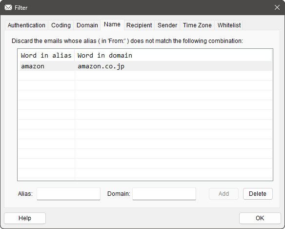

# `CNamePage`

## 構成

ソースコード上は,
[`NamePage.h`](../ChkMails/ChkMails/NamePage.h) と
[`NamePage.cpp`](../ChkMails/ChkMails/NamePage.cpp)
で実装されています.

この class は以下のメンバー関数で構成されています.

#### Constructor

[`CNamePage`](#cdomainpage-1)

#### Override

[`OnInitDialog`](#oninitdialog)
[`OnOK`](#onok)
[`PreTranslateMessage`](#pretranslatemessage)

#### 標準 Window Message ハンドラー

[`OnDropFiles`](#ondropfiles)
[`OnTimer`](#ontimer)

#### コマンドハンドラー

[`OnButtonAdd`](#onbuttonadd)
[`OnButtonDelete`](#onbuttondelete)
[`OnChangeEdit`](#onchangeedit)
[`OnChangeList`](#onchangelist)
[`OnEditPaste`](#oneditpaste)

#### 固有関数

[`OnSelectItem`](#onselectitem)
[`SortName`](#sortname)
[`AddNames`](#addnames)
[`LoadText`](#loadtext)

## 概要

[Name](../README.md#name) の設定を行うための「Page」です. 
[`CProperSheet`](CProperSheet.md) に乗っかった
[`CFilterSheet`](CFilterSheet.md) が
束ねている page のうちの 1つです.

メールの `From:` 欄にある公式な別名 ( Alias ) とメールアドレスの組み合わせを登録するため,
別名とメールアドレスの文字列入力を受け付け,
`Add` ボタンでリストに登録します.

あらかじめ作っておいた組み合わせのテキストファイルを Drag & Drop で受け付けたり,
組み合わせを記述したテキストの中身を Copy & Paste で取り込む機能も備えています.

以下, 本 class 内に実装された関数それぞれの説明です.

## `CNamePage`

この class の constructor です.

ソースコードを見ると, 何もやっていないように見えて「要るの？これ。」という感じですが,
リソース ID を指定して基底クラスの constructor を呼ぶという大事な仕事をしています.

## `OnInitDialog`

[`CPropertyPage::OnInitDialog`](https://learn.microsoft.com/ja-jp/cpp/mfc/reference/cdialog-class#oninitdialog)
の override です.

まずは普通に
`CPropertyPage::OnInitDialog` を呼んだ後,
( `CPropertyPage` は `OnInitDialog` を override していないようなので,
[`CDialog::OnInitDialog`](https://learn.microsoft.com/ja-jp/cpp/mfc/reference/cdialog-class#oninitdialog)
にスルーパスされた後, )
 以下の独自処理を挟みます.

1. [`GetCommonFont`](#CChkMailsApp.md#getcommonfont) で共通の等幅フォントを得る.
1. Edit Box に等幅フォントをセットする.
1. List Control に等幅フォントをセットする.
1. List Control を全カラムで選択表示するように設定.
1. List Control をグリッド表示するように設定.
1. List Control に 2カラム追加.
1. [`SortName`](#sortname) で名義配列をソート.
1. 「名義配列」をList Control に追加.
1. List Control のカラム幅を自動調整.
1. フォーカスを設定していないので, `TRUE` を返す.

## `OnOK`

[`CPropertyPage::OnOK`](https://learn.microsoft.com/ja-jp/cpp/mfc/reference/cpropertypage-class#onok)
の override です.

基底 class の実装である
[`CPropertyPage::OnOK`](https://learn.microsoft.com/ja-jp/cpp/mfc/reference/cpropertypage-class#onok)
も呼ばずに, 以下の処理だけ行います.

* List Control にある各ペアを「名義配列」に格納.

この `public` な配列は `OnOK` の後,
[Main Window](CMainWnd.md) が勝手に回収していく手筈になっています.

## `PreTranslateMessage`

`CProperSheet::PreTranslateMessage` の override です.

`WM_KEYDOWN` が来たとき, `Domain:` の Edit Box に入力フォーカスがあって入力キーが `Enter` だったら,
その事象を「`Add` ボタンが押された」にすり替えて
[`OnButtonAdd`](#onbuttonadd) が呼ばれるように仕向けています.

せっかく Edit Box に何か入れたのに,
`Add` ボタンを押さずにイキオイで `Enter` キーを叩いちゃううっかりさんって, 結構いらっしゃるようです.
しかし page 上で `Enter` キーを叩くと `OK` ボタンが押されたことになっちゃうので,
せっかくの入力がパーです.
ということで, その救済策として挟んでいる心遣いです.

## `OnDropFiles`

Window Message [`WM_DROPFILES`](https://learn.microsoft.com/ja-jp/windows/win32/shell/wm-dropfiles)
に対するハンドラーです.

( ←誤訳が著しいので[英語版](https://learn.microsoft.com/en-us/windows/win32/shell/wm-dropfiles)をご参照ください. )

Drop されたファイルの中身を [LoadText](#loadtext) で読み取って,
読み取った内容で [`AddNames`](#addnames) します.

その結果,
Drop されたファイルから読み取った「Alias とメールアドレスのペア」が,
List Control に取り込まれることになります.

## `OnTimer`

Window Message [`WM_TIMER`](https://learn.microsoft.com/ja-jp/windows/win32/winmsg/wm-timer)
に対するハンドラーです.

下記のタイマー値を取り扱っています.

| タイマー値 | 状況 | 処理内容 |
| --- | --- | --- |
| `TID_SELCHANGE` | 「選択対象変更」 | [`OnSelectItem`](#onselectitem) 呼び出し. |

## `OnButtonAdd`

`Add` ボタンが押された時に飛んでくる `BN_CLICKED` コマンドのハンドラーです.

`Alias:` と `Domain:` の Edit Box に入力されたペアを List Control に追加します.

ただし, すでに List Control 内に全く同じペアがエントリー済みの場合は,
追加はしません.
同じものを複数登録しても意味がないので.

`Add` 直後のペアは, List Control 上では「選択されている」状態になっています.
「間違えた」と思ったらすかさず `Delete` ボタンを押しましょう.
今 `Add` したばかりのペアが登録抹消されます.

`Domain:` の Edit Box への入力を終えた時点で, ついイキオイで `Enter` キーを叩いてしまったときは,
[`PreTranslateMessage`](#pretranslate) の心遣いで当関数が呼ばれています.

## `OnButtonDelete`

`Delete` ボタンが押された時に飛んでくる `BN_CLICKED` コマンドのハンドラーです.

今 List Control 上で選択されている行のエントリーを削除します.

この「選択されている」を常に表現するため,
List Control の元ネタになっているリソース上では,
`Always Show Selection` が `True` に設定されています.
このお陰で List Control に入力フォーカスが当たっていない状況でも,
それなりに「選択されている」行がアピールされます.

## `OnChangeEdit`

Edit Box で文字列が変更された時に飛んでくる `EN_CHANGE` コマンドのハンドラーです.

* `Alias:` か `Domain:` いずれかの文字列が空なら `Add` ボタンを disable.
* `Alias:` と `Domain:` 両方の文字列が空でなければ `Add` ボタンを enable.

としています.

## `OnChangeList`

List Control 上の選択が変えられた時に飛んでくる `LVN_ITEMCHANGED` コマンドのハンドラーです.

待ち時間ゼロで `TID_SELCHANGE` のタイマーをしかけてこの場はやり過ごします.

なぜこんなことをしているかというと,
A から B に選択し直すだけで

* A が選択状態から非選択状態になったという `LVN_ITEMCHANGED`
* B が非選択状態から選択状態になったという `LVN_ITEMCHANGED`

がいちいち飛んでくるのでめんどくさかったんです.
やり過ごしてから「結局、何が選ばれたんだ?」と構える方が世話がなかったので.
( めんどくさがらずにマジメに対応した例は [`CDomainPage::OnChangeList`](CDomainPage.md#onchangelist) にあります. )

## `OnEditPaste`

当 page に対して `Ctrl`+`V` されたときに飛んでくる `ID_EDIT_PASTE` コマンドのハンドラーです.

クリップボードの中身をテキストとして受け取り,
その内容で [`AddNames`](#addnames) します.

その結果,
Drop されたファイルから読み取った「Alias とメールアドレスのペア」が,
List Control に取り込まれることになります.

なお, この `ID_EDIT_PASTE` コマンドですが,
[`CFilterSheet::PreTranslateMessage`](CFilterSheet.md#pretranslatemessage)
様の格別なお引き立てにより, 当 class まで届いていることを申し添えておきます.

## `OnSelectItem`

List Control 上の選択が変えられたことに対応します.

いずれかの有効な行が選択された場合は `Delete` ボタンを有効にし,
無効だった場合は `Delete` ボタンを無効にするだけです.

## `SortName`

文字列をソートして `CStringArray` に格納します.

`\n` 区切りで `CString` に収められたドメイン文字列をソートして `CStringArray` に格納します.

設定値を registry に格納する際は 1本の文字列だと都合が良いのですが,
List に並べて扱う時は配列の方が扱いやすいので,
こうして「文字列→配列」の処理を構えています.

## `AddNames`

「名義」を記述したテキストの中身を取り込みます.

このテキストの記述は,
「Alias とメールアドレスのペア」がタブ (`\t`) で区切られていることが前提になっており,
タブの前の文字列を Alias として, タブの後ろの文字列をメールアドレスとして取り込みます.

[OnDropFiles](#ondropfiles) と [OnEditPaste](#oneditpaste) から呼ばれています.

## `LoadText`

与えられたテキストファイルを開き, その内容を読み取って `CString` ( UTF16LE) で返します.

テキストファイルのエンコード形式は ASCII, Shift JIS, UTF8, UTF16LE に対応しており,
そのいずれの形式なのかは, この関数内部で自動判定しています.

[OnDropFiles](#ondropfiles) から呼ばれています.
