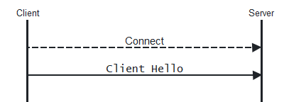

# `CParaSocket`

## 構成

ソースコード上は,
[`ParaSocket.h`](../ChkMails/ChkMails/ParaSocket.h) と
[`ParaSocket.cpp`](../ChkMails/ChkMails/ParaSocket.cpp)
で実装されています.

この class は以下のメンバー関数で構成されています.

#### Constructor & Destructor

[`CParaSocket`](#cparasocket-1)
[`~CParaSocket`](#cparasocket-2)

#### Public

[`Connect`](#connect)
[`Close`](#clse)
[`Send`](#send)
[`Receive`](#receive)
[`IOCtl`](#ioctl)
[`SetNotify`](#setnotify)
[`GetLastState`](#getlaststate)

#### Override

[`OnAccept`](#onaccept)
[`OnClose`](#onclose)
[`OnConnect`](#onconnect)
[`OnReceive`](#onreceive)
[`OnSend`](#onsend)

#### 固有関数

[`NotifyState`](#notifystate)

#### TLS 関連

[`OnConnectTLS1`](#onconnecttls1)
[`OnConnectTLS2`](#onconnecttls2)
[`OnReceiveTLS`](#onreceivetls)

[`ReceiveTLS`](#receivetls)
[`SendTLS`](#sendtls)
[`CloseTLS`](#closetls)
[`FinishTLS`](#finishtls)

[`EnqueueData`](#enqueuedata)
[`DequeueData`](#dequeuedata)

## 概要

非同期ソケット class
[`CAsyncSocket`](https://learn.microsoft.com/ja-jp/cpp/mfc/reference/casyncsocket-class)
から派生させた通信用のソケット class です.

「非同期」なので
「[event driven](https://ja.wikipedia.org/wiki/イベント駆動型プログラミング)」に動きます.
何かきっかけが与えられると, そのきっかけに応じてちょこっと動き,
そのちょこっとの動きが終わったら, 次のきっかけが来るまで何もしないで待っている,
という動きです.
派生元の
[`CAsyncSocket`](https://learn.microsoft.com/ja-jp/cpp/mfc/reference/casyncsocket-class)
がそういう使われ方をする前提の class なので, その流儀を踏襲しています.

当 class は
[TLS](https://ja.wikipedia.org/wiki/Transport_Layer_Security) もサポートしているので,
TLS を使用する
[POP3S](https://ja.wikipedia.org/wiki/Post_Office_Protocol#暗号化)
にも使えます. ( TLS のない [POP3](https://ja.wikipedia.org/wiki/Post_Office_Protocol) にも使えます. )

この class で TLS を使用した際の, アプリ層を含む階層構造は下記のように表せます.

| Application |
| :-: |
| `CParaSocket` |
| [TLS](https://ja.wikipedia.org/wiki/Transport_Layer_Security) ||
| [`CAsyncSocket`](https://learn.microsoft.com/ja-jp/cpp/mfc/reference/casyncsocket-class) |
| *Network* |
| *Server* |

つまり, アプリ層からは TLS 的あれやこれやは見えません.
そういったあれやこれやはこの class の中で面倒を見ています.
アプリ層としては TLS を意識せずに ( 暗号化など考えずに ) サーバーと通信します.
POP3 でも POP3S でもやることは同じです.

では, どうやって TLS を挟むか否かを決めているのかというと,
ポート番号です.
世間的に TLS を挟むもんだと了解されているサービスのポート番号での接続が頼まれた場合,
この class では勝手に TLS を下敷きに挟みます.
対象となるポートは下表の通りです.

| ポート番号 | サービス |
| --- | --- |
| 443 | [HTTPS](https://ja.wikipedia.org/wiki/HTTPS) |
| 465 | [SMPTS](https://ja.wikipedia.org/wiki/SMTPS) |
| 993 | [IMAPS](https://ja.wikipedia.org/wiki/Internet_Message_Access_Protocol)
| 995 | [POP3S](https://ja.wikipedia.org/wiki/Post_Office_Protocol#暗号化)

他にも TLS なサービスがないことはないのですが, 使う予定がないので対応をサボりました.
あと, 「ポート番号が動的に決まるのだが TLS も挟みたい」といった需要のために,

* ポート番号に負数を渡すと正数として承った上で TLS を挟む

という小細工が入っています.

これらの条件から外れる普通のポート番号では, 普通に接続し, 普通に通信します.
つまり, アプリ層から渡されたデータがそのままネットワークに流れ,
ネットワークから来たデータがそのままアプリ層に渡ります.

## `CParaSocket`

この class の constructor です.

基底 class
[`CAsyncSocket`](https://learn.microsoft.com/ja-jp/cpp/mfc/reference/casyncsocket-class)
の constructor を呼ぶという大事な仕事をしたあと,
メンバー変数を初期化しています.
 

そうしておかないと[C26495](https://learn.microsoft.com/ja-jp/cpp/code-quality/c26495)がうるさいので.

## `~CParaSocket`

この class の destructor です.

稼働中に確保したメモリーを開放して,
基底 class
[`CAsyncSocket`](https://learn.microsoft.com/ja-jp/cpp/mfc/reference/casyncsocket-class)
の destructor でソケットを破棄します.

## `Connect`

[`CAsyncSocket::Connect`](https://learn.microsoft.com/ja-jp/cpp/mfc/reference/casyncsocket-class#connect)
の override です.

処理内容は以下の通りです.

1. 引数として渡された接続先とポート番号を記憶しておく.
1. TLS 対象ポート番号だったら, 「TLS段階」を `1` に進める.
1. ポート番号が負数だったら, 正数に反転の上, 「TLS段階」を `1` に進める.
1. 上記 2者に該当しない場合は, 「TLS段階」を `0` に留める.
1. 結局, 「TLS段階」が `1` だったら, 「暗号バッファ」を確保して「空」に初期化.
1. [`CAsyncSocket::Connect`](https://learn.microsoft.com/ja-jp/cpp/mfc/reference/casyncsocket-class#connect)
でソケットを接続する.

最後の
[`CAsyncSocket::Connect`](https://learn.microsoft.com/ja-jp/cpp/mfc/reference/casyncsocket-class#connect)
の呼び出しの戻り値を返します.

## `Close`

[`CAsyncSocket::Close`](https://learn.microsoft.com/ja-jp/cpp/mfc/reference/casyncsocket-class#close)
の override です.

「TLS段階」が `0` でなければ,

* [`CloseTLS`](#closetls) で TLS として閉じる.
* 「TLS段階」を `0` に初期化.
* 「暗号バッファ」を開放し, 暗号化関連の変数もクリア.

とした後, いずれにせよ
[`CAsyncSocket::Close`](https://learn.microsoft.com/ja-jp/cpp/mfc/reference/casyncsocket-class#close)
でソケットを閉じて終了です.

## `Send`

[`CAsyncSocket::Send`](https://learn.microsoft.com/ja-jp/cpp/mfc/reference/casyncsocket-class#send)
の override です.

「TLS段階」が `1` 以上だったら, [`SendTLS`](#sendtls) を呼んでその戻り値を返します.
 
「TLS段階」が `0` だったら,
ソケットからの送信のために
[`CAsyncSocket::Send`](https://learn.microsoft.com/ja-jp/cpp/mfc/reference/casyncsocket-class#send)
を呼んでその戻り値を返します.

## `Receive`

[`CAsyncSocket::Receive`](https://learn.microsoft.com/ja-jp/cpp/mfc/reference/casyncsocket-class#receive)
の override です.

「TLS段階」が `1` 以上だったら, [`ReceiveTLS`](#receivetls) を呼んでその戻り値を返します.
 
「TLS段階」が `0` だったら,
ソケットからの受信のために
[`CAsyncSocket::Receive`](https://learn.microsoft.com/ja-jp/cpp/mfc/reference/casyncsocket-class#receive)
を呼んでその戻り値を返します.

## `IOCtl`

[`CAsyncSocket::IOCtl`](https://learn.microsoft.com/ja-jp/cpp/mfc/reference/casyncsocket-class#ioctl)
の override です.

「TLS段階」が `1` 以上でコマンドが `FIONREAD` の場合は, 「復号バッファ」にあるバイト数を伝えて, `TRUE` を返します.
 
上記以外の場合は,
ソケットの制御のために
[`CAsyncSocket::IOCtl`](https://learn.microsoft.com/ja-jp/cpp/mfc/reference/casyncsocket-class#ioctl)
を呼んでその戻り値を返します.

## `SetNotify`

Socket の状態変化を通知するメッセージを設定します.

それぞれの引数の意味は以下の通りです:

| 引数 | 意味 | デフォルト |
| --- | --- | --- |
| `pWnd` | 通知先の `CWnd*` | `AfxGetMainWnd` で得られる main window |
| `nIdClient` | クライアント指定の任意の値 | `0` |
| `nIdMessage` | 通知する window message | `WM_SOCKET_NOTIFY` |

この関数で設定された通知方式で,
[`NotifyState`](#notifystate) はアプリ層に状態変化を通知します.

`AfxGetMainWnd` で得られる main window がこの class の使用者であるダイアログベースのアプリの場合,
この関数の呼び出しは省略可能ですが,
main window が
[`CFrameWnd`](https://learn.microsoft.com/ja-jp/cpp/mfc/reference/cframewnd-class)
の派生 class となる *Document & View Architecture* の場合で,
この class の使用者が [*View*](https://learn.microsoft.com/ja-jp/cpp/mfc/reference/cview-class) なら,
この関数を通じて *View* が通知先であることを設定しておく必要があります.

サーバーソケットを運用する場合は,
[`Listen`](https://learn.microsoft.com/ja-jp/cpp/mfc/reference/casyncsocket-class#listen)
しているソケットからの通知と,
[`Accept`](https://learn.microsoft.com/ja-jp/cpp/mfc/reference/casyncsocket-class#accept)
したソケットからの通知を見分けるために,
`nIdClient` に別々の値を指定しておくという使い方もあります.

## `GetLastState`

Socket の現在の状態を返します.

取り得る状態値は以下の通りです:

| 状態値 | 意味 |
| --- | --- |
| `SOCK_STATE_IDLE` | 「つながってない・切れた」 |
| `SOCK_STATE_CONNECTED` | 「つながった」 |
| `SOCK_STATE_RECEIVED` | 「なんか受信した」 |
| `SOCK_STATE_SENT` | 「送信できた」 |
| `SOCK_STATE_ACCEPTED` | 「だれか来た」 |
| `SOCK_STATE_FAILED` | 「なんか失敗した」 |

## `OnAccept`

[`CAsyncSocket::OnAccept`](https://learn.microsoft.com/ja-jp/cpp/mfc/reference/casyncsocket-class#onaccept)
の override です.

[`NotifyState`](#notifystate) を呼んでアプリに
`SOCK_STATE_ACCEPTED` ( エラーが生じた場合は `SOCK_STATE_FAILED` ) と通知します.

## `OnClose`

[`CAsyncSocket::OnClose`](https://learn.microsoft.com/ja-jp/cpp/mfc/reference/casyncsocket-class#onclose)
の override です.

[`NotifyState`](#notifystate) を呼んでアプリに
`SOCK_STATE_IDLE` ( エラーが生じた場合は `SOCK_STATE_FAILED` ) と通知します.

## `OnConnect`

[`CAsyncSocket::OnConnect`](https://learn.microsoft.com/ja-jp/cpp/mfc/reference/casyncsocket-class#onconnect)
の override です.

* エラーが生じた場合は, [`NotifyState`](#notifystate) を呼んでアプリに `SOCK_STATE_FAILED` と通知します.
* 「TLS段階」が `1` の場合は, アプリには通知せず, [`OnConnectTLS1`](#onconnecttls1) を呼んで TLS を開始します.
* その他の場合は, [`NotifyState`](#notifystate) を呼んでアプリに `SOCK_STATE_CONNECTED` と通知します.

## `OnReceive`

[`CAsyncSocket::OnReceive`](https://learn.microsoft.com/ja-jp/cpp/mfc/reference/casyncsocket-class#onreceive)
の override です.

その処理内容は, 状況によって下記のように分岐しています.

| 状況 | 対応 |
| --- | --- |
| エラー発生 | `SOCK_STATE_FAILED` とアプリに [`NotifyState`](#notifystate). |
| 「TLS段階」が `2` | [`OnConnectTLS2`](#onconnecttls2) を呼ぶ. | 
| 「TLS段階」が `3` 以上 | [`OnReceiveTLS`](#onreceivetls) を呼ぶ. | 
| その他 | `SOCK_STATE_RECEIVED` とアプリに [`NotifyState`](#notifystate). |

## `OnSend`

[`CAsyncSocket::OnSend`](https://learn.microsoft.com/ja-jp/cpp/mfc/reference/casyncsocket-class#onsend)
の override です.

[`NotifyState`](#notifystate) を呼んでアプリに
`SOCK_STATE_SENT` ( エラーが生じた場合は `SOCK_STATE_FAILED` ) と通知します.

## `NotifyState`

Socket の状態変化をアプリ層に通知します.

[`SetNotify`](#setnotify) で設定されたパラメーターで,

* `WPARAM` にはクライアントの指定値と状態を示すコードを織り込んだ値
* `LPARAM` にはこの class のインスタンスへのポインター

を [post](https://learn.microsoft.com/ja-jp/windows/win32/api/winuser/nf-winuser-postmessagew)
します.

この通知メッセージを受けたアプリ層がソケットを操作しにくる,
というのが「非同期」の流儀です.

## `OnConnectTLS1`

[TLS](https://ja.wikipedia.org/wiki/Transport_Layer_Security) 接続を開始します. (その1)

[`OnConnect`](#onconnect) から呼ばれ, TLS 接続の「はじまりの一歩」を踏み出します.

通信上は, TCP/IP 上の接続が成立してから, いわゆる「Client Hello」を送信するまでを行います.

<picture>
  <source media="(prefers-color-scheme: dark)" srcset="../pics/TLS1d.png">
  <source media="(prefers-color-scheme: light)" srcset="../pics/TLS1l.png">
  
</picture>

すると, サーバーからは「Server Hello」と「Certificate」や「Server Hello Done」が返ってくるはずですが,
本 class は「非同期」を信条にしているので,
続きは現物を受信したときの [`OnReceive`](#onreceive) をきっかけに始めることにして,
この関数はいったん抜けます.

この関数が抜けるまでに行う処理内容は以下の通りです:

1. [`AcquireCredentialsHandle`](https://learn.microsoft.com/ja-jp/windows/win32/secauthn/acquirecredentialshandle--schannel)
で TLS の通信を行う準備を整える.
1. [`InitializeSecurityContext`](https://learn.microsoft.com/ja-jp/windows/win32/secauthn/initializesecuritycontext--schannel)
で, Client Hello のメッセージを作成する.
1. [`CAsyncSocket::Send`](https://learn.microsoft.com/ja-jp/cpp/mfc/reference/casyncsocket-class#send)
で Client Hello のメッセージを送信する.
1. [`FreeContextBuffer`](https://learn.microsoft.com/ja-jp/windows/win32/api/sspi/nf-sspi-freecontextbuffer)
を呼んで, 送信バッファ―を開放.
1. 「TLS段階」を `2` に進める.

## `OnConnectTLS2`

[TLS](https://ja.wikipedia.org/wiki/Transport_Layer_Security) 接続を開始します. (その2)

[`OnReceive`](#onreceive) から呼ばれ, TLS 接続の「残りの仕事」を片付けます.

通信上は, いわゆる「Server Hello」,「Certificate」,「Server Hello Done」を受信して,
「Client Key Exchange」,「Change Cipher Spec」,「Encrypted Handshake Message」を返信し,
そのまた返信の「Change Cipher Spec」,「Encrypted Handshake Message」を受信するまでを行います.

<picture>
  <source media="(prefers-color-scheme: dark)" srcset="../pics/TLS2d.png">
  <source media="(prefers-color-scheme: light)" srcset="../pics/TLS2l.png">
  
</picture>

やり取りするデータが大きくまた複数あるので, 1回では結論が出ず, TLS の API から「つづく」とか返ってくる場合もありますが,
本 class は「非同期」を信条にしているので,
続きはつづきの現物を受信したときの [`OnReceive`](#onreceive) をきっかけに始めることにして,
この関数はいったん抜けます.

この関数の担当フェーズが終わるまでに行う処理内容は以下の通りです:

1. [`CAsyncSocket::Receive`](https://learn.microsoft.com/ja-jp/cpp/mfc/reference/casyncsocket-class#receive)
でサーバーからのメッセージを受信する.
1. 「セキュリティートークンのやり取り」というお題で受信メッセージを
[`InitializeSecurityContext`](https://learn.microsoft.com/ja-jp/windows/win32/secauthn/initializesecuritycontext--schannel).
1. `SECBUFFER_EXTRA` があったら「一緒に受信したデータ」ということで「暗号バッファ」に追加.
1. 「できた」が返ってきたら「TLS段階」を `3` に進めて,
「接続完了」と [`NotifyState`](#notifystate).
1. 「もっと」が返ってきたら, 次の受信を待つためこの場は終わりにする.
1. 「つづく」が返ってきたら, 返信すべきデータが添えられていたらそれを
[`CAsyncSocket::Send`](https://learn.microsoft.com/ja-jp/cpp/mfc/reference/casyncsocket-class#send)してから
[`FreeContextBuffer`](https://learn.microsoft.com/ja-jp/windows/win32/api/sspi/nf-sspi-freecontextbuffer)
を呼んで, 送信バッファ―を開放.

ということで,
アプリ層に黙ったまま水面下でかなりのやり取りを経て, 結論がでたところではじめて
「接続完了」とアプリ層にお知らせするのです.

ところで上記の処理を終えた後, さらに受信データが残っている場合がありますが
( サーバーから最初の挨拶を送ってくる [POP3](https://ja.wikipedia.org/wiki/Post_Office_Protocol)
の場合は大抵そうなりますが ),
その処理は以下の通りです:

1. 「データ」というお題で溜まっている「暗号バッファ」を
[`DecryptMessage`](https://learn.microsoft.com/ja-jp/windows/win32/secauthn/decryptmessage--schannel).
1. 復号できたら, そのメッセージを今後の読み出しに備えて [`EnqueueData`](#enqueuedata).
1. 復号されなかった残りがあったら, その分は「暗号バッファ」に戻しておく.
1. 「なんか受信した」と [`NotifyState`](#notifystate).

「非同期」なアプリ層としては, この「なんか受信した」という通知を受けて,
当 class の [`Receive`](#receive) を呼び出す手筈になっています.

## `OnReceiveTLS`

[TLS](https://ja.wikipedia.org/wiki/Transport_Layer_Security) での受信を行います.

[`OnReceive`](#onreceive) から呼ばれ, TLS により暗号化された受信メッセージを復号します.

その処理は以下の通りです:

1. 「暗号バッファ」がいっぱいだったら, 何もせずに帰る.
1. [`CAsyncSocket::Receive`](https://learn.microsoft.com/ja-jp/cpp/mfc/reference/casyncsocket-class#receive)
で暗号化されたメッセージを受信.
1. 何も受信できなかったら帰る.
1. 「暗号バッファ」に受信データが残っている間, 以下を繰り返し:
1. 「データ」というお題で溜まっている「暗号バッファ」を
[`DecryptMessage`](https://learn.microsoft.com/ja-jp/windows/win32/secauthn/decryptmessage--schannel).
1. 「できた」が返ってきたら, それを [`EnqueueData`](#enqueuedata) して, 
`SECBUFFER_EXTRA` があったら「一緒に巻き込んだデータ」と見なして「暗号バッファ」に追加し, 
復号しきれてないデータが残っていたら 5. から繰り返すけど, そうでなければ 
「なんか受信した」と [`NotifyState`](#notifystate) して終了.
1. 「おわり」が返ってきたら, 今まで受信したデータをなかったことにする.
1. 「もっと」が返ってきたら, 次の受信を待つためこの場は終わりにする.
1. それ以外が返ってきたら, [`FinishTLS`](#finishtls) で TLS を片付けて終了.

つまり, 暗号化されたメッセージの受信を済ませた後,
その復号が完了してはじめて「なんか受信した」とアプリ層にお知らせするのです.

「非同期」なアプリ層としては, この「なんか受信した」という通知を受けて,
当 class の [`Receive`](#receive) を呼び出す手筈になっています.

## `ReceiveTLS`

[TLS](https://ja.wikipedia.org/wiki/Transport_Layer_Security) で受信したデータを引き取ります.

[`Receive`](#receive) から呼ばれ, TLS から得て復号された受信メッセージを引き取ります.

引数で渡された受信バイト数を満たすまで, 以下を繰り返します:

1. 「復号バッファ」に何か入っている場合は, 入っている分だけ [`DequeueData`](#dequeuedata).
1. 「復号バッファ」が空だった場合は, 何か受信するまで
[`WaitForSingleObject`](https://learn.microsoft.com/ja-jp/windows/win32/api/synchapi/nf-synchapi-waitforsingleobject)

そして復号したバイト数 ( ＝ 引数で渡された受信バイト数 ) を返します.
 
引数で渡されたポインターの中身は, 復号したメッセージで満たされています.

## `SendTLS`

[TLS](https://ja.wikipedia.org/wiki/Transport_Layer_Security) でデータを送信します.

[`Send`](#send) から呼ばれ, TLS を介して暗号化されたメッセージを送信します.

引数で渡された送信バイト数に達するまで, 以下を繰り返します:

1. 引数で渡された送信バイト数と一度に送信できる最大バイト数の小さい方を当座の送信バイト数とする.
1. 送信バッファを設ける.
1. 「ヘッダ」,「データ」,「トレイラー」というお題で送信バッファを
[`EncryptMessage`](https://learn.microsoft.com/ja-jp/windows/win32/api/sspi/nf-sspi-encryptmessage).
1. 「できた」が返ってきたら, それを
[`CAsyncSocket::Send`](https://learn.microsoft.com/ja-jp/cpp/mfc/reference/casyncsocket-class#send).
1. 送信バッファを開放する.
1. 「できた」以外が返ってきたら, 「なんか失敗した」と [`NotifyState`](#notifystate) して終了.

そして送信したバイト数 ( ＝ 引数で渡された送信バイト数 ) を返します.
 
送信するメッセージは, 全て暗号化されています.

## `CloseTLS`

[TLS](https://ja.wikipedia.org/wiki/Transport_Layer_Security) 接続を終了します.

[`Close`](#close) から呼ばれ, TLS 接続を終了させます.

1. 「セキュリティートークンのやり取り」というお題でシャットダウンメッセージを
[`InitializeSecurityContext`](https://learn.microsoft.com/ja-jp/windows/win32/secauthn/initializesecuritycontext--schannel).
1. 「できた」が返ってきたら, それを
[`CAsyncSocket::Send`](https://learn.microsoft.com/ja-jp/cpp/mfc/reference/casyncsocket-class#send).
1. 50[ms] ほど待つ.
1. [`FreeContextBuffer`](https://learn.microsoft.com/ja-jp/windows/win32/api/sspi/nf-sspi-freecontextbuffer)
を呼んで, 送信バッファ―を開放.
1. [`FinishTLS`](#finishtls) を呼んで, 今まで保持してきた TLS 用の資源を開放.

ここで疑問を持たれるのが 3. の「待つ」でしょうか.
結論から言うと別に待たなくても何の支障もありません.
ただ, ここでちょっと待つと
[Wireshark](https://ja.wikipedia.org/wiki/Wireshark)
とかでキャプチャーしたログがきれいに終わるから, というだけの理由で入れています.

ここに待ち時間を挟まないと,
ただちに [`Close`](#close) に戻り
[`CAsyncSocket::Close`](https://learn.microsoft.com/en-us/cpp/mfc/reference/casyncsocket-class#close)
が TCP 接続を切断することになります.
こちらから送信したシャットダウンメッセージ「Encrypted Alert: Close Notify」に対する TCP ACK を待たずにです.
そんな失礼な切断の結果, キャプチャーしたログが汚いことになるのです.
( Wireshark では 「TCP Dup ACK」と指摘されます. ACK が届かなかったと判断したサーバーが再送するからです. )

「非同期」で「[event driven](https://ja.wikipedia.org/wiki/イベント駆動型プログラミング)」を標榜している以上,
「待ち時間を挟む」なんて行為はいかがなものかという気もしますが,
ここアプリ階層では「TCP 階層」の ACK を待つすべはない*ので,
「待ち時間を挟む」で手を打っている次第です.
 

*
厳密には「なくはない」のですが,
「え? そんなことのためにそこまでする?」という手段に訴えることになるので,
常識的な手段で間に合わせています.

## `FinishTLS`

[TLS](https://ja.wikipedia.org/wiki/Transport_Layer_Security) を終了します.

TLS を終了しようとするあちこちから呼ばれ, それまで運用してきた TLS 用の資源を開放します.

具体的には, [`OnConnectTLS1`](#onconnecttls1) が
[`AcquireCredentialsHandle`](https://learn.microsoft.com/ja-jp/windows/win32/secauthn/acquirecredentialshandle--schannel)
で取得した「[資格情報](https://learn.microsoft.com/ja-jp/windows/win32/secauthn/obtaining-schannel-credentials)」への handle と,
[`InitializeSecurityContext`](https://learn.microsoft.com/ja-jp/windows/win32/secauthn/initializesecuritycontext--schannel)
で構築した「コンテキスト」への handle を開放します.

上記 handle を開放する局面とはすなわち通信を終了する局面なので,
終了することになった動機を引数のステータスで渡してもらい,
正常終了でなかった場合はその旨を [`NotifyState`](#notifystate) することも ( ついでに ) やっています.

## `EnqueueData`

「復号バッファ」の末尾にデータを追加します.

「復号バッファ」は [FIFO](https://ja.wikipedia.org/wiki/FIFO) の
[キュー](https://ja.wikipedia.org/wiki/キュー_(コンピュータ))になっているので,
その末尾に復号済みのデータを追加します.

[TLS](https://ja.wikipedia.org/wiki/Transport_Layer_Security) が先に受信したデータが,
アプリ層に先に渡るように ( 受信した順番通りにアプリ層に渡るように )
FIFO のキュー形式となっています.

追加した分, キューに保持されているデータは増えます.

## `DequeueData`

「復号バッファ」の先頭からからデータを取り出します.

「復号バッファ」は [FIFO](https://ja.wikipedia.org/wiki/FIFO) の
[キュー](https://ja.wikipedia.org/wiki/キュー_(コンピュータ))になっているので,
その先頭から復号済みのデータを取り出します.

[TLS](https://ja.wikipedia.org/wiki/Transport_Layer_Security) が先に受信したデータが,
アプリ層に先に渡るように ( 受信した順番通りにアプリ層に渡るように )
FIFO のキュー形式となっています.

取り出した分, キューに保持されているデータは減り, 残っているデータは先頭に向けて移動します.

