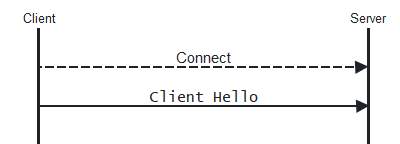
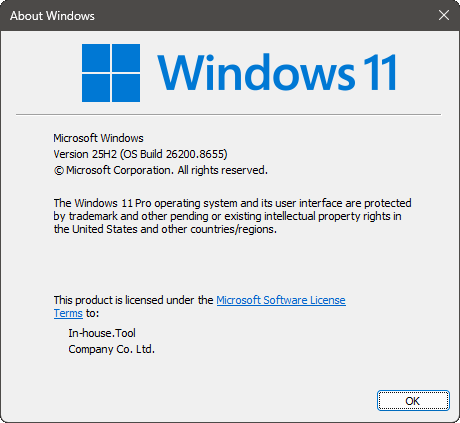

# `CParaSocket`

## 構成

ソースコード上は,
[`ParaSocket.h`](../ChkMails/ChkMails/ParaSocket.h) と
[`ParaSocket.cpp`](../ChkMails/ChkMails/ParaSocket.cpp)
で実装されています.

この class は以下のメンバー関数で構成されています.

#### Constructor & Destructor

[`CParaSocket`](#cparasocket-1)
[`~CParaSocket`](#cparasocket-2)

#### Public

[`Connect`](#connect)
[`Close`](#clse)
[`Send`](#send)
[`Receive`](#receive)
[`IOCtl`](#ioctl)
[`SetNotify`](#setnotify)
[`GetLastState`](#getlaststate)

#### Override

[`OnAccept`](#onaccept)
[`OnClose`](#onclose)
[`OnConnect`](#onconnect)
[`OnReceive`](#onreceive)
[`OnSend`](#onsend)

#### 固有関数

[`NotifyState`](#notifystate)

#### TLS 関連

[`OnConnectTLS1`](#onconnecttls1)
[`OnConnectTLS2`](#onconnecttls2)
[`OnReceiveTLS`](#onreceivetls)

[`ReceiveTLS`](#receivetls)
[`SendTLS`](#sendtls)
[`CloseTLS`](#closetls)
[`FinishTLS`](#finishtls)

[`SendBackTLS`](#sendbacktls)
[`ConsumeTLS`](#consumetls)
[`SeekBufTLS`](#seekbuftls)

[`EnqueueTLS`](#enqueuetls)
[`DequeueTLS`](#dequeuetls)

#### 汎用関数

[`GetWinVer`](#getwinver)


## 概要

非同期ソケット class
[`CAsyncSocket`](https://learn.microsoft.com/ja-jp/cpp/mfc/reference/casyncsocket-class)
から派生させた通信用のソケット class です.

「非同期」なので
「[event driven](https://ja.wikipedia.org/wiki/イベント駆動型プログラミング)」に動きます.
何かきっかけが与えられると, そのきっかけに応じてちょこっと動き,
そのちょこっとの動きが終わったら, 次のきっかけが来るまで何もしないで待っている,
という動きです.
派生元の
[`CAsyncSocket`](https://learn.microsoft.com/ja-jp/cpp/mfc/reference/casyncsocket-class)
がそういう使われ方をする前提の class なので, その流儀を踏襲しています.

当 class は
[TLS](https://ja.wikipedia.org/wiki/Transport_Layer_Security) もサポートしているので,
TLS を使用する
[POP3S](https://ja.wikipedia.org/wiki/Post_Office_Protocol#暗号化)
にも使えます. ( TLS のない [POP3](https://ja.wikipedia.org/wiki/Post_Office_Protocol) にも使えます. )

この class で TLS を使用した際の, アプリ層を含む階層構造は下記のように表せます.

| Application |
| :-: |
| `CParaSocket` |
| [TLS](https://ja.wikipedia.org/wiki/Transport_Layer_Security) ||
| [`CAsyncSocket`](https://learn.microsoft.com/ja-jp/cpp/mfc/reference/casyncsocket-class) |
| *Network* |
| *Server* |

つまり, アプリ層からは TLS 的あれやこれやは見えません.
そういったあれやこれやはこの class の中で面倒を見ています.
アプリ層としては TLS を意識せずに ( 暗号化など考えずに ) サーバーと通信します.
POP3 でも POP3S でもやることは同じです.

では, どうやって TLS を挟むか否かを決めているのかというと,
ポート番号です.
世間的に TLS を挟むもんだと了解されているサービスのポート番号での接続が頼まれた場合,
この class では勝手に TLS を下敷きに挟みます.
対象となるポートは下表の通りです.

| ポート番号 | サービス |
| --- | --- |
| 443 | [HTTPS](https://ja.wikipedia.org/wiki/HTTPS) |
| 465 | [SMTPS](https://ja.wikipedia.org/wiki/SMTPS) |
| 993 | [IMAPS](https://ja.wikipedia.org/wiki/Internet_Message_Access_Protocol)
| 995 | [POP3S](https://ja.wikipedia.org/wiki/Post_Office_Protocol#暗号化)

他にも TLS なサービスがないことはないのですが, 使う予定がないので対応をサボりました.
あと, 「ポート番号が動的に決まるのだが TLS も挟みたい」といった需要のために,

* ポート番号に負数を渡すと正数として承った上で TLS を挟む

という小細工が入っています.

これらの条件から外れる普通のポート番号では, 普通に接続し, 普通に通信します.
つまり, アプリ層から渡されたデータがそのままネットワークに流れ,
ネットワークから来たデータがそのままアプリ層に渡ります.


## `CParaSocket`

この class の constructor です.

基底 class
[`CAsyncSocket`](https://learn.microsoft.com/ja-jp/cpp/mfc/reference/casyncsocket-class)
の constructor を呼ぶという大事な仕事をしたあと,
メンバー変数を初期化しています.
<br>
<sub>
そうしておかないと[C26495](https://learn.microsoft.com/ja-jp/cpp/code-quality/c26495)がうるさいので.
</sub>

## `~CParaSocket`

この class の destructor です.

稼働中に確保したメモリーを開放します.


## `Connect`

[`CAsyncSocket::Connect`](https://learn.microsoft.com/ja-jp/cpp/mfc/reference/casyncsocket-class#connect)
の override です.

処理内容は以下の通りです.

1. 引数として渡された接続先とポート番号を記憶しておく.
1. TLS 対象ポート番号だったら, 「TLS段階」を `1` に進める.
1. ポート番号が負数だったら, 正数に反転の上, 「TLS段階」を `1` に進める.
1. 上記 2者に該当しない場合は, 「TLS段階」を `0` に留める.
1. 結局, 「TLS段階」が `1` だったら, 「暗号バッファ」を確保して「空」に初期化.
1. [`CAsyncSocket::Connect`](https://learn.microsoft.com/ja-jp/cpp/mfc/reference/casyncsocket-class#connect)
でソケットを接続する.

最後の
[`CAsyncSocket::Connect`](https://learn.microsoft.com/ja-jp/cpp/mfc/reference/casyncsocket-class#connect)
の呼び出しの戻り値を返します.


## `Close`

[`CAsyncSocket::Close`](https://learn.microsoft.com/ja-jp/cpp/mfc/reference/casyncsocket-class#close)
の override です.

「TLS段階」が `0` でなければ,

* [先方から切断された](#onclose)のでなければ [`CloseTLS`](#closetls) で TLS として閉じる.
* 「TLS段階」を `0` に初期化.
* 「暗号バッファ」を開放し, 暗号化関連の変数もクリア.

とした後, いずれにせよ
[`CAsyncSocket::Close`](https://learn.microsoft.com/ja-jp/cpp/mfc/reference/casyncsocket-class#close)
でソケットを閉じて終了です.


## `Send`

[`CAsyncSocket::Send`](https://learn.microsoft.com/ja-jp/cpp/mfc/reference/casyncsocket-class#send)
の override です.

「TLS段階」が `1` 以上だったら, [`SendTLS`](#sendtls) を呼んでその戻り値を返します.
<br>
「TLS段階」が `0` だったら,
ソケットからの送信のために
[`CAsyncSocket::Send`](https://learn.microsoft.com/ja-jp/cpp/mfc/reference/casyncsocket-class#send)
を呼んでその戻り値を返します.


## `Receive`

[`CAsyncSocket::Receive`](https://learn.microsoft.com/ja-jp/cpp/mfc/reference/casyncsocket-class#receive)
の override です.

「TLS段階」が `1` 以上だったら, [`ReceiveTLS`](#receivetls) を呼んでその戻り値を返します.
<br>
「TLS段階」が `0` だったら,
ソケットからの受信のために
[`CAsyncSocket::Receive`](https://learn.microsoft.com/ja-jp/cpp/mfc/reference/casyncsocket-class#receive)
を呼んでその戻り値を返します.


## `IOCtl`

[`CAsyncSocket::IOCtl`](https://learn.microsoft.com/ja-jp/cpp/mfc/reference/casyncsocket-class#ioctl)
の override です.

「TLS段階」が `1` 以上でコマンドが `FIONREAD` の場合は, 「復号バッファ」にあるバイト数を伝えて, `TRUE` を返します.
<br>
上記以外の場合は,
ソケットの制御のために
[`CAsyncSocket::IOCtl`](https://learn.microsoft.com/ja-jp/cpp/mfc/reference/casyncsocket-class#ioctl)
を呼んでその戻り値を返します.


## `SetNotify`

Socket の状態変化を通知するメッセージを設定します.

それぞれの引数の意味は以下の通りです:

| 引数 | 意味 | デフォルト |
| --- | --- | --- |
| `pWnd` | 通知先の `CWnd*` | `AfxGetMainWnd` で得られる main window |
| `nIdClient` | クライアント指定の任意の値 | `0` |
| `nIdMessage` | 通知する window message | `WM_SOCKET_NOTIFY` |

この関数で設定された通知方式で,
[`NotifyState`](#notifystate) はアプリ層に状態変化を通知します.

`AfxGetMainWnd` で得られる main window がこの class の使用者であるダイアログベースのアプリの場合,
この関数の呼び出しは省略可能ですが,
main window が
[`CFrameWnd`](https://learn.microsoft.com/ja-jp/cpp/mfc/reference/cframewnd-class)
の派生 class となる *Document & View Architecture* の場合で,
この class の使用者が [*View*](https://learn.microsoft.com/ja-jp/cpp/mfc/reference/cview-class) なら,
この関数を通じて *View* が通知先であることを設定しておく必要があります.

サーバーソケットを運用する場合は,
[`Listen`](https://learn.microsoft.com/ja-jp/cpp/mfc/reference/casyncsocket-class#listen)
しているソケットからの通知と,
[`Accept`](https://learn.microsoft.com/ja-jp/cpp/mfc/reference/casyncsocket-class#accept)
したソケットからの通知を見分けるために,
`nIdClient` に別々の値を指定しておくという使い方もあります.

## `GetLastState`

Socket の現在の状態を返します.

取り得る状態値は以下の通りです:

| 状態値 | 意味 |
| --- | --- |
| `SOCK_STATE_IDLE` | 「つながってない・切れた」 |
| `SOCK_STATE_CONNECTED` | 「つながった」 |
| `SOCK_STATE_RECEIVED` | 「なんか受信した」 |
| `SOCK_STATE_SENT` | 「送信できた」 |
| `SOCK_STATE_ACCEPTED` | 「だれか来た」 |
| `SOCK_STATE_FAILED` | 「なんか失敗した」 |


## `OnAccept`

[`CAsyncSocket::OnAccept`](https://learn.microsoft.com/ja-jp/cpp/mfc/reference/casyncsocket-class#onaccept)
の override です.

[`NotifyState`](#notifystate) を呼んでアプリに
`SOCK_STATE_ACCEPTED` ( エラーが生じた場合は `SOCK_STATE_FAILED` ) と通知します.


## `OnClose`

[`CAsyncSocket::OnClose`](https://learn.microsoft.com/ja-jp/cpp/mfc/reference/casyncsocket-class#onclose)
の override です.

[`NotifyState`](#notifystate) を呼んでアプリに
`SOCK_STATE_IDLE` ( エラーが生じた場合は `SOCK_STATE_FAILED` ) と通知します.


## `OnConnect`

[`CAsyncSocket::OnConnect`](https://learn.microsoft.com/ja-jp/cpp/mfc/reference/casyncsocket-class#onconnect)
の override です.

* エラーが生じた場合は, [`NotifyState`](#notifystate) を呼んでアプリに `SOCK_STATE_FAILED` と通知します.
* 「TLS段階」が `1` の場合は, アプリには通知せず, [`OnConnectTLS1`](#onconnecttls1) を呼んで TLS を開始します.
* その他の場合は, [`NotifyState`](#notifystate) を呼んでアプリに `SOCK_STATE_CONNECTED` と通知します.


## `OnReceive`

[`CAsyncSocket::OnReceive`](https://learn.microsoft.com/ja-jp/cpp/mfc/reference/casyncsocket-class#onreceive)
の override です.

その処理内容は, 状況によって下記のように分岐しています.

| 状況 | 対応 |
| --- | --- |
| エラー発生 | `SOCK_STATE_FAILED` とアプリに [`NotifyState`](#notifystate). |
| 「TLS段階」が `2` | [`OnConnectTLS2`](#onconnecttls2) を呼ぶ. | 
| 「TLS段階」が `3` 以上 | [`OnReceiveTLS`](#onreceivetls) を呼ぶ. | 
| その他 | `SOCK_STATE_RECEIVED` とアプリに [`NotifyState`](#notifystate). |


## `OnSend`

[`CAsyncSocket::OnSend`](https://learn.microsoft.com/ja-jp/cpp/mfc/reference/casyncsocket-class#onsend)
の override です.

[`NotifyState`](#notifystate) を呼んでアプリに
`SOCK_STATE_SENT` ( エラーが生じた場合は `SOCK_STATE_FAILED` ) と通知します.


## `NotifyState`

Socket の状態変化をアプリ層に通知します.

[`SetNotify`](#setnotify) で設定されたパラメーターで,

* `WPARAM` にはクライアントの指定値と状態を示すコードを織り込んだ値
* `LPARAM` にはこの class のインスタンスへのポインター

を [post](https://learn.microsoft.com/ja-jp/windows/win32/api/winuser/nf-winuser-postmessagew)
します.

この通知メッセージを受けたアプリ層がソケットを操作しにくる,
というのが「非同期」の流儀です.


## `OnConnectTLS1`

[TLS](https://ja.wikipedia.org/wiki/Transport_Layer_Security) 接続を開始します. (その1)

[`OnConnect`](#onconnect) から呼ばれ, TLS 接続の「はじまりの一歩」を踏み出します.

通信上は, TCP/IP 上の接続が成立してから, いわゆる「Client Hello」を送信するまでを行います.

<picture>
  <source media="(prefers-color-scheme: dark)" srcset="../pics/TLS1d.png">
  <source media="(prefers-color-scheme: light)" srcset="../pics/TLS1l.png">
  
</picture>
<p>

すると, サーバーからは「Server Hello」と「Certificate」や「Server Hello Done」が返ってくるはずですが,
本 class は「非同期」を信条にしているので,
続きは現物を受信したときの [`OnReceive`](#onreceive) をきっかけに始めることにして,
この関数はいったん抜けます.

この関数が抜けるまでに行う処理内容は以下の通りです:

1. [`GetWinVer`](#getwinver) で Windows&reg; のバージョンを読み,
Windows&reg;11以降なら TLS1.3 を,
Windows&reg;10以前なら TLS1.2 をチョイス.
1. [`AcquireCredentialsHandle`](https://learn.microsoft.com/ja-jp/windows/win32/secauthn/acquirecredentialshandle--schannel)
で TLS の通信を行う準備を整える.
1. [`InitializeSecurityContext`](https://learn.microsoft.com/ja-jp/windows/win32/secauthn/initializesecuritycontext--schannel)
で, Client Hello のメッセージを作成する.
1. [`SendBackTLS`](#sendbacktls) でClient Hello のメッセージを返信する.
1. 「TLS段階」を `2` に進める.


## `OnConnectTLS2`

[TLS](https://ja.wikipedia.org/wiki/Transport_Layer_Security) 接続を開始します. (その2)

[`OnReceive`](#onreceive) から呼ばれ, TLS 接続の「残りの仕事」を片付けます.

通信上は, いわゆる「Server Hello」,「Certificate」,「Server Hello Done」を受信して,
「Client Key Exchange」,「Change Cipher Spec」,「Encrypted Handshake Message」を返信し,
そのまた返信の「Change Cipher Spec」,「Encrypted Handshake Message」を受信するまでを行います.

<picture>
  <source media="(prefers-color-scheme: dark)" srcset="../pics/TLS2d.png">
  <source media="(prefers-color-scheme: light)" srcset="../pics/TLS2l.png">
  
</picture>
<p>

やり取りするデータが大きくまた複数あるので, 1回では結論が出ず, TLS の API から「つづく」とか返ってくる場合もありますが,
本 class は「非同期」を信条にしているので,
続きはつづきの現物を受信したときの [`OnReceive`](#onreceive) をきっかけに始めることにして,
この関数はいったん抜けます.
なのでこの関数は何回か呼ばれることになります.

この関数の担当フェーズが終わるまでに行う処理内容は以下の通りです:

1. [`CAsyncSocket::Receive`](https://learn.microsoft.com/ja-jp/cpp/mfc/reference/casyncsocket-class#receive)
でサーバーからのメッセージを受信する.
1. 「セキュリティートークンのやり取り」というお題で受信メッセージを
[`InitializeSecurityContext`](https://learn.microsoft.com/ja-jp/windows/win32/secauthn/initializesecuritycontext--schannel).
1. 「できた」または「つづく」が返ってきたら, 処理続行.
1. 「もっと」が返ってきたら, 次の受信を待つためこの場は抜ける.
1. それ以外だと想定外なので「失敗」と判定して抜ける.

とした上で, [`ConsumeTLS`](#consumetls) で「暗号バッファ」を進めて,
さきほど「できた」が返ってきていたら,

1. [`QueryContextAttributes()`](https://learn.microsoft.com/ja-jp/windows/win32/secauthn/querycontextattributes--schannel)
を `SECPKG_ATTR_STREAM_SIZES`
で呼んで[通信上の各種ブロックサイズ](https://learn.microsoft.com/ja-jp/windows/win32/api/sspi/ns-sspi-secpkgcontext_streamsizes)を取得.
1. ブロックサイズが初期値より大きかったら, 改めて「暗号バッファ」を確保し直し.
1. 「TLS段階」を `3` に進めて,
1. 「接続完了」と [`NotifyState`](#notifystate).

という段取りを踏みます.

その上で, 最初の判定で「失敗」とならなかった場合は,

*「出力バッファ」に何か溜まっていたらその内容を [`SendBackTLS`](#sendbacktls) で返信.

「失敗」と判定していた場合は,

* [`FinishTLS`](#finishtls) で TLS を片付けて終了.

とします.

全体的には「TLS としての接続」が完了するまでの手順を進めているのですが,
「接続が完了したらもう何か受信していた」ということもあり
( サーバーから最初の挨拶を送ってくる [POP3](https://ja.wikipedia.org/wiki/Post_Office_Protocol)
の場合は大抵そうなりますが ),
「なんか受信した」とアプリ層に通知して,
その後のアプリ層でのやり取りのきっかけとしています.


## `OnReceiveTLS`

[TLS](https://ja.wikipedia.org/wiki/Transport_Layer_Security) での受信を行います.

[`OnReceive`](#onreceive) から呼ばれ, TLS により暗号化された受信メッセージを復号します.

その処理は以下の通りです:

1. 「暗号バッファ」がいっぱいだったら, 何もせずに帰る.
1. [`CAsyncSocket::Receive`](https://learn.microsoft.com/ja-jp/cpp/mfc/reference/casyncsocket-class#receive)
で暗号化されたメッセージを受信.
1. 何も受信できなかったら, [`FinishTLS`](#finishtls) で TLS を片付けて終了.

とした上で, あとは「暗号バッファ」の中身が尽きるまで, 以下を繰り返します.

1. 「データ」というお題で溜まっている「暗号バッファ」を
[`DecryptMessage`](https://learn.microsoft.com/ja-jp/windows/win32/secauthn/decryptmessage--schannel).
1. 「できた」が返ってきたら,
	1. それを [`EnqueueTLS`](#enqueuetls) しておく.
	1. [`ConsumeTLS`](#consumetls) で「暗号バッファ」を進める.
	1. 「なんか受信した」と [`NotifyState`](#notifystate) して抜ける.
1. 「おわり」が返ってきたら, 今まで受信したデータをなかったことにする.
1. 「もっと」が返ってきたら, 次の受信を待つためこの場は抜ける.
1. 「再ネゴ」が返ってきたら, `SECBUFFER_EXTRA` を探して, もしあったら,
	1. `SECBUFFER_EXTRA` に返された分を「トークン」というお題で
[`InitializeSecurityContext`](https://learn.microsoft.com/ja-jp/windows/win32/secauthn/initializesecuritycontext--schannel).
	1. 「できた」または「つづく」が返ってきたら, 出力バッファにできたデータを [`SendBackTLS`](#sendbacktls) で返信.
	1. それ以外が返ってきたら, 「失敗」と判定.
1. それ以外が返ってきたら,「失敗」と判定.
1. 「失敗」と判定されていたら, [`FinishTLS`](#finishtls) で TLS を片付けて抜ける.

つまり, 暗号化されたメッセージの受信を済ませた後,
その復号が完了してはじめて「なんか受信した」とアプリ層にお知らせするのです.

「非同期」なアプリ層としては, この「なんか受信した」という通知を受けて,
当 class の [`Receive`](#receive) を呼び出す手筈になっています.


## `ReceiveTLS`

[TLS](https://ja.wikipedia.org/wiki/Transport_Layer_Security) で受信したデータを引き取ります.

[`Receive`](#receive) から呼ばれ, TLS から得て復号された受信メッセージを引き取ります.

引数で渡された受信バイト数をが `0` でなければ, 以下を実行します:

1. 「復号バッファ」に何か入っている場合は, 入っている分だけ [`DequeueTLS`](#dequeuetls).
1. 「復号バッファ」が空だった場合は, 何か受信するまで
[`WaitForSingleObject`](https://learn.microsoft.com/ja-jp/windows/win32/api/synchapi/nf-synchapi-waitforsingleobject)

そして復号したバイト数を返します.
<br>
引数で渡されたポインターの中身は, 復号したメッセージで満たされています.

事前に[`IOCtl( FIONREAD )`](#ioctl) で復号済みのデータのバイト数を把握してから,
そのバイト数分で呼ばれることを礼儀と考えています.<br>
その手順を踏んでいない無礼な呼び出しをされた場合は,
在庫にあるだけのバイト数を返すことになります.


## `SendTLS`

[TLS](https://ja.wikipedia.org/wiki/Transport_Layer_Security) でデータを送信します.

[`Send`](#send) から呼ばれ, TLS を介して暗号化されたメッセージを送信します.

引数で渡された送信バイト数に達するまで, 以下を繰り返します:

1. 引数で渡された送信バイト数と一度に送信できる最大バイト数の小さい方を当座の送信バイト数とする.
1. 送信バッファを設ける.
1. 「ヘッダ」,「データ」,「トレイラー」というお題で送信バッファを
[`EncryptMessage`](https://learn.microsoft.com/ja-jp/windows/win32/api/sspi/nf-sspi-encryptmessage).
1. 「できた」が返ってきたら, それを
[`CAsyncSocket::Send`](https://learn.microsoft.com/ja-jp/cpp/mfc/reference/casyncsocket-class#send).
1. 送信バッファを開放する.
1. 「できた」以外が返ってきていたら, 「なんか失敗した」と [`NotifyState`](#notifystate) して終了.

そして送信したバイト数 ( ＝ 引数で渡された送信バイト数：暗号化前のバイト数 ) を返します.
<br>
送信するメッセージは, 全て暗号化されています.


## `CloseTLS`

[TLS](https://ja.wikipedia.org/wiki/Transport_Layer_Security) 接続を終了します.

[`Close`](#close) から呼ばれ, TLS 接続を終了させます.<br>
ただし, [先方から切断された](#onclose)場合は, この関数は呼ばれません.
先方から切断された場合は, すでに TCP 階層で切断されており,
この関数が担当している「TLS 接続を終了させる」という仕事そのものが不要だからです.

1. シャットダウンのトークンを
[`ApplyControlToken`](https://learn.microsoft.com/ja-jp/windows/win32/api/sspi/nf-sspi-applycontroltoken).
1. そのトークンを「セキュリティートークンのやり取り」というお題で
[`InitializeSecurityContext`](https://learn.microsoft.com/ja-jp/windows/win32/secauthn/initializesecuritycontext--schannel).
1. 「できた」が返ってきたら, それを [`SendBackTLS`](#sendbacktls).
1. [`FinishTLS`](#finishtls) を呼んで, 今まで保持してきた TLS 用の資源を開放.


## `FinishTLS`

[TLS](https://ja.wikipedia.org/wiki/Transport_Layer_Security) を終了します.

TLS を終了しようとするあちこちから呼ばれ, それまで運用してきた TLS 用の資源を開放します.

具体的には, [`OnConnectTLS1`](#onconnecttls1) が
[`AcquireCredentialsHandle`](https://learn.microsoft.com/ja-jp/windows/win32/secauthn/acquirecredentialshandle--schannel)
で取得した「[資格情報](https://learn.microsoft.com/ja-jp/windows/win32/secauthn/obtaining-schannel-credentials)」への handle と,
[`InitializeSecurityContext`](https://learn.microsoft.com/ja-jp/windows/win32/secauthn/initializesecuritycontext--schannel)
で構築した「コンテキスト」への handle を開放します.

上記 handle を開放する局面とはすなわち通信を終了する局面なので,
終了することになった動機を引数のステータスで渡してもらい,
正常終了でなかった場合はその旨を [`NotifyState`](#notifystate) することも ( ついでに ) やっています.


## `SendBackTLS`

「出力バッファ」の中身をサーバーに返送します.

[`InitializeSecurityContext`](https://learn.microsoft.com/ja-jp/windows/win32/secauthn/initializesecuritycontext--schannel) や
[`DecryptMessage`](https://learn.microsoft.com/ja-jp/windows/win32/secauthn/decryptmessage--schannel)
で作ってもらった「出力バッファ」の内容をサーバーに送信します.

このバッファは使用後
 [`FreeContextBuffer`](https://learn.microsoft.com/ja-jp/windows/win32/api/sspi/nf-sspi-freecontextbuffer)
を呼んで開放する必要があるので,
その処理が漏れないよう専用の関数として設けました.
<br>
<sup>
( TLS1.3 への対応で, あちこちに「返送する」という処理が挟まったので. )</sup>


## `ConsumeTLS`

「暗号バッファ」の中身を進めます.

やっていることは「暗号バッファ」のキュー ( queue ) を,
「入力バッファ」の `SECBUFFER_EXTRA` 分を残して「進める」ことです.

その「進める」処理を実際にメモリのコピーを行う `MoveMemory()` で実装しているところが,
もうちょっと CPU に優しくできなかったかと思わせないでもありませんが,
POP3 ぐらいなら何の問題もないので, えっちらおっちらコピーさせています.

もっと大容量のデータを扱う場合 ( HTTPS とか ) は,
この `MoveMemory()` を ring buffer とかに置き換えると,
少しは CPU の発熱量も減るかもしれません.
<br>
<sup>
( HTTPS するなら [WinHTTP](https://learn.microsoft.com/ja-jp/windows/win32/winhttp/about-winhttp)
でやる方がよっぽど王道ってもんですけど. )
</sup>

ここで言っている「consume」とは,
データ通信関係の技術者がデータを「食わせる」的なニュアンスでよく使う言い回しですかね.


## `SeekBufTLS`

「入力バッファ」の中から指定のタイプを持つものを探します.

ここで言う「入力バッファ」は最大 4つ並んだ配列で使われることがほとんどなのですが,
その 4つのうち, 引数として与えたタイプのものが何番目にあるのかをインデックスで返します.

実際この 4つは:

`[0]: SECBUFFER_STREAM_HEADER`<br>
`[1]: SECBUFFER_DATA`<br>
`[2]: SECBUFFER_STREAM_TRAILER`<br>
`[3]: SECBUFFER_EXTRA`<br>

と並ぶことが多いのですが,
コードレビューに招待した Copilot さんが,
「そういう先入観はいかんなあ」的なことを仰るので,
いちいち検索することにしました.


## `EnqueueTLS`

「復号バッファ」の末尾にデータを追加します.

「復号バッファ」は [FIFO](https://ja.wikipedia.org/wiki/FIFO) の
[キュー](https://ja.wikipedia.org/wiki/キュー_(コンピュータ))になっているので,
その末尾に復号済みのデータを追加します.

[TLS](https://ja.wikipedia.org/wiki/Transport_Layer_Security) が先に受信したデータが,
アプリ層に先に渡るように ( 受信した順番通りにアプリ層に渡るように )
FIFO のキュー形式となっています.

追加した分, キューに保持されているデータは増えます.

その「追加」処理を実際にメモリのコピーを行う `CopyMemory()` で実装しているところが,
もうちょっと CPU に優しくできなかったかと思わせないでもありませんが,
POP3 ぐらいなら何の問題もないので, えっちらおっちらコピーさせています.


## `DequeueTLS`

「復号バッファ」の先頭からからデータを取り出します.

「復号バッファ」は [FIFO](https://ja.wikipedia.org/wiki/FIFO) の
[キュー](https://ja.wikipedia.org/wiki/キュー_(コンピュータ))になっているので,
その先頭から復号済みのデータを取り出します.

[TLS](https://ja.wikipedia.org/wiki/Transport_Layer_Security) が先に受信したデータが,
アプリ層に先に渡るように ( 受信した順番通りにアプリ層に渡るように )
FIFO のキュー形式となっています.

取り出した分, キューに保持されているデータは減り, 残っているデータは先頭に向けて移動します.


その「取り出し」処理を実際にメモリのコピーを行う `CopyMemory()` で実装しているところが,
もうちょっと CPU に優しくできなかったかと思わせないでもありませんが,
POP3 ぐらいなら何の問題もないので, えっちらおっちらコピーさせています.

## `GetWinVer`

Windows&reg; のバージョンを返します.

Windows&reg;11環境下では戻り値が `11`,
Windows&reg;10環境下では戻り値が `10` となるだけの関数です.<br>
<sup>( 将来 Windows&reg;12 環境下で `11` と返るか `12` と返るかは不明ですが,
いずれにせよ `11以上` が返ることになります. )</sup>

ご利用中の Windows&reg; のバージョンを確かめる方法の一つに,

* ただコマンドプロンプトを立ち上げる

というものがあります.
よく見ると, 立ち上がったコマンドプロンプトのいちばん上の行に,
バージョンが出ているのに気づきます.

```
Microsoft Windows [Version 10.0.26200.8655]
(c) Microsoft Corporation. All rights reserved.

C:\Users\In-house.Tool>
```

Windows&reg;11 を使っていても `10.0.なんとか.かんとか` と出てきます.
ここで出てくる数字並びは Windows&reg; の内部バージョンだそうで,
「Windows&reg;11」と銘打っていても, 中身はしょせん Windows&reg;10 の亜種であるという内部事情が見えてしまっています.
当関数ではこの `10` ( メジャーバージョン ) を確認したら,
次は`なんとか`の部分 ( ビルド番号 ) を確認して,
`10` と返すべきか `11` と返すべきかを決定します.
同じメジャーバージョン `10` でも
ビルド番号が `22000` 以上なのが「Windows&reg;11」なんだそうです.

ところで, コマンドプロンプトを出したついでに
`winver`
というコマンドを打ち込むと,
```
C:\Users\In-house.Tool>winver

C:\Users\In-house.Tool>
```

バージョンをグラフィカルに表示してきます.
こちらでは `10.0.なんとか.かんとか` とか言わずに,
`なんとか.かんとか` だけに絞った表示をしますね.



少々余談が長くなりました.
本関数は TLS1.3 に進むべきか TLS1.2 にとどめておくべきかを決めるため,
[`OnConnectTLS1`](#onconnecttls1) から呼ばれています.


## 動作例

下記は TLS1.2 の POP サーバーとの通信を [Wireshark](https://www.wireshark.org) でキャプチャーした例です.
タイムスタンプ表示は, 最初のパケットからの経過時間 [s] を [&micro;s] 単位まで表記したものです.
Frame No. が途中飛び飛びになっているのは, TCP の `[ACK]` を省略したためです.
( 出だしとおしまいの TCP ACK は略さず表示しています. )

```
1	0.000000	CLIENT	SERVER	TCP	66	50707 → 995 [SYN]
2	0.025680	SERVER	CLIENT	TCP	66	995 → 50707 [SYN, ACK]
3	0.025744	CLIENT	SERVER	TCP	54	50707 → 995 [ACK]
4	0.028947	CLIENT	SERVER	TLSv1.2	500	Client Hello (SNI=pop.provider.ne.jp)
5	0.063717	SERVER	CLIENT	TLSv1.2	1514	Server Hello
6	0.063909	SERVER	CLIENT	TLSv1.2	1499	Certificate,
							Server Hello Done
8	0.067916	CLIENT	SERVER	TLSv1.2	412	Client Key Exchange,
							Change Cipher Spec,
							Encrypted Handshake Message
10	0.097212	SERVER	CLIENT	TLSv1.2	145	Change Cipher Spec,
							Encrypted Handshake Message
12	0.175987	SERVER	CLIENT	TLSv1.2	155	Application Data
13	0.176757	CLIENT	SERVER	TLSv1.2	139	Application Data
15	0.201460	SERVER	CLIENT	TLSv1.2	139	Application Data
16	0.201988	CLIENT	SERVER	TLSv1.2	139	Application Data
18	0.313435	SERVER	CLIENT	TLSv1.2	139	Application Data
19	0.313792	CLIENT	SERVER	TLSv1.2	123	Application Data
21	0.347685	SERVER	CLIENT	TLSv1.2	123	Application Data
22	0.348111	CLIENT	SERVER	TLSv1.2	123	Application Data
24	0.371177	SERVER	CLIENT	TLSv1.2	155	Application Data
25	0.371249	SERVER	CLIENT	TCP	60	995 → 50707 [FIN, ACK]
26	0.371274	CLIENT	SERVER	TCP	54	50707 → 995 [ACK]
27	0.371764	CLIENT	SERVER	TCP	54	50707 → 995 [FIN, ACK]
28	0.398535	SERVER	CLIENT	TCP	60	995 → 50707 [ACK]
```

Frame No.1 は [`Connect`](#connect) で出したものです.<br>
Frame No.2 は Frame No.1 に対するサーバー側の応答で,<br>
Frame No.3 を返していわゆる
[Three-way Handshake](https://ja.wikipedia.org/wiki/3ウェイ・ハンドシェイク)
が成立しています.

Frame No.4 は [`OnConnectTLS1`](#onconnecttls1) で出したものです.<br>
つまり,
[`AcquireCredentialsHandle`](https://learn.microsoft.com/ja-jp/windows/win32/secauthn/acquirecredentialshandle--schannel)
した後に
[`InitializeSecurityContext`](https://learn.microsoft.com/ja-jp/windows/win32/secauthn/initializesecuritycontext--schannel)
すると, 出力バッファーに `Client Hello` が形成されるので, それを送信しているわけです.

この `Client Hello` を受けて, サーバーからは `Server Hello` が返ってきます.<br>
Frame No.5 がそれです. そして立て続けに ( 上記通信例によると 192[&micro;s] 後 )<br>
Frame No.6 の `Certificate` と `Server Hello Done` が両方入ったパケットが飛んできます.

これらに対応するのが [`OnConnectTLS2`](#onconnecttls2) です.

192[&micro;s] しか間が空いていないので, こちらがもたもたしていると ( デバッグ用のメッセージ出力を挟んだりしていると ),
Frame No.5 と No.6 がくっついたイメージを受信したりします.
いずれのケースでも
[`InitializeSecurityContext`](https://learn.microsoft.com/ja-jp/windows/win32/secauthn/initializesecuritycontext--schannel)
から帰ってくる答えは `SEC_I_CONTINUE_NEEDED` で変わりませんが,
Frame No.5 と No.6 を個別に受信するほど反応が速かった場合は,
Frame No.5 の受信時には, 出力バッファーが空で帰ってきて返信するものがない状態で終わり,
Frame No.6 の受信時に出力バッファーに応答が形成されます.
Frame No.5 と No.6 をまとめて受信するほど反応が鈍かった場合は,
すぐに出力バッファーに応答が形成されます.

Frame No.8 がこの形成された応答です.<br>
1つのパケットの中に `Client Key Exchange`, `Change Cipher Spec`, `Encrypted Handshake Message` が入っています.

Frame No.10 がその応答です<br>
1つのパケットの中に `Change Cipher Spec` と `Encrypted Handshake Message` が入っています.

このパケットを受信するまでが [`OnConnectTLS2`](#onconnecttls2) の仕事で,
このパケットを渡された
[`InitializeSecurityContext`](https://learn.microsoft.com/ja-jp/windows/win32/secauthn/initializesecuritycontext--schannel)
が, `SEC_E_OK` を返してきたところで, TLS が開通したものとみなし,
次回の受信からは [`OnReceiveTLS`](#onreceivetls) で受けるフェーズに進みます.

ところで, Frame No.10 で TLS が開通したら, Frame No.12 で早速なにか `Application Data` をサーバーが送ってきています.
その時間差はわずか 78.775[ms] ( = 0.175987[s] - 0.097212[s] ).
これに追いつけないほどこちらの動きが鈍かった場合どうなるかを,
100[ms] の `Sleep` を挟んで確認してみました.<br>
すると, 
[`InitializeSecurityContext`](https://learn.microsoft.com/ja-jp/windows/win32/secauthn/initializesecuritycontext--schannel)
が返してきた入力バッファーに `SECBUFFER_EXTRA` が検出されていて,
それを
[`DecryptMessage`](https://learn.microsoft.com/ja-jp/windows/win32/secauthn/decryptmessage--schannel)
すると, 巻き込まれた Frame No. 12 の `Application Data` が POP3 のサーバーからの応答であることが確認できました.

つまり, こちら側の動きが速かろうと遅かろうと,
通信としては噛み合うということです.


## TLS1.3 について

当アプリは「Windows&reg; 10 と Windows&reg; 11 両方に対応！」を標榜していたので,
初版当時は Windows&reg; 10 では動かない [TLS1.3 は含めず, TLS1.2 だけの動作に絞りました.](TLS1.2.md) 

そんな 2025年初頭から月日は流れ,
Windows&reg; 10 のサポートも終了しました.
つまり TLS1.3 を排除する公式な理由もなくなったわけです.
という理屈で [TLS1.3 も解禁してあります.](TLS1.3.md)
<br>
<sup>( 未練がましくも, Windows&reg;10で稼働している場合は TLS1.2 をキープするよう心掛けてはいますが. )</sup>
