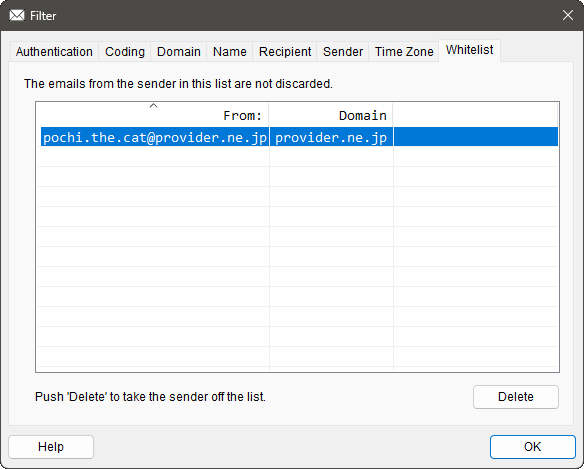

# `CWhitePage`

## 構成

ソースコード上は,
[`WhitePage.h`](../ChkMails/ChkMails/WhitePage.h) と
[`WhitePage.cpp`](../ChkMails/ChkMails/WhitePage.cpp)
で実装されています.

この class は以下のメンバー関数で構成されています.

#### Constructor

[`CWhitePage`](#cwhitepage-1)

#### Override

[`OnInitDialog`](#oninitdialog)
[`OnOK`](#onok)

#### 標準 Window Message ハンドラー

[`OnDropFiles`](#ondropfiles)

#### コマンドハンドラー

[`OnButtonDelete`](#onbuttondelete)
[`OnChangeList`](#onchangelist)
[`OnClickHeader`](#onclickheader)
[`OnEditPaste`](#oneditpaste)

#### 固有関数

[`TakeSender`](#takesender)
[`AddSender`](#addsender)
[`SortSender`](#sortsender)
[`CompareSender`](#comparesender)

## 概要

[Whitelist](../README.md#whitelist) の設定を行うための「Page」です. 
[`CProperSheet`](CProperSheet.md) に乗っかった
[`CFilterSheet`](CFilterSheet.md) が
束ねている page のうちの 1つです.

手動入力はサポートしていません.
元ネタとなるメールの `.eml` を　Drag & Drop してもらうか,
元ネタとなるメールのヘッダーを copy したものを paste してもらうか,
の二択です.

いずれの場合も, リストに投入する情報の抽出は [`TakeSender()`](#takesender) という専用関数が担当しており,
メールの差出人の「名義」を`From:` から,
メールの本当の送信者を `Authentication-Results:` ( か `Received:` ) から,
それぞれ割り出して両者のペアでリストを構成します.
ただ, このペアを取得する処理も
[Main Window](CMainWnd.md) に丸投げしています.
そちらでも同じ業務を常日頃こなしているので.

## `CWhitePage`

この class の constructor です.

ソースコードを見ると, 何もやっていないように見えて「要るの？これ。」という感じですが,
リソース ID を指定して基底クラスの constructor を呼ぶという大事な仕事をしています.

## `OnInitDialog`

[`CPropertyPage::OnInitDialog`](https://learn.microsoft.com/ja-jp/cpp/mfc/reference/cdialog-class#oninitdialog)
の override です.

まずは普通に
`CPropertyPage::OnInitDialog` を呼んだ後,
( `CPropertyPage` は `OnInitDialog` を override していないようなので,
[`CDialog::OnInitDialog`](https://learn.microsoft.com/ja-jp/cpp/mfc/reference/cdialog-class#oninitdialog)
にスルーパスされた後, )
 以下の独自処理を挟みます.

1. [`GetCommonFont`](#CChkMailsApp.md#getcommonfont) で共通の等幅フォントを得る.
1. List Control に等幅フォントをセットする.
1. List Control を全カラムで選択表示するように設定.
1. List Control をグリッド表示するように設定.
1. カラム 0 にダミーを挟んで, カラム 1 に右詰めの `From:`, カラム 2 に右詰めの `Domain` を追加.
1. カラム 0 のダミーを削除.
1. カラム 2 のカラム幅を自動調整.
1. 「Whitelist 配列」の各行に対して以下を実行: 
各行の左辺を追加. 
各行の右辺をカラム 1 にセット. 
1. List Control が空でなければカラム幅を自動調整.
1. List Control のヘッダーを「カラム 0 で昇順ソート」と設定.
1. Page 下段テキスト欄に「追加の案内」をセット.
1. フォーカスを設定していないので, `TRUE` を返す.

このうち, 5. と 6. にある「ダミー」は一見不要そうな段取りですが,
[「カラム 0 は左詰めにしかできない」](https://learn.microsoft.com/ja-jp/windows/win32/api/commctrl/ns-commctrl-lvcolumnw#remarks)
という List Control の情けない事情を回避するためのものです.
 

いや, 「回避策」を説明するんじゃなくて, 「修正」してくれんかね?

## `OnOK`

[`CPropertyPage::OnOK`](https://learn.microsoft.com/ja-jp/cpp/mfc/reference/cpropertypage-class#onok)
の override です.

基底 class の実装である
[`CPropertyPage::OnOK`](https://learn.microsoft.com/ja-jp/cpp/mfc/reference/cpropertypage-class#onok)
も呼ばずに, 以下の処理だけ行います.

* まず「Whitelist 配列」を空にする.
* List Control をカラム 0 で昇順ソート.
* List Control のカラム 0 とカラム 1 を tab で区切った文字列を LF 改行して「Whitelist 配列」に追加.

この `public` な配列は `OnOK` の後,
[Main Window](CMainWnd.md) が勝手に回収していく手筈になっています.

## `OnDropFiles`

Window Message [`WM_DROPFILES`](https://learn.microsoft.com/ja-jp/windows/win32/shell/wm-dropfiles)
に対するハンドラーです.

( ←誤訳が著しいので[英語版](https://learn.microsoft.com/en-us/windows/win32/shell/wm-dropfiles)をご参照ください. )

Drop された `.eml` ファイルを片っ端から読み取って,
読み取った内容で [`TakeSender`](#takesender) します.

その結果,
Drop された `.eml` ファイルから抽出した「`From:` と送信者所属ドメインのペア」が,
List Control に取り込まれることになります.

ただし, 抽出した `From:` に疑義がある場合は, その旨を
[`AfxMessageBox()`](https://learn.microsoft.com/ja-jp/cpp/mfc/reference/cstring-formatting-and-message-box-display#afxmessagebox)
して取り込みを拒否します.

## `OnButtonDelete`

`Delete` ボタンが押された時に飛んでくる `BN_CLICKED` コマンドのハンドラーです.

今 List Control 上で選択されている行のエントリーを削除します.

削除が終わったら, List Control のカラム幅を調整しておきます.

## `OnChangeList`

List Control 上の状態が変えられた時に飛んでくる `LVN_ITEMCHANGED` コマンドのハンドラーです.

最終的にどの行が選択されたのか知りたいだけの
[`CAccountDlg::OnChangeList`](CAccountDlg.md#onchangelist) でやっている横着な処理と違って,
少しマジメにコマンドに対応しています.
なぜなら,

* 選択状態から非選択状態になったという `LVN_ITEMCHANGED`
* 非選択状態から選択状態になったという `LVN_ITEMCHANGED`

の両方にそれぞれ対応したいからです.
なぜそれぞれに対応したいかというと

* どれかの行が選択されているときは, `Delete` ボタンを enable して, 下段テキスト欄に「削除の案内」をセット.
* どの行も選択されていないときは, `Delete` ボタンを disable して, 下段テキスト欄に「追加の案内」をセット.

という処理を挟むためです.

まあ, デフォルトの page ( シート ) サイズでは,
よほど行数が少なくない限りは,
一度どれかを選択してしまうと, 非選択状態に戻すのは難しいかもしれませんが.

## `OnClickHeader`

List Control 上のヘッダーがつつかれた時に飛んでくる `HDN_ITEMCLICK` コマンドのハンドラーです.

下記のように処理を進めています.

1. ヘッダー上のどのカラムがつつかれたのかを得る.
1. そのカラムの現在の「フォーマット」を得る.
1. 現在の「フォーマット」が「昇順ソート」なら「降順ソート」に変更.
1. 現在の「フォーマット」が「降順ソート」なら「昇順ソート」に変更.
1. 変更した「フォーマット」をヘッダーにセット.
1. つつかれたカラム以外の「フォーマット」を「ソートなし」に変更してヘッダーにセット.
1. [`SortSender`](#sortlist) で並べ直す.

[`CZonePage::OnClickHeader`](CZonePage.md#onclickheader) では,
handler 内で直接 List Control をソートしていますが,
当 class の handler では [`SortSender`](#sortlist) という担当関数を挟んでいます.
これは, 当 class ではヘッダーの操作以外にもソート処理を挟みたい契機 ( [`AddSender`](#addsender) ) があるためです.

## `OnEditPaste`

当 page に対して `Ctrl`+`V` されたときに飛んでくる `ID_EDIT_PASTE` コマンドのハンドラーです.

クリップボードの中身をテキストとして受け取り,
その内容で [`TakeSender`](#takesender) します.

その結果,
Paste されたテキストから抽出した「`From:` と送信者所属ドメインのペア」が,
List Control に取り込まれることになります.

ただし, 抽出した `From:` に疑義がある場合は, その旨を
[`AfxMessageBox()`](https://learn.microsoft.com/ja-jp/cpp/mfc/reference/cstring-formatting-and-message-box-display#afxmessagebox)
して取り込みを拒否します.

なお, この `ID_EDIT_PASTE` コマンドですが,
[`CFilterSheet::PreTranslateMessage`](CFilterSheet.md#pretranslatemessage)
様の格別なお引き立てにより, 当 class まで届いていることを申し添えておきます.

## `TakeSender`

与えられたメールのテキストから, そのメールの送信者を取り込みます.

この「送信者」は, メールヘッダーにある下記の情報から構成されています.

* `From:` にある「名義」としての差出人のメールアドレス
* `Authentication-Results:` などにある「実際」のメール送信者の所属ドメイン

この関数にはメールヘッダーがテキスト形式で与えられているので,
上記の情報を探せばいいのですが,
全く同じ仕事を通常営業で繰り広げている [Main Window](CMainWnd.md) という存在があるので,
そちらに依頼することにしました.
依頼の方法は「`WM_GET_SENDER` を
[send](https://learn.microsoft.com/ja-jp/windows/win32/api/winuser/nf-winuser-sendmessagew)
すること」です.
これで [`CMainWnd::OnGetSender`](CMainWnd.md#ongetsender) が依頼を受けてくれます.

[send](https://learn.microsoft.com/ja-jp/windows/win32/api/winuser/nf-winuser-sendmessagew)
なので, 依頼した仕事が完了してからこちらに制御が戻ってきます.
その戻り値は

* ペアを記述した `\n` 区切りの 2行の文字列へのポインター

という形式で納品されてくるのですが,
このポインターが `NULL` だった場合は,

「この送信者は信用できない。取り込むのはやめておいた方がいい。」

という意味なので, 処理を中止して「取り込んでいない」を意味する `false` を返して終わります.

`NULL` でなかった場合は,
直ちにポインターから `CStringA` を起こし,
納品されたポインターは開放します.
そしてその `CStringA` を `From:` と `実際の送信者` に分けます.

そして, `From:` と `実際の送信者` の両方が空文字列でなければ,
さらに `実際の送信者` をその`所属ドメイン`だけに削り落とします.
なぜ削り落とすのかというと,
企業のメールでは複数のメールサーバーを使い分けていることがあり,
`実際の送信者` の文字列全てをキーにすると受信のたびに異なる結果を導き出しかねないからです.

で, この `From:` と `所属ドメイン` で
[`AddSender`](#addsender) を呼んでその後の仕事を委ねて,
「取り込んだ」を意味する `true` を返して終わります.

なお, `From:` と `実際の送信者` のいずれかが空文字列であった場合は,
「取り込んでいない」を意味する `false` を返して終わります.

## `AddSender`

メールの送信者を List に加えます.

与えられた `From:` と `所属ドメイン` のペアを List Control に加えます.

まず, List Control にエントリー済みの全ての行をあたって,
すでに同じペアがエントリー済みだったら何もせずに帰ります.

新規エントリーなら, カラム 0 に `From:` を, カラム 1 に `所属ドメイン` をセットした上で,
新規追加した行を選択状態にします.

そして List Control のカラム幅を調整し,
[`SortSender`](#sortsender) を呼んで List の行並びをソートします.

あとは, 選択された行が目立つように List Control にフォーカスをあて,
選択された行があるので `Delete` ボタンを enable して完了です.

## `SortSender`

List Control の表示をいま選ばれている条件でソートします.

まずは List Control から現状を読み取ります.
この「現状」とは

* 今ソートのキーとなっているカラム ( のインデックス )
* ソートは昇順か降順か

の 2つの情報です.

で, 現状の ( ソートする前の ) 各行に対して

* `行のデータ` イコール `行の番号 ( というかインデックス )`

となるよう
[`SetItemData`](https://learn.microsoft.com/ja-jp/cpp/mfc/reference/clistctrl-class#setitemdata)
しておきます.
これはコールバック関数である [`CompareSender`](#comparesender) が,
受け取った引数から List Control 上のアイテムを参照できるようにするための事前準備です.

そして,
[`CompareSender`](#comparesender) を比較関数に指定して
[`CListCtrl::SortItems`](https://learn.microsoft.com/ja-jp/cpp/mfc/reference/clistctrl-class#sortitems)
して, 実際のソート作業を行います.

最後に, ソート後の状態で

* `行のデータ` イコール `行の番号 ( というかインデックス )`

となるよう改めて
[`SetItemData`](https://learn.microsoft.com/ja-jp/cpp/mfc/reference/clistctrl-class#setitemdata)
しておきます.

## `CompareSender`

List Control にある項目同士を比較します.

与えられた二つの項目のうち, 前者が後に位置するものだったら `+1` を, 前者が前に位置するものだったら `-1` を返します.
全く同じ位置だったら `0` を返します.

[`CListCtrl::SortItems`](https://learn.microsoft.com/ja-jp/cpp/mfc/reference/clistctrl-class#sortitems)
を経由して間接的に呼び出されています.

どのカラムの項目同士を比較するのかは,
引数として与えられた構造体から引き出しますが,
どのカラムの文字列もメールアドレスのようなドメイン表記
( 最後が[トップレベルドメイン](https://ja.wikipedia.org/wiki/トップレベルドメイン)で終わる )
ので,
表記の後ろ ( 右 ) から前後関係を比較していきます.
 

( [`CDomainPage::CompareDomain`](CDomainPage.md#comparedomain) と同じように比較します.
というか [`CDomainPage::CompareDomain`](CDomainPage.md#comparedomain) のソースが copy & paste されています.
同じロジックが複数の箇所に植わっているのも気に入りませんが,
呼び出される回数の多い関数なので, あまり凝ったことはせず, 現物を直接貼り付けました. )

Class のメンバーのようなフリをしていますが, コールバック関数なので class メンバーにはアクセスできません.
なので必要な情報は全て引数で受け取っています.

この関数は,
本アプリの「三大ソート用比較関数」(
[`CDomainPage::CompareDomain`](CDomainPage.md#comparedomain),
[`CZonePage::CompareZone`](CZonePage.md#comparezone),
`CWhitePage::CompareSender` )
の 1つです.