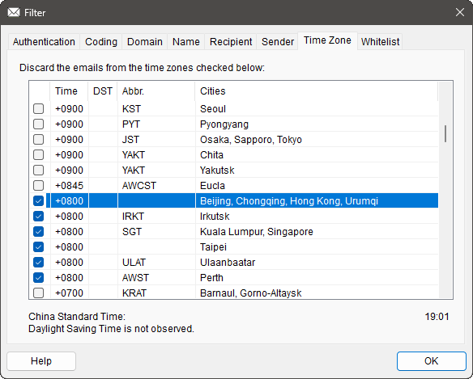

# `CZonePage`

## 構成

ソースコード上は,
[`ZonePage.h`](../ChkMails/ChkMails/ZonePage.h) と
[`ZonePage.cpp`](../ChkMails/ChkMails/ZonePage.cpp)
で実装されています.

この class は以下のメンバー関数で構成されています.

#### Constructor

[`CZonePage`](#czonepage-1)

#### Override

[`OnInitDialog`](#oninitdialog)
[`OnOK`](#onok)

#### 標準 Window Message ハンドラー

[`OnTimer`](#ontimer)

#### コマンドハンドラー

[`OnChangeList`](#onchangelist)
[`OnClickHeader`](#onclickheader)

#### 固有関数

[`OnSelectItem`](#onselectitem)
[`DecodeDST`](#decodedst)
[`DrawLocalTime`](#drawlocaltime)
[`CompareZone`](#comparezone)

## 概要

[Time Zone](../README.md#time-zone) の設定を行うための「Page」です. 
[`CProperSheet`](CProperSheet.md) に乗っかった
[`CFilterSheet`](CFilterSheet.md) が
束ねている page のうちの 1つです.

[タイムゾーン](https://ja.wikipedia.org/wiki/等時帯)の列挙や時間差を計算するのも面倒な処理なので,
それらを封じ込めた [`CTimeZones`](CTimeZones.md)
という専用 class を利用しています.
その [`CTimeZones`](CTimeZones.md) では Windows&reg; が内蔵しているデータベースから,
どのようなタイムゾーンがあるのかを取得しているので,
当 class でも Windows&reg; 並みにタイムゾーンを列挙しています.

選択したタイムゾーンの現地時刻を表示するという特に必要もない機能が,
わざわざ組み込まれています.

数多くあるタイムゾーンを少しでも見分けやすくするため,
この page の
[CList Control](https://learn.microsoft.com/ja-jp/cpp/mfc/reference/clistctrl-class)
には, リストヘッダーをつつくと, つつかれたヘッダーに従ってソートする機能が付けられています.

以下, 本 class 内に実装された関数それぞれの説明です.

## `CZonePage`

この class の constructor です.

リソース ID を指定して基底クラスの constructor を呼ぶという大事な仕事を果たした後,
メンバー変数を初期化しています.

そうしておかないと[C26495](https://learn.microsoft.com/ja-jp/cpp/code-quality/c26495)がうるさいので.

## `OnInitDialog`

[`CPropertyPage::OnInitDialog`](https://learn.microsoft.com/ja-jp/cpp/mfc/reference/cdialog-class#oninitdialog)
の override です.

まずは普通に
`CPropertyPage::OnInitDialog` を呼んだ後,
( `CPropertyPage` は `OnInitDialog` を override していないようなので,
[`CDialog::OnInitDialog`](https://learn.microsoft.com/ja-jp/cpp/mfc/reference/cdialog-class#oninitdialog)
にスルーパスされた後, )
 以下の独自処理を挟みます.

1. List Control を全カラムで選択表示するように設定.
1. List Control をグリッド表示するように設定.
1. List Control を Check Box を表示するように設定.
1. List Control に 5カラム追加.
1. [`CTimeZones`](CTimeZones.md) の配列の全ての要素に対して以下を実行: 
当該タイムゾーンのバイアス値からバイアス*表示文字列 ( `"+0900"` など ) を生成. 
カラム 1 にバイアス表示文字列をセット. 
カラム 2 に当該タイムゾーンが [DST](https://ja.wikipedia.org/wiki/夏時間) 実施地域なら今が DST か否か**をセット. 
カラム 3 に当該タイムゾーンの略称をセット. 
カラム 4 に当該タイムゾーンの代表都市名をセット. 
カラム 0 の Check Box を OFF にしておく. 
この行が何行目かをデータとしてセット. ( ソート用 )
1. List Control のカラム幅を自動調整.
1. 「破棄対象配列」に含まれていたら Check Box を&#x2611;.
1. &#x2611;した行が見えるように List Control をスクロール.
1. 現地時刻表示更新用タイマーをしかける.
1. 現地時刻表示の初回更新をしかける.
1. フォーカスを設定していないので, `TRUE` を返す.

*
UTC との時間差を表す「Microsoftタイムゾーン業界用語」. [ISO](https://ja.wikipedia.org/wiki/ISO_8601) や
[RFC](https://datatracker.ietf.org/doc/html/rfc3339) 業界用語では「offset」.
 
例えば中国の場合は `+0800` で統一されています. ( あんなに国土が東西に長いのに. )
 
** 
本アプリのユーザーインターフェイスは国際的に中立 ( [Neutral] ) を心掛けているので,
表示文字列も中立であるべきです.
中立な国際文書ではアメリカ英語ではなくイギリス英語を使うのが普通なので,
「DST」などというアメリカ英語丸出しの言葉は使いたくなかったのですが,
「夏時間」はイギリス英語では「Summer Timer」なので略すと「ST」,
一方その対義語の「標準時間」は「Standard Time」なので略すと「ST」.
苦渋の選択でこの表現はアメリカ英語丸出しの言葉を採用した次第です.

## `OnOK`

[`CPropertyPage::OnOK`](https://learn.microsoft.com/ja-jp/cpp/mfc/reference/cpropertypage-class#onok)
の override です.

基底 class の実装である
[`CPropertyPage::OnOK`](https://learn.microsoft.com/ja-jp/cpp/mfc/reference/cpropertypage-class#onok)
も呼ばずに, 以下の処理だけ行います.

* List Control で Check Box が&#x2611;されたタイムゾーンを「破棄対象配列」に格納.

この `public` な配列は `OnOK` の後,
[Main Window](CMainWnd.md) が勝手に回収していく手筈になっています.

## `OnTimer`

Window Message [`WM_TIMER`](https://learn.microsoft.com/ja-jp/windows/win32/winmsg/wm-timer)
に対するハンドラーです.

下記のタイマー値を取り扱っています.

| タイマー値 | 状況 | 処理内容 |
| --- | --- | --- |
| `TID_SECOND` | 「現地時刻表示更新」 | 分単位が改まったら [`DrawLocalTime`](#drawlocaltime) 呼び出し. |

## `OnChangeList`

List Control 上の状態が変えられた時に飛んでくる `LVN_ITEMCHANGED` コマンドのハンドラーです.

最終的にどの行が選択されたのか知りたいだけの
[`CAccountDlg::OnChangeList`](CAccountDlg.md#onchangelist) でやっている横着な処理と違って,
少しマジメにコマンドに対応しています.
なぜなら,
 
Check Box をいじると飛んでくる

* &#x2611;状態から非&#x2611;状態になったという `LVN_ITEMCHANGED`
* 非&#x2611;状態から&#x2611;状態になったという `LVN_ITEMCHANGED`

の両方にそれぞれ対応したいからです.

さらに `LVNI_FOCUSED` の変化と `LVNI_SELECTED` の変化が別々に飛んでくる, という冗長っぷりなので,
下記のように状態変化を整理した上で対応しています.

| チェック | 意味 | 対応 |
| --- | --- | --- |
| `-1` | 変化なし | 何もしない |
| `0` | &#x2611;されていたものから&#x2611;が外れた | &#x2611; を OFF する. |
| `1` | &#x2611;されていなかったものが&#x2611;された | &#x2611; を ON する. |

そして, 上記の状態変化が `1` だった場合は,

* &#x2611;されたタイムゾーンと同じ時間差の地域全てを巻き込む

という仕事もしています.

以上, チェック状態の変化に関しての仕事を片付けると,
選択状態への対応は [`OnSelectItem`](#onselectitem) に丸投げしています.

## `OnClickHeader`

List Control 上のヘッダーがつつかれた時に飛んでくる `HDN_ITEMCLICK` コマンドのハンドラーです.

下記のように処理を進めています.

1. ヘッダー上のどのカラムがつつかれたのかを得る.
1. そのカラムの現在の「フォーマット」を得る.
1. 現在の「フォーマット」が「昇順ソート」なら「降順ソート」に変更.
1. 現在の「フォーマット」が「降順ソート」なら「ソートなし」に変更.
1. 現在の「フォーマット」が「ソートなし」なら「昇順ソート」に変更.
1. 変更した「フォーマット」をヘッダーにセット.
1. つつかれたカラム以外の「フォーマット」を「ソートなし」に変更してセット.
1. 全ての行を「ソートなし」で並べ直す.
1. 全ての行を変更した「フォーマット」で並べ直す.

上記 8. と 9. の「並べ直し」ですが,
なぜ一旦「ソートなし」で並べ直してから指定のソートをし直すのかというと,
一旦デフォルトの状態で List を並べ直すためです.
本番のソートは, そのデフォルトの状態に対して行われる前提になっています.
 

( [`CWhitePage::SortSender`](CWhitePage.md#sortsender) ではこの「ソートの 2度掛け」は行なわずに 1度で済ませていますが,
その代わりに「`行のデータ` イコール `行の番号 ( というかインデックス )`」となるよう, 動的に
[`CListCtrl::SetItemData`](https://learn.microsoft.com/ja-jp/cpp/mfc/reference/clistctrl-class#setitemdata)
しています.
やり方を統一すれば良さそうなもんですが,
ソースコード再利用のために残しておくバリエーションを拡げたかったんです. )

このソート作業の一次委託先は
[`CListCtrl::SortItems`](https://learn.microsoft.com/ja-jp/cpp/mfc/reference/clistctrl-class#sortitems)
ですが,
[`CListCtrl::SortItems`](https://learn.microsoft.com/ja-jp/cpp/mfc/reference/clistctrl-class#sortitems)
にはコールバック関数としての「比較関数」を指定する必要があります.
当 class では [`CompareZone`](#comparezone) を指定していますが,
この関数には以下の複数の引数を与える必要があります.

* List Control へのポインター
* どのカラムをキーにソートするか
* ソートの「フォーマット」

ですが, [`CompareZone`](#comparezone) は
class のメンバー変数にはアクセスできないコールバック関数で,
渡せる引数は 1つきりです.
ここではその引数を「構造体へのポインター」として,
その構造体に必要な情報を詰め込んでいます.
 

そりゃあ, List Control は ID は決め打ちにして, 残る 2つを 32bits ずつ 1つの `DWORD_PTR` に詰め込む,
とかすれば済む話なんですが,
ここはもっと「一般解」なやり方で通してみたかったんです.

## `OnSelectItem`

List Control 上の選択が変えられたことに対応します.

[`OnChangeList`](#omchangelist) がやった仕事の後半戦として,
[`OnChangeList`](#omchangelist) がやり残した「選択された行が変わった」ことに対する仕事を片付けます.
つまり,

1. 選択されたタイムゾーンの概要を下段に表示する
1. 選択されたタイムゾーンの現在時刻を表示するように設定する

という仕事です.

このうち 1. の「タイムゾーンの概要」の表示ですが,
その DST の状況を表現する文字列の生成を [`DecodeDST`](#decodedst) に委ねています.
また, 2. の「タイムゾーンの現在時刻」ですが,
その表示は [`DrawLocalTime`](#drawlocaltime) に委ねています.

## `DecodeDST`

与えられた `SYSTEMTIME` に格納されている「夏時間／標準時間がいつから始まるのか」を文字列で返します.

`SYSTEMTIME` は普通なら特定の日時を表すために使われる情報構造ですが,
ここで渡される `SYSTEMTIME` は一味違って, 下記のような情報を持たされています.

| メンバー | 意味 |
| --- | --- |
| `wYear` | 無意味なので常に `0` |
| `wMonth` | 夏時間／標準時間が始まるのは何月か |
| `wDay` | 夏時間／標準時間が始まるのは第何曜日か ( `5`の場合は最終曜日 ) |
| `wDayOfWeek` | 夏時間／標準時間が始まるの曜日 |
| `wHour` | 夏時間／標準時間が始まるのは何時か |
| `wMinute` | 夏時間／標準時間が始まるのは何分か |

なので, この関数ではこの情報に応じた文字列化を行い, その文字列を返します.

なお, 夏時間を実施していないタイムゾーン
( `wDay` が `0` で表現される )
に対しては, 空の文字列を返します.

## `DrawLocalTime`

与えられたインデックスで示されたタイムゾーンの現地時刻を表示します.

ここで与えられる「インデックス」とは,
当 class が保持している [`CTimeZones`](CTimeZones.md#ctimezones)
から特定のタイムゾーンを表す [`CTimeZone`](CTimeZones.md#ctimezone) を参照するためのインデックスです.
この [`CTimeZone`](CTimeZones.md#ctimezone) から現地時間のバイアスを得て,

* 本アプリが稼働している地域のバイアスを打ち消して UTC を得て,
* インデックスで示されたタイムゾーンのバイアスを UTC に加味して現地時刻を得て,
* インデックスで示されたタイムゾーンが夏時間ならその時間差を現地時刻に加味して,
* 得られた現地時刻を文字列化して表示する

という段取りを踏んでいます.

## `CompareZone`

List Control にある項目同士を比較します.

与えられた二つの項目のうち, 前者が後に位置するものだったら `+1` を, 前者が前に位置するものだったら `-1` を返します.
全く同じ位置だったら `0` を返します.

[`OnClickHeader`](#onclickheader) から
[`CListCtrl::SortItems`](https://learn.microsoft.com/ja-jp/cpp/mfc/reference/clistctrl-class#sortitems)
を経由して間接的に呼び出されています.

どのカラムの項目同士を比較するのかは,
引数として与えられた構造体から引き出しますが,
カラムによって下記のような比較を行います.

| カラム | 比較内容 |
| --- | --- |
| `0`: Check Box | &#x2611;されているものとされていないものなら, されているものが前 |
| `1`: `Time` | バイアスの小さい ( 日付が変わるのが遅い ) 方が前 |
| その他 | 辞書順 |

ただし, ヘッダーが 2回つつかれてソートが逆順になっている場合は,
返す前後関係を反転します.

ヘッダーが 3回つつかれてソートしない指定の場合は,
オリジナルの順序での前後関係を返します.
このオリジナルの順序とは ( 夏時間ではない ) 標準時間でのバイアスの大きい ( 日付が変わるのが早い ) 順です.

Class のメンバーのようなフリをしていますが, コールバック関数なので class メンバーにはアクセスできません.
なので必要な情報は全て引数で受け取っています.

この関数は,
本アプリの「三大ソート用比較関数」(
[`CDomainPage::CompareDomain`](CDomainPage.md#comparedomain),
`CZonePage::CompareZone`,
[`CWhitePage::CompareSender`](CWhitePage.md#comparesender) )
の 1つです.