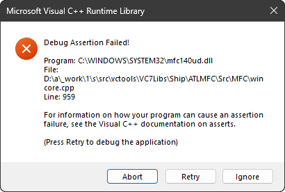
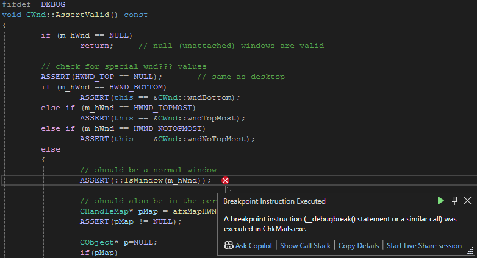

# 実装

[ChkMails](../README.md#chkmails) は,
Visual Studio 2022&reg; で [MFC](https://en.wikipedia.org/wiki/Microsoft_Foundation_Class_Library) をベースに,
プログラミング言語 C++ で書かれたアプリです.
<p>

C++ なので, 実装は class ごとにまとめられています.
本アプリは以下の class で構成されています.

| class | 役割 |
| --- | --- |
| [`CChkMailsApp`](CChkMailsApp.md) | 初期化担当 |
| [`CMainWnd`](CMainWnd.md) | 本アプリの主役 |
| [`CAccountDlg`](CAccountDlg.md) | [Accounts](../README.md#accounts) 設定ダイアログ |
| [`CFilterSheet`](CFilterSheet.md) | [Filter](../README.md#filter) を束ねるシート |
| [`CProperSheet`](CProperSheet.md) | [`CFilterSheet`](CFilterSheet.md) を支える「適切な」シート |
| [`CAuthPage`](CAuthPage.md) | [Filter](../README.md#filter) の [Authentication](../README.md#authentication) 担当 |
| [`CCodePage`](CCodePage.md) | [Filter](../README.md#filter) の [Coding](../README.md#coding) 担当 |
| [`CDomainPage`](CDomainPage.md) | [Filter](../README.md#filter) の [Domain](../README.md#domain) 担当 |
| [`CNamePage`](CNamePage.md) | [Filter](../README.md#filter) の [Name](../README.md#name) 担当 |
| [`CSenderPage`](CSenderPage.md) | [Filter](../README.md#filter) の [Sender](../README.md#sender) 担当 |
| [`CZonePage`](CZonePage.md) | [Filter](../README.md#filter) の [TimeZone](../README.md#time-zone) 担当 |
| [`CWhitePage`](CWhitePage.md) | [Filter](../README.md#filter) の [Whitelist](../README.md#whitelist) 担当 |
| [`CSetupDlg`](CSetupDlg.md) | [Setup](../README.md#setup) 設定ダイアログ |
| [`CMessageBox`](CMessageBox.md) | [`MessageBox`](https://learn.microsoft.com/ja-jp/windows/win32/api/winuser/nf-winuser-messagebox)の代役 |
| [`CNotifyWnd`](CNotifyWnd.md) | 未読メールのお知らせ係 |
| [`CParaSocket`](CParaSocket.md) | 通信担当 socket |
| [`CTimeZones`](CTimeZones.md) | タイムゾーン情報提供元 |

Visual Studio 2022&reg; での C++ なので,
実装の説明には MFC 業界用語が多々出てきますが,
説明されていない単語等については, web 検索などで補っていただけると,
こちらも細かいことを言わなくていいので助かります.<br>
<sup>まず自分の都合から入るか, そうか……</sup>


## ご自身で build して debug される方への連絡事項


### 1. 無駄な警告

サーバーと通信するたびに下記のような警告文が output pane に出ますが,
<sub>( 2025/1月現在 Windows&reg; 11 24H2 にて確認 )</sub>

> `8007277C No such service is known. The service cannot be found in the specified name space.`

これは [Windows&reg; 側の不手際](https://github.com/dotnet/runtime/issues/91677)によるものです.
本品の品質には問題ありません. 安心してご利用いただけます.


### 2. 書き変えられるファイルのタイムスタンプ

ログ ( `.eml` と `.txt` ) を眺めていると,
その[タイムスタンプ ( 最終更新日時 ) がパタパタと変わっていくという不思議な現象を目撃することがあります.](https://superuser.com/questions/1852879/how-to-stop-windows-from-changing-date-modified-when-copying-files-from-network)
<sub>( 2025/1月現在 Windows&reg; 11 24H2 にて確認 )</sub>

これも Windows&reg; のしわざで,
[KB5039212](https://support.microsoft.com/ja-jp/topic/june-11-2024-kb5039212-os-builds-22621-3737-and-22631-3737-d7f574c0-2b13-48ca-a9fc-a63093b1a2c2)
でやらかした模様です.

ファイル作成日時は変わることがないので, そちらを参考にしてください. 書き換えられる前と同じ日時が入っています.
<br>
<sup>
ファイルの更新日時を変えられたら差分バックアップがおかしくなるだろうが！
OS としての基本を見失ってないか？ Windows&reg;.
</sup>


### 3. 誤った assertion failure

Debug build において,
ダイアログやシートが表示されている状態で,
その Close ボタン ( 例の赤いアレ ) の内外をマウスでウロウロさせて
tooltip を出したり引っ込めたりを根気よく繰り返していると……,
( 下図参照 )
<br>
<sup>( 画面の上端ギリギリに構えて tooltip が出るのを待ち, 出たら tooltip の方に動かすのがコツです. )</sup><br>
いきなり下記のように assertion に失敗することがあります.
<sub>( 2025/1月現在 Windows&reg; 11 24H2 にて確認 )</sub>



せっかくなので `Retry` を押して実況見分してみると,

* [`WM_NCMOUSEMOVE`](https://learn.microsoft.com/ja-jp/windows/win32/inputdev/wm-ncmousemove) や
[`WM_MOUSEMOVE`](https://learn.microsoft.com/ja-jp/windows/win32/inputdev/wm-mousemove) を受けた `CWnd` が,
これら Window Message の宛先 window に対して
[“当然この `CWnd` って, まだ window として生きてるよね?”](https://learn.microsoft.com/ja-jp/windows/win32/api/winuser/nf-winuser-iswindow)
と `ASSERT` してみたら, そのときすでに window は死んでいた

という状況に引っかかったようです. ( 下図参照 )



この再現手順でこの状況に引っかかりそうな `CWnd` は tooltip しかいません. なので犯人は tooltip です.

……いや, 犯人呼ばわりは濡れ衣ですね. tooltip は自分の仕事をしていただけです.
真犯人は, たまたま自分と表示領域がカブっていたからというだけで,
tooltip 宛てに飛んできた Window Message を
`CWnd::FromHandle(pMsg->hwnd)` して不当に我がもの扱いし,
それだけでは飽き足らず `ASSERT_VALID` する過程で `IsWindow(m_hWnd)` までする
 [MFC](https://en.wikipedia.org/wiki/Microsoft_Foundation_Class_Library) の
`CWnd` です.<br>

そもそも
[`IsWindow`の解説](https://learn.microsoft.com/en-us/windows/win32/api/winuser/nf-winuser-iswindow#remarks)に,

> A thread should not use **IsWindow** for a window that it did not create because the window could be destroyed after this function was called.

【意訳】<br>
> よその thread が作った window に `IsWindow` は使わないでね。この関数が呼ばれた後いつ破棄されるかも判らないもん。

と書かれています.
<sub>
( 原文もアレですが,
[和文](https://learn.microsoft.com/ja-jp/windows/win32/api/winuser/nf-winuser-iswindow#remarks)はもっとアレだったので, あえて意訳してみました. )
</sub>

実際 tooltip は assertion に失敗した thread とは無関係な thread で生成されている window ですし,
マウスをあてがうと引っ込む性質があるので,
まさにこの解説が警告している通りの状況です.

それなのに tooltip という「よその window」に対して `IsWindow` した挙句 `ASSERT` ですから,
罪を重ねています.

この現象は Visual Studio&reg; で「新規作成」しただけの project でも再現できるので <sub>( Version 17.11.6 現在 )</sub>,
興味のある方はご自分の目でお確かめいただくのも一興かと.

`ASSERT` なんかしない Release build では当然こんな現象は出ませんし,
元々言いがかりなので, 動作を繰り返しても当然何の問題もありません.
安心して debug をお進めください.
上記画面が現われても `Ignore` すればいいでしょう.

あまりにちょいちょい現れるのでイラっときた方 ( `OK` ボタンじゃなくて赤いアレで dialog を閉じる派の方 ) は,
[`CChkMailsApp::PreTranslateMessage`](CChkMailsApp.md#pretranslatemessage) の冒頭に
```
#ifdef _DEBUG
if ( !IsWindow( pMsg->hwnd ) )
    return TURE;
#endif
```
とでも挟んでおけば, こんな事件に巻き込まれずに済みます.
<br>
<br>
<sup>
この現象は再現条件を特定するのに苦労しました.
プログラムの動作とは無関係なタイミングで出るし,
web 上の誰もこんなこと言ってなかったし.
</sup>


### 4. リーク確認

当アプリは常駐プロセスなので, メモリリークやハンドルリークなどしていないことの確認が必須です.
当アプリは「10[min] に 1回ちょこっと動く」というその性質上,
[Performance Monitor](https://en.wikipedia.org/wiki/Performance_Monitor)等を利用したリーク確認には,
かなりの時間 ( 少なくとも 12[h] 以上 ) が必要となります.

特に当アプリは「ちょこっと動く」ときに「ちょこっと」メモリーを確保するので,
そのメモリー確保は
「[LFH: Low Fragmentation Heap](https://learn.microsoft.com/ja-jp/windows/win32/memory/low-fragmentation-heap)」
という heap 上で行われます.
この heap に関して Microsoft&reg;さんは「断片化が少ない」とメリットを強調されていますが,

* [メモリ解放のタイミングがプログラムの動きとズレるのでリークしているか否かの見極めが難しい](https://togarasi.wordpress.com/2009/01/14/低断片化ヒープ（low-fragmentation-heap）/)

というデメリットもあります.
<br>
<sub>
( 最悪, なかなか実際の開放が行われず, マジでリークしているようにしか見えない場合すらあります. )
</sub>

技術的には, 「LFH が発動する前に ( 昔ながらの ) Look-aside List 方式を指定する」
というやり方もあるそうですが,
[Look-aside List 方式には攻撃に対する脆弱性がある](https://atmarkit.itmedia.co.jp/ait/articles/1408/28/news010_2.html)ので,
実用的には LFH に「甘んじる」しかなさそうです.

LFH の影響を受けて「リークしているように見える」のは,
Performance Monitor の測定項目のうち

* Page File Bytes
* Private Bytes

の 2つでしょう. ( 両者はきれいに重なるほど同じグラフを描きます. )

* Virtual Bytes
* Working Set

は LFH の影響が直撃しないようなので,
これら 2つの推移を眺めて

「ああ、リークはしてなさそうだな……(たぶん)。」

と大雑把に判断しておくのが, まあ, 「現実解」というものでしょうか.

<div style="text-align: right;">
In-house Tool / 家中 徹
</div>
